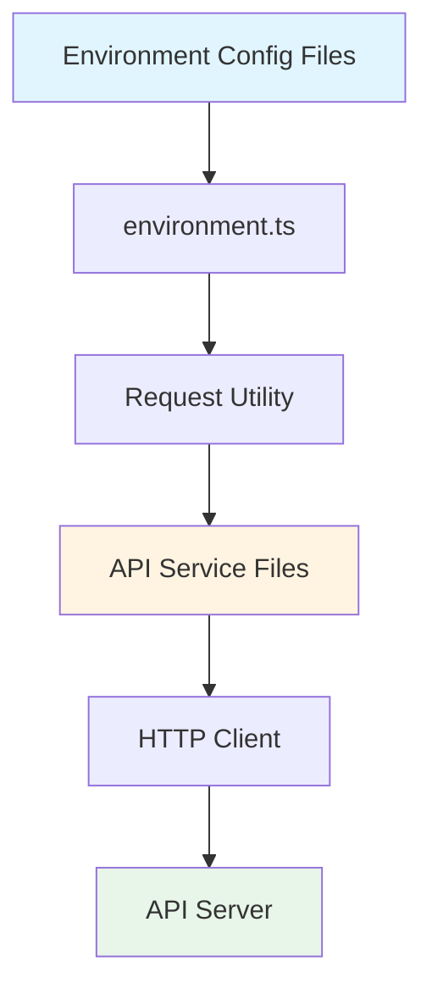

# Design Document: API v1 Prefix Migration

## Overview

This design addresses the migration of API endpoint paths to include the `/v1` version prefix. The system architecture has changed from including the version in the base URL (`https://api.voxel.cn/v1`) to a cleaner base URL (`https://api.voxel.cn`) with version prefixes on individual endpoints. This migration involves two main components:

1. **Environment Configuration Update**: Adding the missing `VITE_APP_API_URL` to `.env.staging`
2. **API Path Transformation**: Systematically updating all API endpoint paths in `src/api/v1/` to include the `/v1` prefix

The migration must be comprehensive, consistent, and preserve all existing functionality while maintaining code quality.

## Architecture

### Current State

```
Base URL: https://api.voxel.cn/v1 (in some env files)
Endpoint: /auth/login
Full URL: https://api.voxel.cn/v1/auth/login
```

### Target State

```
Base URL: {scheme}//api.{domain} (in all env files)
Endpoint: /v1/auth/login
Full URL: https://api.example.com/v1/auth/login (after runtime substitution)
```

### System Components



The migration affects:
- **Environment Layer**: `.env.staging` configuration file
- **API Service Layer**: All TypeScript files in `src/api/v1/` and subdirectories
- **Request Layer**: No changes needed (handles URL concatenation)

## Components and Interfaces

### 1. Environment Configuration Component

**File**: `.env.staging`

**Current State**:
```bash
# Missing VITE_APP_API_URL
ENV = '01xr.com'
VITE_APP_PORT = 80
# ... other variables
```

**Target State**:
```bash
ENV = '01xr.com'
VITE_APP_PORT = 80
VITE_APP_API_URL = "{scheme}//api.{domain}"
# ... other variables
```

**Responsibilities**:
- Define the base API URL without version suffix
- Maintain consistency with other environment files

### 2. API Service Files Component

**Location**: `src/api/v1/*.ts`, `src/api/v1/resources/*.ts`, `src/api/v1/types/*.ts`

**Current Pattern**:
```typescript
export const login = (data: any) => {
  return request({
    url: `/auth/login`,
    method: "post",
    data,
  });
};
```

**Target Pattern**:
```typescript
export const login = (data: any) => {
  return request({
    url: `/v1/auth/login`,
    method: "post",
    data,
  });
};
```

**Path Transformation Rules**:
1. Simple paths: `/auth/login` → `/v1/auth/login`
2. Paths with parameters: `/verses/${id}` → `/v1/verses/${id}`
3. Paths with query strings: `/verses${qs.stringify(...)}` → `/v1/verses${qs.stringify(...)}`
4. Already prefixed paths: `/v1/auth/login` → `/v1/auth/login` (no change)

### 3. Request Utility Component

**File**: `src/utils/request.ts` (not modified)

**Responsibilities**:
- Concatenate base URL with endpoint path
- Handle HTTP requests
- No changes needed for this migration

## Data Models

### Environment Configuration Model

```typescript
interface EnvironmentConfig {
  ENV: string;
  VITE_APP_PORT: number;
  VITE_APP_API_URL: string;  // Added for staging
  VITE_APP_BLOCKLY_URL: string;
  VITE_APP_EDITOR_URL: string;
  VITE_APP_AI_API: string;
  VITE_APP_AUTH_API: string;
  VITE_APP_A1_API: string;
  VITE_APP_BASE_MODE: string;
  VITE_APP_DOC_API: string;
}
```

### API Request Configuration Model

```typescript
interface RequestConfig {
  url: string;           // Must start with /v1/ after migration
  method: 'get' | 'post' | 'put' | 'delete';
  data?: any;
  params?: any;
  headers?: Record<string, string>;
}
```

### Path Transformation Model

```typescript
interface PathTransformation {
  original: string;      // e.g., "/auth/login"
  transformed: string;   // e.g., "/v1/auth/login"
  hasParameters: boolean; // e.g., true for "/verses/${id}"
  hasQueryString: boolean; // e.g., true for "/verses${qs.stringify(...)}"
}
```

## Correctness Properties

*A property is a characteristic or behavior that should hold true across all valid executions of a system—essentially, a formal statement about what the system should do. Properties serve as the bridge between human-readable specifications and machine-verifiable correctness guarantees.*


### Property Reflection

After analyzing all acceptance criteria, I've identified the following redundancies:

**Redundant Properties to Consolidate:**
- Requirements 2.1, 2.2, 2.6, and 4.1 all describe the same core transformation rule → Combine into Property 1
- Requirements 2.3, 2.4, 2.5 are specific examples of Property 1 → Keep as unit test examples, not separate properties
- Requirements 3.1, 3.2, 3.3 all describe file coverage → Combine into Property 3
- Requirements 4.4 and 4.5 both describe preserving dynamic content → Combine into Property 5
- Requirements 5.1, 5.2, 5.3, 5.4 all describe code preservation → Combine into Property 8

**Unique Properties to Keep:**
1. All API endpoints must start with `/v1/` (combines 2.1, 2.2, 2.6, 4.1)
2. Only URL field changes, other request config preserved (2.7)
3. All TypeScript files in directory tree are updated (combines 3.1, 3.2, 3.3)
4. All endpoints within each file are updated (3.4)
5. Dynamic content (template literals, query strings) preserved (combines 4.4, 4.5)
6. No double slashes created (4.2)
7. Idempotence - already prefixed paths unchanged (4.3)
8. Code structure preserved (combines 5.1, 5.2, 5.3, 5.4)
9. No TypeScript compilation errors (5.5)

### Correctness Properties

Property 1: **All API endpoints have v1 prefix**
*For any* API service file in `src/api/v1/` and its subdirectories, all `request()` calls must have a `url` property that starts with `/v1/`
**Validates: Requirements 2.1, 2.2, 2.6, 4.1**

Property 2: **Request configuration preservation**
*For any* API request configuration object, after path transformation, all properties except `url` must remain unchanged (method, data, params, headers, etc.)
**Validates: Requirements 2.7**

Property 3: **Complete file coverage**
*For all* TypeScript files in `src/api/v1/` directory tree (including subdirectories `resources/` and `types/`), each file must be processed for path transformation
**Validates: Requirements 3.1, 3.2, 3.3**

Property 4: **All endpoints per file updated**
*For any* TypeScript file containing multiple `request()` calls, all such calls must have their `url` property updated to include the `/v1/` prefix
**Validates: Requirements 3.4**

Property 5: **Dynamic content preservation**
*For any* API endpoint path containing template literals (e.g., `${id}`) or query string builders (e.g., `${qs.stringify(...)}`), these dynamic segments must remain unchanged after transformation, with only the static path prefix modified
**Validates: Requirements 4.4, 4.5**

Property 6: **No malformed URLs**
*For any* transformed API endpoint path, the result must not contain double slashes (e.g., `/v1//auth`) or other malformed URL patterns
**Validates: Requirements 4.2**

Property 7: **Transformation idempotence**
*For any* API endpoint path, if the path already starts with `/v1/`, applying the transformation must leave it unchanged (idempotent operation)
**Validates: Requirements 4.3**

Property 8: **Code structure preservation**
*For any* TypeScript file that is modified, the file must preserve all TypeScript type annotations, import statements, code comments, function signatures, and export statements
**Validates: Requirements 5.1, 5.2, 5.3, 5.4**

Property 9: **TypeScript compilation validity**
*For all* modified TypeScript files, running the TypeScript compiler must produce no new compilation errors compared to the pre-migration state
**Validates: Requirements 5.5**

## Error Handling

### Environment Configuration Errors

**Missing File**: If `.env.staging` does not exist, the migration should fail with a clear error message indicating the file is missing.

**File Permission Errors**: If the file cannot be written due to permissions, the migration should fail with an appropriate error message.

**Malformed Environment File**: If the file contains syntax errors, the migration should preserve the file and report the issue.

### API File Processing Errors

**File Read Errors**: If an API service file cannot be read, log the error and continue with other files, then report all failures at the end.

**Parse Errors**: If a TypeScript file cannot be parsed (syntax errors), skip the file and report it as requiring manual intervention.

**Write Errors**: If a modified file cannot be written back, preserve the original and report the error.

### Path Transformation Errors

**Already Prefixed Paths**: Paths already containing `/v1/` should be left unchanged (idempotent operation).

**Malformed Paths**: Paths not starting with `/` should be reported as potential issues but not modified.

**Complex Template Literals**: If a path uses complex string interpolation that cannot be safely transformed, report it for manual review.

### Validation Errors

**TypeScript Compilation Errors**: After migration, if TypeScript compilation fails, provide a detailed report of which files have errors.

**Missing Request Calls**: If a file in `src/api/v1/` contains no `request()` calls, log it as informational (may be a type definition file).

## Testing Strategy

### Unit Tests

Unit tests will focus on specific examples and edge cases:

1. **Environment Configuration Tests**
   - Test that `.env.staging` contains `VITE_APP_API_URL` after migration
   - Test that the value is exactly `{scheme}//api.{domain}`
   - Test that other variables remain unchanged

2. **Path Transformation Examples**
   - Test `/auth/login` → `/v1/auth/login`
   - Test `/user/info` → `/v1/user/info`
   - Test `/email/send-verification` → `/v1/email/send-verification`
   - Test `/verses/${id}` → `/v1/verses/${id}`
   - Test `/verses${qs.stringify(...)}` → `/v1/verses${qs.stringify(...)}`

3. **Edge Cases**
   - Test that `/v1/auth/login` remains `/v1/auth/login` (idempotence)
   - Test that paths without leading `/` are handled correctly
   - Test empty strings and null values

4. **Error Conditions**
   - Test behavior when file doesn't exist
   - Test behavior when file is read-only
   - Test behavior with malformed TypeScript files

### Property-Based Tests

Property-based tests will verify universal correctness across all inputs. Each test should run a minimum of 100 iterations.

1. **Property 1: All API endpoints have v1 prefix**
   - Generate: Random selection of files from `src/api/v1/`
   - Test: Parse each file and verify all `request()` calls have `url` starting with `/v1/`
   - Tag: **Feature: api-v1-prefix-migration, Property 1: All API endpoints have v1 prefix**

2. **Property 2: Request configuration preservation**
   - Generate: Random API request configurations with various properties
   - Test: Apply transformation and verify only `url` changed
   - Tag: **Feature: api-v1-prefix-migration, Property 2: Request configuration preservation**

3. **Property 3: Complete file coverage**
   - Generate: List all `.ts` files in `src/api/v1/` tree
   - Test: Verify each file was processed (has modification timestamp or content check)
   - Tag: **Feature: api-v1-prefix-migration, Property 3: Complete file coverage**

4. **Property 4: All endpoints per file updated**
   - Generate: Random files with multiple `request()` calls
   - Test: Verify all calls in each file have updated URLs
   - Tag: **Feature: api-v1-prefix-migration, Property 4: All endpoints per file updated**

5. **Property 5: Dynamic content preservation**
   - Generate: Random paths with template literals and query strings
   - Test: Verify dynamic segments unchanged after transformation
   - Tag: **Feature: api-v1-prefix-migration, Property 5: Dynamic content preservation**

6. **Property 6: No malformed URLs**
   - Generate: Random path transformations
   - Test: Verify no double slashes or malformed patterns in results
   - Tag: **Feature: api-v1-prefix-migration, Property 6: No malformed URLs**

7. **Property 7: Transformation idempotence**
   - Generate: Random paths, some already with `/v1/` prefix
   - Test: Apply transformation twice, verify same result as once
   - Tag: **Feature: api-v1-prefix-migration, Property 7: Transformation idempotence**

8. **Property 8: Code structure preservation**
   - Generate: Random TypeScript files from the migration set
   - Test: Parse before and after, verify AST structure preserved (only url strings changed)
   - Tag: **Feature: api-v1-prefix-migration, Property 8: Code structure preservation**

9. **Property 9: TypeScript compilation validity**
   - Generate: All modified files
   - Test: Run TypeScript compiler, verify no new errors
   - Tag: **Feature: api-v1-prefix-migration, Property 9: TypeScript compilation validity**

### Testing Tools

- **TypeScript Compiler API**: For parsing and validating TypeScript files
- **fast-check** (or similar PBT library for TypeScript): For property-based testing
- **Jest** or **Vitest**: For unit testing framework
- **fs-extra**: For file system operations in tests

### Test Execution Strategy

1. Run unit tests first to validate specific examples
2. Run property-based tests to validate universal properties
3. Run TypeScript compilation as final validation
4. All tests must pass before migration is considered complete
