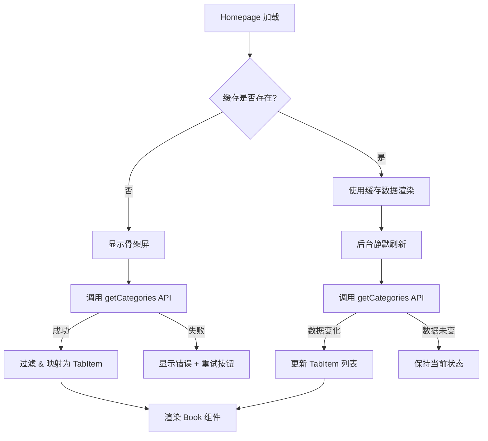
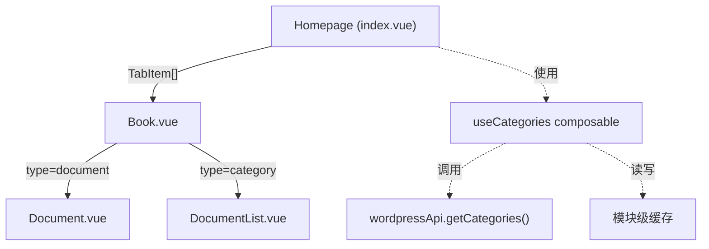

# 设计文档：首页动态内容

## 概述

本设计将首页从硬编码 WordPress 资源 ID 的静态模式，重构为从 WordPress REST API 动态获取分类列表并自动构建标签页的动态模式。核心变更包括：

1. **动态数据获取**：Homepage 加载时调用 `wordpressApi.getCategories()` 获取可用分类，替代硬编码的 ID 列表
2. **自动映射**：将 API 返回的 `NewsCategory[]` 自动转换为 `TabItem[]`，驱动 Book 组件渲染
3. **容错降级**：DocumentList 和 Document 组件增加 404 及通用错误处理，避免页面崩溃
4. **可选过滤**：支持 `includeCategories`/`excludeCategories` 白名单黑名单和 `pinnedItems` 置顶配置
5. **缓存策略**：采用 stale-while-revalidate 模式，优先展示缓存数据，后台静默刷新

### 设计决策

| 决策 | 选择 | 理由 |
|------|------|------|
| 状态管理 | 组合式函数（composable） | 分类数据仅首页使用，无需全局 store；composable 更轻量且易测试 |
| 缓存位置 | 模块级变量 + stale-while-revalidate | 与现有 `categoriesCache` 模式一致，避免引入新依赖 |
| 过滤配置来源 | 组件 props | 灵活性最高，不同页面可传入不同配置；未来可从环境变量或后端获取 |
| 错误处理模式 | 组件内 try/catch + 状态枚举 | 每个组件独立处理自身错误，符合 Vue 组件自治原则 |

## 架构

### 整体数据流



### 组件层级




## 组件与接口

### 1. `useCategories` 组合式函数（新增）

核心 composable，封装分类数据获取、缓存、过滤、映射逻辑。

```typescript
// src/composables/useCategories.ts

interface UseCategoriesOptions {
  includeCategories?: (number | string)[];
  excludeCategories?: (number | string)[];
  pinnedItems?: TabItem[];
}

interface UseCategoriesReturn {
  items: Ref<TabItem[]>;
  loading: Ref<boolean>;
  error: Ref<string | null>;
  retry: () => Promise<void>;
}

function useCategories(options?: UseCategoriesOptions): UseCategoriesReturn
```

**职责**：
- 调用 `wordpressApi.getCategories()` 获取分类
- 过滤 `count === 0` 的空分类
- 应用 `includeCategories`/`excludeCategories` 过滤
- 将 `NewsCategory` 映射为 `TabItem`
- 在列表前插入 `pinnedItems`
- 管理 loading/error 状态
- 实现 stale-while-revalidate 缓存策略

### 2. `Homepage`（index.vue 改造）

```typescript
// 移除硬编码 list
// 使用 useCategories composable
const { items, loading, error, retry } = useCategories({
  includeCategories: props.includeCategories,
  excludeCategories: props.excludeCategories,
  pinnedItems: props.pinnedItems,
});
```

**模板变更**：
- 加载中：显示骨架屏
- 错误：显示错误提示 + 重试按钮
- 空数据：显示空状态提示
- 正常：传递 `items` 给 `<Book>`

### 3. `Book.vue`（改造）

```typescript
// 移除硬编码默认值
// items 为必传 prop（由 Homepage 保证传入）
const props = defineProps<{
  items: TabItem[];
  documentPath?: string;
  categoryPath?: string;
  category?: boolean;
  modelValue?: number;
}>();
```

**变更**：
- 移除 `items` 的默认硬编码列表
- 当 `items` 为空数组时显示空状态提示

### 4. `DocumentList.vue`（改造）

**新增错误处理**：
```typescript
type LoadState = 'loading' | 'success' | 'not-found' | 'error';

const categoryState = ref<LoadState>('loading');
const postsState = ref<LoadState>('loading');
const errorMessage = ref<string | null>(null);
```

**模板变更**：
- `categoryState === 'not-found'`：显示"分类不存在"
- `postsState === 'not-found'`：显示"暂无文章"
- `*State === 'error'`：显示通用错误 + 重试按钮

### 5. `Document.vue`（改造）

**新增错误处理**：
```typescript
type LoadState = 'loading' | 'success' | 'not-found' | 'error';

const state = ref<LoadState>('loading');
const errorMessage = ref<string | null>(null);
```

**模板变更**：
- `state === 'not-found'`：显示"文章不存在"
- `state === 'error'`：显示通用错误 + 重试按钮

### 6. `wordpressApi`（wordpress.ts 增强）

**缓存增强**：
```typescript
// 现有 categoriesCache 升级为支持 stale-while-revalidate
interface CacheEntry<T> {
  data: T;
  timestamp: number;
}

let categoriesCache: CacheEntry<NewsCategory[]> | null = null;
const CACHE_MAX_AGE = 5 * 60 * 1000; // 5 分钟
```

**新增方法**：
```typescript
// 获取分类（支持 stale-while-revalidate）
async getCategoriesWithCache(): Promise<{
  data: NewsCategory[];
  isStale: boolean;
}>
```

## 数据模型

### TabItem 类型（新增）

```typescript
// src/types/news.ts 中新增

export interface TabItem {
  label: string;
  type: 'document' | 'category';
  id: number;
}
```

### CacheEntry 类型（新增）

```typescript
// src/api/home/wordpress.ts 内部使用

interface CacheEntry<T> {
  data: T;
  timestamp: number;
}
```

### LoadState 类型（新增）

```typescript
// 各组件内部使用
type LoadState = 'loading' | 'success' | 'not-found' | 'error';
```

### 现有类型复用

- `NewsCategory`（`src/types/news.ts`）：已有 `id`, `name`, `slug` 字段，直接用于映射
- `WPCategory`（`src/types/news.ts`）：已有 `count` 字段，用于过滤空分类

### 分类到 TabItem 的映射规则

```typescript
function mapCategoryToTabItem(category: NewsCategory): TabItem {
  return {
    label: category.name,
    type: 'category',
    id: category.id,
  };
}
```

### 过滤逻辑优先级

1. 若 `includeCategories` 已配置 → 仅保留白名单中的分类（按 id 或 slug 匹配）
2. 否则若 `excludeCategories` 已配置 → 排除黑名单中的分类
3. 否则 → 显示所有分类
4. 始终过滤 `count === 0` 的分类
5. `pinnedItems` 插入到过滤后列表的最前面


## 正确性属性

*属性是指在系统所有有效执行中都应成立的特征或行为——本质上是对系统应做什么的形式化陈述。属性是人类可读规格说明与机器可验证正确性保证之间的桥梁。*

### 属性 1：分类到 TabItem 的映射正确性

*对于任意* `NewsCategory` 列表，经过 `mapCategoryToTabItem` 映射后，每个生成的 `TabItem` 应满足：`type === 'category'`、`label === category.name`、`id === category.id`。映射后的列表长度应等于输入列表长度。

**验证需求：1.2, 3.1, 3.2, 3.3**

### 属性 2：空分类过滤与默认全量展示

*对于任意* 分类列表（不配置 `includeCategories` 或 `excludeCategories`），过滤后的结果应恰好等于输入中所有 `count > 0` 的分类。即：结果中不包含任何 `count === 0` 的分类，且所有 `count > 0` 的分类都被保留。

**验证需求：3.4, 7.6**

### 属性 3：白名单过滤

*对于任意* 分类列表和任意 `includeCategories` 白名单配置，过滤后的结果中每个分类的 `id` 或 `slug` 都应存在于白名单中。且白名单中存在的、`count > 0` 的分类都应出现在结果中。

**验证需求：7.3**

### 属性 4：黑名单过滤

*对于任意* 分类列表和任意 `excludeCategories` 黑名单配置（且未配置 `includeCategories`），过滤后的结果中不应包含任何 `id` 或 `slug` 在黑名单中的分类。

**验证需求：7.4**

### 属性 5：白名单优先于黑名单

*对于任意* 分类列表，当 `includeCategories` 和 `excludeCategories` 同时配置时，过滤结果应与仅配置 `includeCategories` 时的结果完全相同。

**验证需求：7.5**

### 属性 6：pinnedItems 置顶

*对于任意* `pinnedItems` 列表和任意动态分类列表，最终的 `TabItem[]` 的前 `pinnedItems.length` 项应严格等于 `pinnedItems`，其余项为动态分类映射结果。

**验证需求：7.7**

### 属性 7：非 404 错误的通用处理

*对于任意* HTTP 错误状态码（排除 404），当 API 请求失败时，组件的加载状态应为 `'error'`（而非 `'not-found'`），且应提供重试能力。

**验证需求：5.3, 6.2**

## 错误处理

### 错误分类

| 错误场景 | HTTP 状态码 | 处理方式 | 用户提示 |
|----------|------------|---------|---------|
| 分类列表获取失败 | 任意 | Homepage 显示错误 + 重试按钮 | "加载失败，请重试" |
| 分类不存在 | 404 | DocumentList 显示提示 | "分类不存在" |
| 分类下无文章 | 404 | DocumentList 显示提示 | "暂无文章" |
| 文章不存在 | 404 | Document 显示提示 | "文章不存在" |
| 分类/文章通用错误 | 非 404 | 组件显示错误 + 重试按钮 | "加载失败，请重试" |
| 网络超时 | - | 同通用错误 | "网络连接失败，请重试" |

### 错误检测机制

```typescript
function isNotFoundError(error: unknown): boolean {
  if (error instanceof AxiosError) {
    return error.response?.status === 404;
  }
  return false;
}
```

### 重试策略

- 用户手动重试：点击重试按钮触发 `retry()` 方法
- 不自动重试：避免在 API 不可用时产生大量请求
- 重试时重置状态为 `loading`，重新发起请求

### 缓存错误处理

- API 请求失败时不更新缓存，保留上次成功的缓存数据
- 若缓存存在且 API 失败，继续使用缓存数据（不显示错误）
- 若无缓存且 API 失败，显示错误状态

## 测试策略

### 属性测试（Property-Based Testing）

使用 [fast-check](https://github.com/dubzzz/fast-check) 库进行属性测试，每个属性测试至少运行 100 次迭代。

每个正确性属性对应一个属性测试，测试标签格式：
`Feature: dynamic-homepage-content, Property {number}: {property_text}`

**测试文件**：`test/unit/composables/useCategories.spec.ts`

| 属性 | 测试描述 | 生成器 |
|------|---------|--------|
| 属性 1 | 映射正确性 | 随机 `NewsCategory` 列表（随机 id、name、slug） |
| 属性 2 | 空分类过滤 | 随机分类列表（count 在 0-100 之间随机） |
| 属性 3 | 白名单过滤 | 随机分类列表 + 随机白名单子集 |
| 属性 4 | 黑名单过滤 | 随机分类列表 + 随机黑名单子集 |
| 属性 5 | 白名单优先 | 随机分类列表 + 同时随机白名单和黑名单 |
| 属性 6 | pinnedItems 置顶 | 随机 pinnedItems + 随机分类列表 |
| 属性 7 | 非 404 错误处理 | 随机非 404 HTTP 状态码（400-599，排除 404） |

### 单元测试

**测试文件**：`test/unit/composables/useCategories.spec.ts`（与属性测试同文件）

| 场景 | 验证需求 | 描述 |
|------|---------|------|
| 空分类列表 | 1.3 | API 返回空数组时，items 为空 |
| API 失败重试 | 1.4 | 调用 retry 后重新发起请求 |
| 缓存命中 | 8.1, 8.2 | 第二次调用直接返回缓存数据 |
| stale-while-revalidate | 8.3, 8.4 | 返回缓存后后台刷新，数据变化时更新 |

**测试文件**：`test/unit/components/Home/DocumentList.spec.ts`

| 场景 | 验证需求 | 描述 |
|------|---------|------|
| 分类 404 | 5.1 | getCategory 返回 404 时显示"分类不存在" |
| 文章 404 | 5.2 | Posts 返回 404 时显示"暂无文章" |

**测试文件**：`test/unit/components/Home/Document.spec.ts`

| 场景 | 验证需求 | 描述 |
|------|---------|------|
| 文章 404 | 6.1 | Article 返回 404 时显示"文章不存在" |

### 测试配置

- 属性测试库：`fast-check`（需安装为 devDependency）
- 每个属性测试最少 100 次迭代
- 使用 Vitest 作为测试运行器（与项目现有配置一致）
- Mock `wordpressApi` 的网络请求，隔离测试逻辑层
