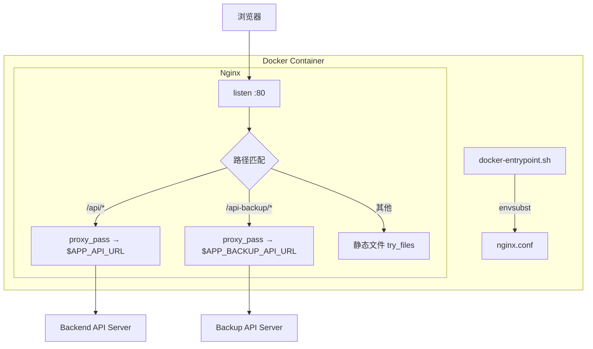

# 设计文档：Nginx API 反向代理

## 概述

本设计为现有 Vue 3 + Vite 项目添加 Nginx 反向代理层，使生产环境中前端通过相对路径 `/api/` 和 `/api-backup/` 访问主备后端服务，替代当前的跨域直连方式。同时移除现有的 `{scheme}`、`{domain}`、`{ip}` 占位符替换机制，简化前端环境配置和 Docker 启动流程。

### 当前架构

```
浏览器 → Nginx (静态文件) → dist/
浏览器 → api.{domain}     (跨域直连后端 API，通过 ReplaceURL 占位符替换)
```

### 目标架构

```
浏览器 → Nginx → /api/*        → proxy_pass → Backend_API
              → /api-backup/*  → proxy_pass → Backup_API
              → /*             → 静态文件 (dist/)
```

### 设计决策

1. **相对路径 vs 绝对路径**：生产环境使用相对路径 `/api`、`/api-backup`，开发环境直接写死完整 URL。理由：相对路径消除跨域问题，简化 CORS 配置，且与 Nginx 反向代理天然配合。
2. **路径剥离（strip prefix）**：Nginx 转发时移除 `/api/` 和 `/api-backup/` 前缀。理由：后端 API 路由不需要感知代理前缀，保持后端零改动。
3. **移除占位符机制**：不再使用 `ReplaceURL`、`ReplaceIP`、`GetIP` 等函数处理 `{scheme}`、`{domain}`、`{ip}` 占位符。理由：生产环境使用相对路径后不再需要动态拼接 URL，开发环境直接在 `.env.development` 中写死完整 URL，大幅简化代码和部署流程。
4. **环境变量注入方式**：使用 `envsubst` 模板方案替代 sed 替换 JS 文件。理由：更可靠、更安全，不会意外修改构建产物。
6. **保留 failover 机制**：前端 `createFailoverAxios` 的主备切换逻辑在反向代理模式下仍然有效——`backup_api` 配置为 `/api-backup`。
7. **docker-compose.prod.yml**：提供生产部署编排文件，包含环境变量、端口映射和健康检查。

## 架构



### 请求流转

1. 浏览器发送 `GET /api/v1/users` 请求
2. Nginx 匹配 `location /api/` 规则
3. Nginx 剥离 `/api` 前缀，将请求转发为 `GET /v1/users` 到 `$APP_API_URL`
4. 后端返回响应，Nginx 透传给浏览器

备用 API 流程相同，路径为 `/api-backup/`，转发到 `$APP_BACKUP_API_URL`。

### 启动流程

```mermaid
sequenceDiagram
    participant Docker as Docker Engine
    participant Entry as docker-entrypoint.sh
    participant Nginx as Nginx

    Docker->>Entry: 启动容器
    Entry->>Entry: 读取 APP_API_URL / APP_BACKUP_API_URL
    Entry->>Entry: envsubst 生成 nginx.conf（注入 upstream 地址）
    Entry->>Entry: 注入 window.__API_URL__ 等全局变量到 index.html（可选，兼容 failover）
    Entry->>Nginx: exec nginx -g 'daemon off;'
```

## 组件与接口

### 1. nginx.conf.template — Nginx 配置模板

在现有 `server` 块中新增两个 `location` 块，使用 `envsubst` 变量：

```nginx
# 在 server 块顶部定义 upstream 变量
set $backend_api "${APP_API_URL}";
set $backup_api "${APP_BACKUP_API_URL}";

# ============ 反向代理 - 主 API ============
location /api/ {
    proxy_pass $backend_api/;    # 尾部斜杠实现路径剥离
    proxy_set_header Host $host;
    proxy_set_header X-Real-IP $remote_addr;
    proxy_set_header X-Forwarded-For $proxy_add_x_forwarded_for;
    proxy_set_header X-Forwarded-Proto $scheme;

    # GEEK_ 自定义请求头
    proxy_set_header X-GEEK-Proxy "true";
    proxy_set_header X-GEEK-Real-IP $remote_addr;
    proxy_set_header X-GEEK-Source "nginx";

    # WebSocket 支持
    proxy_http_version 1.1;
    proxy_set_header Upgrade $http_upgrade;
    proxy_set_header Connection "upgrade";

    # 超时配置
    proxy_connect_timeout 60s;
    proxy_read_timeout 120s;
    proxy_send_timeout 120s;

    # 请求体大小
    client_max_body_size 50m;
}

# ============ 反向代理 - 备用 API ============
location /api-backup/ {
    proxy_pass $backup_api/;
    proxy_set_header Host $host;
    proxy_set_header X-Real-IP $remote_addr;
    proxy_set_header X-Forwarded-For $proxy_add_x_forwarded_for;
    proxy_set_header X-Forwarded-Proto $scheme;

    # GEEK_ 自定义请求头
    proxy_set_header X-GEEK-Proxy "true";
    proxy_set_header X-GEEK-Real-IP $remote_addr;
    proxy_set_header X-GEEK-Source "nginx";

    # WebSocket 支持
    proxy_http_version 1.1;
    proxy_set_header Upgrade $http_upgrade;
    proxy_set_header Connection "upgrade";

    # 超时配置
    proxy_connect_timeout 60s;
    proxy_read_timeout 120s;
    proxy_send_timeout 120s;

    client_max_body_size 50m;
}
```

**关键点**：
- 使用 `envsubst` 变量 `${APP_API_URL}` 和 `${APP_BACKUP_API_URL}`，在容器启动时替换为实际地址
- `proxy_pass` 尾部斜杠实现路径前缀自动剥离
- 所有代理 location 块统一添加三个 `X-GEEK-*` 请求头

### 2. docker-entrypoint.sh — 简化启动脚本

移除旧的 sed 替换 JS 占位符逻辑，改为纯 `envsubst` 方案：

```bash
#!/bin/sh

# 1. 使用 envsubst 将环境变量注入 Nginx 配置模板
envsubst '${APP_API_URL} ${APP_BACKUP_API_URL}' \
  < /etc/nginx/conf.d/default.conf.template \
  > /etc/nginx/conf.d/default.conf

echo "Nginx config generated with:"
echo "  APP_API_URL=${APP_API_URL}"
echo "  APP_BACKUP_API_URL=${APP_BACKUP_API_URL}"

# 2. 注入全局变量到 index.html（用于 failover 等场景）
INJECT="<script>"
[ -n "$APP_API_URL" ] && INJECT="${INJECT}window.__API_URL__='${APP_API_URL}';"
[ -n "$APP_BACKUP_API_URL" ] && INJECT="${INJECT}window.__BACKUP_API_URL__='${APP_BACKUP_API_URL}';"
[ -n "$APP_DOMAIN_INFO_API_URL" ] && INJECT="${INJECT}window.__DOMAIN_INFO_API_URL__='${APP_DOMAIN_INFO_API_URL}';"
[ -n "$APP_BACKUP_DOMAIN_INFO_API_URL" ] && INJECT="${INJECT}window.__BACKUP_DOMAIN_INFO_API_URL__='${APP_BACKUP_DOMAIN_INFO_API_URL}';"
INJECT="${INJECT}</script>"

if [ "$INJECT" != "<script></script>" ]; then
  sed -i "s|<head>|<head>${INJECT}|" /usr/share/nginx/html/index.html
  echo "Injected global variables into index.html"
fi

# 3. 启动 nginx
exec nginx -g 'daemon off;'
```

**变更要点**：
- 移除 `sed` 替换 JS 文件中 `{scheme}//api.{domain}` 等占位符的逻辑
- 移除 `APP_AUTH_API` 相关替换
- 新增 `envsubst` 生成 Nginx 配置
- 保留 `window.__*` 全局变量注入（用于 failover 场景）

### 3. environment.ts — 前端环境适配（移除占位符）

移除 `ReplaceURL`、`ReplaceIP`、`GetIP` 的使用，生产环境直接返回相对路径：

```typescript
// 不再 import { GetIP, ReplaceIP, ReplaceURL } from "./utils/helper"

const environment = {
  api: import.meta.env.DEV
    ? (import.meta.env.VITE_APP_API_URL || "")
    : "/api",
  backup_api: import.meta.env.DEV
    ? (import.meta.env.VITE_APP_BACKUP_API_URL || "")
    : "/api-backup",
  doc: import.meta.env.VITE_APP_DOC_API || "",
  blockly: import.meta.env.VITE_APP_BLOCKLY_URL || "",
  editor: import.meta.env.VITE_APP_EDITOR_URL || "",
  domain_info: import.meta.env.DEV
    ? (import.meta.env.VITE_APP_DOMAIN_INFO_API_URL || "")
    : (window.__DOMAIN_INFO_API_URL__ || import.meta.env.VITE_APP_DOMAIN_INFO_API_URL || ""),
  domain_info_backup: import.meta.env.DEV
    ? (import.meta.env.VITE_APP_BACKUP_DOMAIN_INFO_API_URL || "")
    : (window.__BACKUP_DOMAIN_INFO_API_URL__ || import.meta.env.VITE_APP_BACKUP_DOMAIN_INFO_API_URL || ""),
  version: 1,
  subtitle: () => "支持Rokid设备",
  useCloud: () => import.meta.env.VITE_APP_BASE_MODE !== "local",
  local: () => import.meta.env.VITE_APP_BASE_MODE === "local",
};

export default environment;
```

**变更要点**：
- 移除 `GetIP`、`ReplaceURL`、`ReplaceIP` 的导入和使用
- 移除 `ip` 属性和 `replaceIP` 方法
- 移除 `auth_api` 属性（不再做 auth 代理）
- 生产环境 `api` → `"/api"`，`backup_api` → `"/api-backup"`
- 开发环境直接使用 Vite 环境变量中的完整 URL

### 4. Dockerfile 变更

三个 Dockerfile 均需更新：

| Dockerfile | 变更 |
|---|---|
| `Dockerfile`（根目录） | 复制 `nginx.conf` 为 `.template` 文件，entrypoint 中通过 envsubst 生成最终配置 |
| `docker/production/Dockerfile` | 增加 entrypoint 支持，复制模板文件 |
| `docker/staging/Dockerfile` | 增加 entrypoint 支持，复制模板文件 |

### 5. docker-compose.prod.yml — 生产部署编排

```yaml
services:
  web:
    build:
      context: .
      dockerfile: Dockerfile
    container_name: vue3-prod
    ports:
      - "80:80"
    environment:
      - APP_API_URL=https://api.xrteeth.com
      - APP_BACKUP_API_URL=https://api.tmrpp.com
      - APP_DOMAIN_INFO_API_URL=https://domain.xrteeth.com
      - APP_BACKUP_DOMAIN_INFO_API_URL=https://domain.tmrpp.com
    restart: unless-stopped
    healthcheck:
      test: ["CMD", "curl", "-f", "http://localhost/"]
      interval: 30s
      timeout: 10s
      retries: 3
      start_period: 10s
```

### 6. .env.production — 简化生产环境变量

移除占位符格式的环境变量：

```dotenv
# 生产环境不再需要 {scheme}//api.{domain} 格式
# API 地址由 Nginx 反向代理处理，前端使用相对路径
VITE_APP_API_URL="/api"
VITE_APP_BACKUP_API_URL="/api-backup"
```

## 数据模型

本功能不涉及新的数据模型。主要变更为配置文件和环境变量：

### 环境变量（Docker 运行时）

| 变量名 | 用途 | 示例值 | 必填 |
|---|---|---|---|
| `APP_API_URL` | Backend API upstream 地址 | `https://api.xrteeth.com` | 是 |
| `APP_BACKUP_API_URL` | Backup API upstream 地址 | `https://api.tmrpp.com` | 是 |
| `APP_DOMAIN_INFO_API_URL` | 域名信息 API 地址 | `https://domain.xrteeth.com` | 否 |
| `APP_BACKUP_DOMAIN_INFO_API_URL` | 备用域名信息 API 地址 | `https://domain.tmrpp.com` | 否 |

### Nginx 变量（由 envsubst 注入）

| 变量 | 来源 | 说明 |
|---|---|---|
| `$backend_api` | `APP_API_URL` 经 envsubst 注入 | 主 API 代理目标地址 |
| `$backup_api` | `APP_BACKUP_API_URL` 经 envsubst 注入 | 备用 API 代理目标地址 |

### GEEK_ 自定义请求头

| 请求头 | 值 | 说明 |
|---|---|---|
| `X-GEEK-Proxy` | `true` | 标识请求经过 Nginx 反向代理 |
| `X-GEEK-Real-IP` | `$remote_addr` | 客户端真实 IP 地址 |
| `X-GEEK-Source` | `nginx` | 标识请求来源为 Nginx |


## 正确性属性

*属性（Property）是指在系统所有合法执行中都应成立的特征或行为——本质上是对系统行为的形式化陈述。属性是人类可读规格说明与机器可验证正确性保证之间的桥梁。*

### 属性 1：代理路由正确性

*对于任意*代理路径前缀（`/api/` 或 `/api-backup/`）及其对应的 upstream 环境变量值，经 envsubst 生成的 Nginx 配置应将匹配该前缀的请求路由到对应的 upstream 服务器。

**验证需求：1.1, 1.2**

### 属性 2：路径前缀剥离

*对于任意*经过代理的请求路径 `/api/X` 或 `/api-backup/X`（其中 X 为任意合法 URL 路径段），后端接收到的路径应为 `/X`（即前缀被正确移除）。

**验证需求：1.3**

### 属性 3：GEEK 自定义请求头完整性

*对于任意*代理 location 块（`/api/` 和 `/api-backup/`），该 location 块中应同时包含 `X-GEEK-Proxy`、`X-GEEK-Real-IP` 和 `X-GEEK-Source` 三个自定义请求头的 `proxy_set_header` 指令。

**验证需求：1.6, 1.7, 1.8**

### 属性 4：模板替换往返一致性

*对于任意*合法的 URL 字符串对 `(api_url, backup_api_url)`，将其作为环境变量 `APP_API_URL` 和 `APP_BACKUP_API_URL` 传入 `envsubst` 处理 nginx 配置模板后，生成的配置文件中应包含这两个 URL 作为对应 `proxy_pass` 的目标地址。

**验证需求：2.1, 2.2, 2.3**

### 属性 5：环境感知 URL 选择

*对于任意*运行环境模式（开发/生产），`environment.ts` 模块的 `api` 和 `backup_api` 属性应返回正确格式的基础路径：生产环境返回相对路径（`/api` 和 `/api-backup`），开发环境返回 Vite 环境变量中配置的完整 URL。

**验证需求：3.1, 3.2, 3.3, 3.5**

### 属性 6：静态文件回退

*对于任意*不以 `/api/` 或 `/api-backup/` 开头的请求路径，Nginx 应按照现有逻辑提供静态文件服务（通过 `try_files` 回退到 `index.html`）。

**验证需求：7.4**

## 错误处理

### Nginx 层错误处理

| 错误场景 | 处理方式 |
|---|---|
| 后端返回 502/503/504 | 返回 JSON 格式错误响应 `{"error": "Service Unavailable", "status": 502}` |
| 代理连接超时（60s） | Nginx 返回 504 Gateway Timeout |
| 代理读取超时（120s） | Nginx 返回 504 Gateway Timeout |
| 请求体超过 50MB | Nginx 返回 413 Request Entity Too Large |
| upstream 地址无法解析 | Nginx 返回 502 Bad Gateway；日志记录 DNS 解析失败 |

### 前端层错误处理

现有的 `failover.ts` 机制继续生效：
- 当 Nginx 代理的主 API 不可达时，`createFailoverAxios` 自动切换到 `backup_api`（即 `/api-backup`）
- 主备切换对业务代码透明，无需额外处理

### 启动脚本错误处理

| 错误场景 | 处理方式 |
|---|---|
| `APP_API_URL` 未设置 | envsubst 输出空值，Nginx 启动可能失败，日志提示配置错误 |
| `envsubst` 执行失败 | 脚本退出，容器启动失败，便于运维排查 |
| 模板文件不存在 | 脚本报错退出，容器启动失败 |

## 测试策略

### 双重测试方法

本功能采用单元测试 + 属性测试的双重策略：

- **单元测试**：验证具体示例、边界情况和静态配置正确性
- **属性测试**：验证跨所有输入的通用属性

### 属性测试

使用 `fast-check` 库（项目已使用 Vitest，fast-check 与之集成良好）。

每个属性测试至少运行 100 次迭代，并通过注释标注对应的设计属性：

```typescript
// Feature: nginx-api-proxy, Property 5: 环境感知 URL 选择
test.prop([fc.boolean()], (isProd) => {
  // 对于任意环境模式，api 和 backup_api 属性应返回正确格式
});
```

每个正确性属性由单个属性测试实现。属性测试与单元测试互补：属性测试覆盖通用规则，单元测试覆盖具体配置值和边界情况。

### 单元测试覆盖

| 测试类别 | 测试内容 | 对应需求 |
|---|---|---|
| Nginx 标准头 | 验证 proxy_set_header 包含 X-Real-IP、X-Forwarded-For、X-Forwarded-Proto、Host | 1.4, 1.5 |
| GEEK 请求头 | 验证所有代理 location 包含 X-GEEK-Proxy、X-GEEK-Real-IP、X-GEEK-Source | 1.6, 1.7, 1.8 |
| WebSocket 配置 | 验证 Upgrade/Connection 头设置、超时 ≥ 60s | 4.1, 4.2 |
| 超时配置 | 验证 connect=60s, read=120s, send=120s | 5.1, 5.2, 5.3 |
| 请求体限制 | 验证 client_max_body_size ≥ 50m | 5.5 |
| 错误响应 | 验证 502/503/504 返回自定义 JSON 错误 | 5.4 |
| Gzip 保留 | 验证 gzip 相关指令存在 | 7.1 |
| 缓存策略保留 | 验证 JS/CSS/字体/图片缓存 location 块存在 | 7.2 |
| SPA 回退 | 验证 try_files 指令存在 | 7.3 |
| Dockerfile 完整性 | 验证三个 Dockerfile 均包含 nginx.conf COPY 和 entrypoint 指令 | 6.1, 6.2, 6.3 |
| docker-compose | 验证 docker-compose.prod.yml 包含环境变量、端口映射、健康检查 | 6.5, 6.6, 6.7 |
| 占位符移除 | 验证 environment.ts 不再导入 ReplaceURL/GetIP/ReplaceIP | 3.4 |
| entrypoint 简化 | 验证 docker-entrypoint.sh 不包含 {scheme}、{domain} 的 sed 替换 | 3.7 |

### 属性测试映射

| 属性 | 测试标签 | 最少迭代 |
|---|---|---|
| 属性 1：代理路由正确性 | `Feature: nginx-api-proxy, Property 1: 代理路由正确性` | 100 |
| 属性 2：路径前缀剥离 | `Feature: nginx-api-proxy, Property 2: 路径前缀剥离` | 100 |
| 属性 3：GEEK 自定义请求头完整性 | `Feature: nginx-api-proxy, Property 3: GEEK 自定义请求头完整性` | 100 |
| 属性 4：模板替换往返一致性 | `Feature: nginx-api-proxy, Property 4: 模板替换往返一致性` | 100 |
| 属性 5：环境感知 URL 选择 | `Feature: nginx-api-proxy, Property 5: 环境感知 URL 选择` | 100 |
| 属性 6：静态文件回退 | `Feature: nginx-api-proxy, Property 6: 静态文件回退` | 100 |
