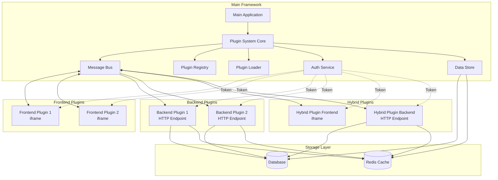
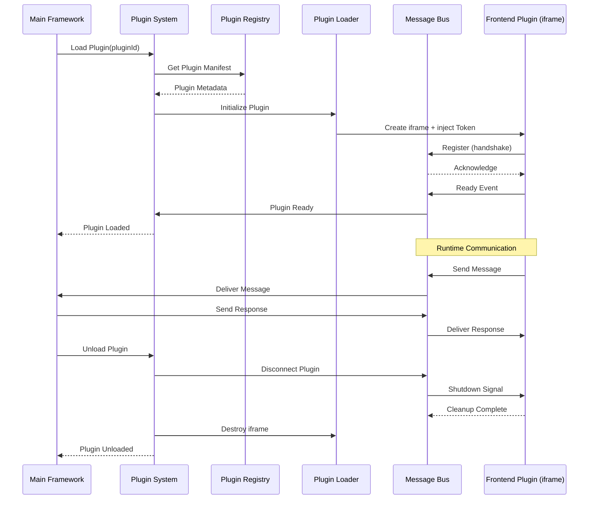
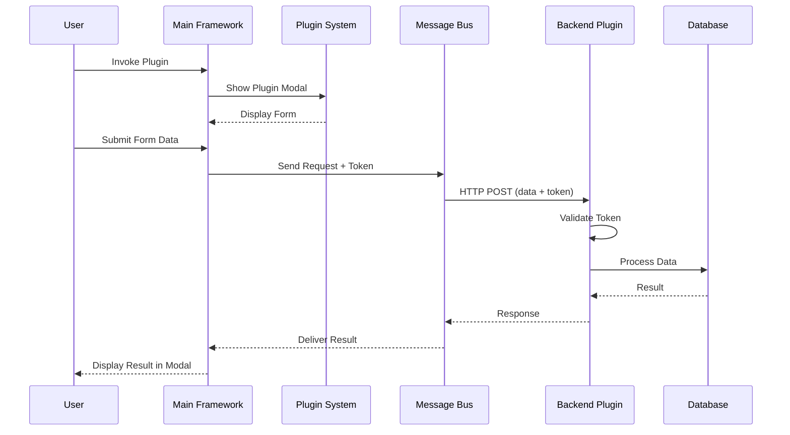
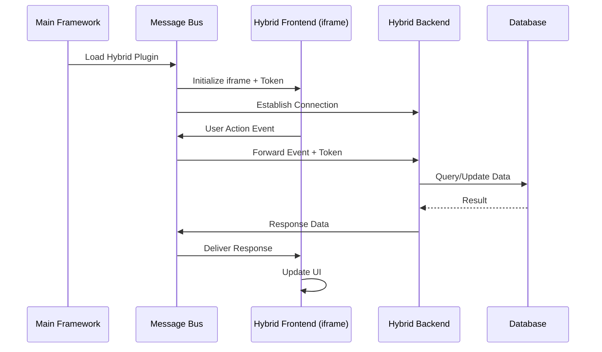
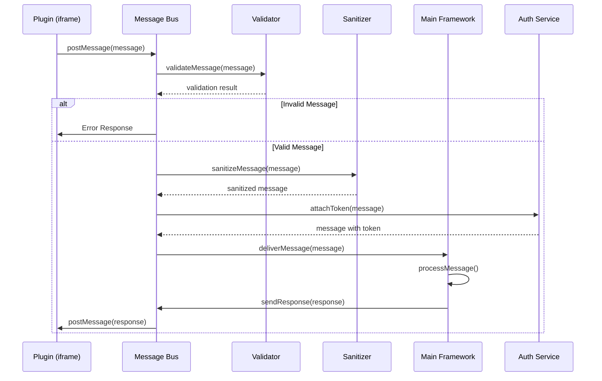
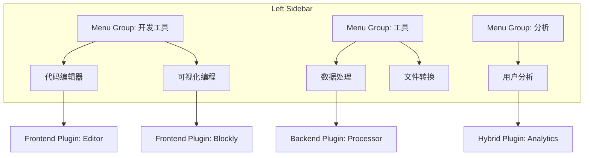

# Plugin System Design Document

## Overview

### Purpose

本设计文档描述了一个可扩展的插件化架构系统，旨在通过解耦合的插件体系保持主框架的整洁性。系统支持三种插件类型，遵循 KISS 原则和 Unix 设计哲学，提供统一的通信机制和安全隔离。

### Design Principles

1. **KISS (Keep It Simple, Stupid)**: 保持架构简洁，避免过度设计
2. **Unix Philosophy**:
   - 每个组件做好一件事
   - 组件间通过明确的接口通信
   - 使用文本/JSON 作为通用数据格式
3. **Separation of Concerns**: 插件与主框架解耦，通过消息总线通信
4. **Security by Default**: 默认隔离，最小权限原则
5. **Type Safety**: 全面使用 TypeScript，避免 any 类型

### System Context

插件系统运行在 Vue 3 应用中，使用以下技术栈：
- **Frontend**: Vue 3 + TypeScript + Vite + Pinia
- **Communication**: PostMessage API (iframe) + HTTP/WebSocket (backend)
- **Authentication**: Token-based authentication
- **Data Storage**: Backend database + cache (Redis)

## Architecture

### High-Level Architecture



### Component Interaction Flow

#### Frontend Plugin Lifecycle



#### Backend Plugin Invocation



#### Hybrid Plugin Communication



### Directory Structure

```
src/
├── plugins/                          # 现有插件系统（Vue插件）
│   ├── index.ts
│   └── permission.ts
├── plugin-system/                    # 新的插件化架构系统
│   ├── core/
│   │   ├── PluginSystem.ts          # 插件系统核心
│   │   ├── MessageBus.ts            # 消息总线
│   │   ├── PluginRegistry.ts        # 插件注册表
│   │   ├── PluginLoader.ts          # 插件加载器
│   │   └── PluginSandbox.ts         # 沙箱管理器
│   ├── types/
│   │   ├── plugin.ts                # 插件相关类型定义
│   │   ├── manifest.ts              # 清单类型定义
│   │   ├── message.ts               # 消息类型定义
│   │   └── state.ts                 # 状态类型定义
│   ├── services/
│   │   ├── AuthService.ts           # 认证服务
│   │   ├── DataStoreService.ts      # 数据存储服务
│   │   └── MonitoringService.ts     # 监控服务
│   ├── utils/
│   │   ├── validator.ts             # 验证工具
│   │   ├── security.ts              # 安全工具
│   │   └── logger.ts                # 日志工具
│   ├── plugins/                     # 插件实例目录
│   │   ├── frontend/                # 前端插件
│   │   │   ├── editor/
│   │   │   │   ├── manifest.json
│   │   │   │   ├── index.html
│   │   │   │   └── main.ts
│   │   │   └── blockly/
│   │   │       ├── manifest.json
│   │   │       ├── index.html
│   │   │       └── main.ts
│   │   ├── backend/                 # 后端插件（前端部分）
│   │   │   └── data-processor/
│   │   │       ├── manifest.json
│   │   │       └── form.vue
│   │   └── hybrid/                  # 混合插件
│   │       └── analytics/
│   │           ├── manifest.json
│   │           ├── frontend/
│   │           │   ├── index.html
│   │           │   └── main.ts
│   │           └── form.vue
│   └── index.ts                     # 插件系统入口
├── api/
│   └── plugins/                     # 插件相关API
│       ├── registry.ts              # 注册表API
│       ├── backend-plugins.ts       # 后端插件API
│       └── data-store.ts            # 数据存储API
└── store/
    └── modules/
        └── plugin-system.ts         # 插件系统状态管理
```

### Plugin Types Implementation

#### 1. Frontend Plugin (纯前端插件)

**特点**:
- 完全运行在浏览器端
- 通过 iframe 隔离
- 使用 PostMessage API 通信
- 适用于独立的前端功能（如编辑器、可视化工具）

**实现机制**:
```typescript
// iframe 创建和初始化
const iframe = document.createElement('iframe');
iframe.src = pluginManifest.entryPoint;
iframe.sandbox = 'allow-scripts allow-same-origin';
iframe.setAttribute('csp', "default-src 'self'; script-src 'self' 'unsafe-inline'");

// Token 注入
iframe.addEventListener('load', () => {
  iframe.contentWindow?.postMessage({
    type: 'INIT',
    token: authService.getToken(),
    config: pluginManifest.config
  }, pluginManifest.origin);
});

// 消息通信
window.addEventListener('message', (event) => {
  if (event.origin === pluginManifest.origin) {
    messageBus.handlePluginMessage(pluginId, event.data);
  }
});
```

#### 2. Backend Plugin (纯后端插件)

**特点**:
- 前端仅提供简单的表单界面（Modal）
- 主要逻辑在后端处理
- 通过 HTTP/WebSocket 通信
- 适用于数据处理、复杂计算等场景

**实现机制**:
```typescript
// 前端：显示表单并提交
const showBackendPlugin = async (pluginId: string) => {
  const manifest = await pluginRegistry.getManifest(pluginId);
  const formComponent = await import(manifest.formComponent);

  // 显示 Modal
  const result = await showModal({
    component: formComponent,
    onSubmit: async (formData) => {
      // 提交到后端
      const response = await fetch(manifest.backendEndpoint, {
        method: 'POST',
        headers: {
          'Authorization': `Bearer ${authService.getToken()}`,
          'Content-Type': 'application/json'
        },
        body: JSON.stringify(formData)
      });
      return response.json();
    }
  });

  return result;
};
```

#### 3. Hybrid Plugin (混合插件)

**特点**:
- 同时包含前端界面和后端逻辑
- 前端通过 iframe 运行
- 前端与后端通过 Message Bus 中转通信
- 适用于需要复杂交互和数据处理的场景

**实现机制**:
```typescript
// 前端 iframe 与后端通信
// Frontend (in iframe)
window.parent.postMessage({
  type: 'BACKEND_REQUEST',
  pluginId: 'analytics',
  action: 'fetchData',
  payload: { query: 'user-stats' }
}, '*');

// Message Bus 中转
messageBus.on('BACKEND_REQUEST', async (message) => {
  const response = await fetch(message.backendEndpoint, {
    method: 'POST',
    headers: {
      'Authorization': `Bearer ${authService.getToken()}`,
      'Content-Type': 'application/json'
    },
    body: JSON.stringify({
      action: message.action,
      payload: message.payload
    })
  });

  const result = await response.json();

  // 返回给前端 iframe
  iframe.contentWindow?.postMessage({
    type: 'BACKEND_RESPONSE',
    requestId: message.requestId,
    result
  }, message.origin);
});
```


## Components and Interfaces

### 1. PluginSystem (插件系统核心)

**职责**:
- 统一管理所有插件的生命周期
- 协调各个子组件的工作
- 提供插件系统的公共 API

**接口定义**:
```typescript
interface IPluginSystem {
  // 初始化插件系统
  initialize(config: PluginSystemConfig): Promise<void>;

  // 注册插件
  registerPlugin(manifest: PluginManifest): Promise<void>;

  // 注销插件
  unregisterPlugin(pluginId: string): Promise<void>;

  // 加载插件
  loadPlugin(pluginId: string): Promise<void>;

  // 卸载插件
  unloadPlugin(pluginId: string): Promise<void>;

  // 激活插件
  activatePlugin(pluginId: string): Promise<void>;

  // 暂停插件
  suspendPlugin(pluginId: string): Promise<void>;

  // 获取插件状态
  getPluginState(pluginId: string): PluginState;

  // 获取所有插件
  getAllPlugins(): PluginMetadata[];

  // 查询插件
  queryPlugins(filter: PluginFilter): PluginMetadata[];

  // 销毁插件系统
  destroy(): Promise<void>;
}

interface PluginSystemConfig {
  // 是否启用开发模式
  devMode: boolean;

  // 插件目录路径
  pluginBasePath: string;

  // 最大并发插件数
  maxConcurrentPlugins: number;

  // 插件初始化超时时间（毫秒）
  initTimeout: number;

  // 是否启用沙箱
  enableSandbox: boolean;

  // CSP 策略
  cspPolicy: string;

  // 监控配置
  monitoring: {
    enabled: boolean;
    logRetentionDays: number;
    errorRateThreshold: number;
  };
}
```

### 2. MessageBus (消息总线)

**职责**:
- 处理插件与主框架之间的所有消息通信
- 验证和清理消息内容
- 路由消息到正确的目标
- 支持发布-订阅模式

**接口定义**:
```typescript
interface IMessageBus {
  // 发送消息到插件
  sendToPlugin(pluginId: string, message: Message): Promise<void>;

  // 发送消息到主框架
  sendToFramework(message: Message): Promise<void>;

  // 广播消息到所有插件
  broadcast(message: Message, excludePlugins?: string[]): Promise<void>;

  // 订阅消息类型
  subscribe(messageType: string, handler: MessageHandler): Unsubscribe;

  // 取消订阅
  unsubscribe(messageType: string, handler: MessageHandler): void;

  // 注册插件连接
  registerPlugin(pluginId: string, connection: PluginConnection): void;

  // 注销插件连接
  unregisterPlugin(pluginId: string): void;

  // 验证消息
  validateMessage(message: Message): boolean;

  // 清理消息内容（防止 XSS）
  sanitizeMessage(message: Message): Message;
}

interface PluginConnection {
  type: 'iframe' | 'http' | 'websocket';
  origin?: string;
  endpoint?: string;
  iframe?: HTMLIFrameElement;
  websocket?: WebSocket;
}

type MessageHandler = (message: Message) => void | Promise<void>;
type Unsubscribe = () => void;
```

### 3. PluginRegistry (插件注册表)

**职责**:
- 存储和管理所有已注册插件的元数据
- 提供插件查询和过滤功能
- 验证插件清单格式
- 管理插件版本

**接口定义**:
```typescript
interface IPluginRegistry {
  // 注册插件
  register(manifest: PluginManifest): Promise<void>;

  // 注销插件
  unregister(pluginId: string): Promise<void>;

  // 获取插件清单
  getManifest(pluginId: string): Promise<PluginManifest | null>;

  // 获取插件元数据
  getMetadata(pluginId: string): Promise<PluginMetadata | null>;

  // 查询插件
  query(filter: PluginFilter): Promise<PluginMetadata[]>;

  // 检查插件是否存在
  exists(pluginId: string): Promise<boolean>;

  // 验证清单格式
  validateManifest(manifest: PluginManifest): ValidationResult;

  // 检查版本兼容性
  checkCompatibility(pluginId: string, frameworkVersion: string): boolean;

  // 获取所有插件
  getAll(): Promise<PluginMetadata[]>;

  // 更新插件元数据
  updateMetadata(pluginId: string, metadata: Partial<PluginMetadata>): Promise<void>;
}

interface PluginFilter {
  type?: PluginType;
  name?: string;
  capability?: string;
  version?: string;
  author?: string;
  tags?: string[];
}

interface ValidationResult {
  valid: boolean;
  errors: ValidationError[];
}

interface ValidationError {
  field: string;
  message: string;
  code: string;
}
```

### 4. PluginLoader (插件加载器)

**职责**:
- 负责加载和初始化插件
- 创建插件运行环境（iframe、HTTP 连接等）
- 注入必要的依赖（Token、配置等）
- 处理插件资源的懒加载

**接口定义**:
```typescript
interface IPluginLoader {
  // 加载插件
  load(pluginId: string, manifest: PluginManifest): Promise<LoadedPlugin>;

  // 卸载插件
  unload(pluginId: string): Promise<void>;

  // 重新加载插件
  reload(pluginId: string): Promise<LoadedPlugin>;

  // 预加载插件资源
  preload(pluginId: string): Promise<void>;

  // 获取已加载的插件
  getLoaded(pluginId: string): LoadedPlugin | null;

  // 检查插件是否已加载
  isLoaded(pluginId: string): boolean;
}

interface LoadedPlugin {
  pluginId: string;
  type: PluginType;
  instance: PluginInstance;
  connection: PluginConnection;
  loadTime: number;
  state: PluginState;
}

interface PluginInstance {
  // Frontend Plugin: iframe element
  iframe?: HTMLIFrameElement;

  // Backend Plugin: endpoint URL
  endpoint?: string;

  // Hybrid Plugin: both
  frontend?: HTMLIFrameElement;
  backend?: string;

  // 插件配置
  config: Record<string, unknown>;

  // 插件上下文
  context: PluginContext;
}

interface PluginContext {
  pluginId: string;
  token: string;
  config: Record<string, unknown>;
  messageBus: IMessageBus;
  dataStore: IDataStore;
}
```

### 5. PluginSandbox (沙箱管理器)

**职责**:
- 为前端插件创建隔离的运行环境
- 限制插件的资源访问
- 监控插件的资源使用情况
- 强制执行安全策略

**接口定义**:
```typescript
interface IPluginSandbox {
  // 创建沙箱环境
  createSandbox(pluginId: string, config: SandboxConfig): Sandbox;

  // 销毁沙箱
  destroySandbox(pluginId: string): void;

  // 获取沙箱
  getSandbox(pluginId: string): Sandbox | null;

  // 执行代码在沙箱中
  executeInSandbox(pluginId: string, code: string): Promise<unknown>;

  // 监控资源使用
  monitorResources(pluginId: string): ResourceUsage;

  // 设置资源限制
  setResourceLimits(pluginId: string, limits: ResourceLimits): void;
}

interface SandboxConfig {
  // 允许的 DOM API
  allowedAPIs: string[];

  // CSP 策略
  csp: string;

  // 资源限制
  resourceLimits: ResourceLimits;

  // 是否允许网络请求
  allowNetwork: boolean;

  // 允许的域名白名单
  allowedOrigins: string[];
}

interface Sandbox {
  pluginId: string;
  iframe: HTMLIFrameElement;
  config: SandboxConfig;
  createdAt: number;
  resourceUsage: ResourceUsage;
}

interface ResourceUsage {
  memory: number;        // MB
  cpu: number;           // percentage
  networkRequests: number;
  domNodes: number;
}

interface ResourceLimits {
  maxMemory: number;     // MB
  maxCPU: number;        // percentage
  maxNetworkRequests: number;
  maxDOMNodes: number;
  timeout: number;       // ms
}
```

### 6. AuthService (认证服务)

**职责**:
- 管理用户认证 Token
- 为插件提供 Token
- 自动刷新过期的 Token
- 验证 Token 有效性

**接口定义**:
```typescript
interface IAuthService {
  // 获取当前 Token
  getToken(): string | null;

  // 设置 Token
  setToken(token: string): void;

  // 刷新 Token
  refreshToken(): Promise<string>;

  // 验证 Token
  validateToken(token: string): Promise<boolean>;

  // 清除 Token
  clearToken(): void;

  // 监听 Token 变化
  onTokenChange(callback: (token: string | null) => void): Unsubscribe;

  // 检查 Token 是否过期
  isTokenExpired(token: string): boolean;
}
```

### 7. DataStoreService (数据存储服务)

**职责**:
- 为插件提供数据存储能力
- 管理插件间的数据共享
- 支持发布-订阅模式
- 数据命名空间隔离

**接口定义**:
```typescript
interface IDataStore {
  // 写入数据
  set(pluginId: string, key: string, value: unknown): Promise<void>;

  // 读取数据
  get(pluginId: string, key: string): Promise<unknown>;

  // 删除数据
  delete(pluginId: string, key: string): Promise<void>;

  // 检查键是否存在
  has(pluginId: string, key: string): Promise<boolean>;

  // 获取所有键
  keys(pluginId: string): Promise<string[]>;

  // 清空插件数据
  clear(pluginId: string): Promise<void>;

  // 订阅数据变化
  subscribe(pluginId: string, key: string, callback: DataChangeCallback): Unsubscribe;

  // 发布数据变化
  publish(pluginId: string, key: string, value: unknown): Promise<void>;

  // 跨插件数据共享
  share(fromPluginId: string, toPluginId: string, key: string): Promise<void>;
}

type DataChangeCallback = (key: string, value: unknown, oldValue: unknown) => void;
```

### 8. MonitoringService (监控服务)

**职责**:
- 收集插件运行指标
- 记录插件生命周期事件
- 监控错误率和性能
- 提供健康检查接口

**接口定义**:
```typescript
interface IMonitoringService {
  // 记录事件
  logEvent(event: PluginEvent): void;

  // 记录错误
  logError(pluginId: string, error: Error, context?: Record<string, unknown>): void;

  // 记录指标
  recordMetric(pluginId: string, metric: Metric): void;

  // 获取插件指标
  getMetrics(pluginId: string): PluginMetrics;

  // 获取所有插件健康状态
  getHealthStatus(): HealthStatus[];

  // 设置告警阈值
  setAlertThreshold(pluginId: string, threshold: AlertThreshold): void;

  // 订阅告警
  onAlert(callback: (alert: Alert) => void): Unsubscribe;
}

interface PluginEvent {
  pluginId: string;
  type: 'load' | 'activate' | 'suspend' | 'unload' | 'error';
  timestamp: number;
  details?: Record<string, unknown>;
}

interface Metric {
  name: string;
  value: number;
  unit: string;
  timestamp: number;
}

interface PluginMetrics {
  pluginId: string;
  uptime: number;
  errorRate: number;
  avgResponseTime: number;
  resourceUsage: ResourceUsage;
  requestCount: number;
}

interface HealthStatus {
  pluginId: string;
  status: 'healthy' | 'degraded' | 'unhealthy';
  lastCheck: number;
  issues: string[];
}

interface AlertThreshold {
  errorRate?: number;
  responseTime?: number;
  memoryUsage?: number;
  cpuUsage?: number;
}

interface Alert {
  pluginId: string;
  type: string;
  severity: 'info' | 'warning' | 'error' | 'critical';
  message: string;
  timestamp: number;
}
```


## Data Models

### PluginManifest (插件清单)

插件清单文件描述插件的所有元数据、配置和依赖关系。

```typescript
interface PluginManifest {
  // 必需字段
  name: string;                    // 插件名称（唯一标识符）
  version: string;                 // 语义化版本号 (major.minor.patch)
  type: PluginType;                // 插件类型
  entryPoint: string;              // 入口点（URL 或路径）
  permissions: Permission[];       // 所需权限列表

  // 可选字段
  displayName?: string;            // 显示名称
  description?: string;            // 插件描述
  author?: string;                 // 作者
  homepage?: string;               // 主页 URL
  repository?: string;             // 代码仓库 URL
  license?: string;                // 许可证
  icon?: string;                   // 图标 URL
  tags?: string[];                 // 标签

  // 依赖和兼容性
  dependencies?: PluginDependency[];     // 插件依赖
  frameworkVersion?: string;             // 兼容的框架版本范围

  // 配置
  config?: PluginConfig;                 // 插件配置
  configSchema?: JSONSchema;             // 配置验证模式

  // 类型特定字段
  frontend?: FrontendPluginConfig;       // 前端插件配置
  backend?: BackendPluginConfig;         // 后端插件配置
  hybrid?: HybridPluginConfig;           // 混合插件配置

  // 生命周期钩子
  lifecycle?: LifecycleHooks;

  // 能力声明
  capabilities?: string[];               // 插件提供的能力

  // 热重载支持
  hotReload?: boolean;
}

type PluginType = 'frontend' | 'backend' | 'hybrid';

interface Permission {
  name: string;                    // 权限名称
  description: string;             // 权限描述
  required: boolean;               // 是否必需
}

interface PluginDependency {
  name: string;                    // 依赖插件名称
  version: string;                 // 版本范围
  optional: boolean;               // 是否可选
}

interface PluginConfig {
  [key: string]: string | number | boolean | Record<string, unknown>;
}

interface JSONSchema {
  type: string;
  properties?: Record<string, unknown>;
  required?: string[];
  [key: string]: unknown;
}

interface FrontendPluginConfig {
  entryPoint: string;              // HTML 入口文件
  sandbox: SandboxConfig;          // 沙箱配置
  csp?: string;                    // 自定义 CSP 策略
  allowedOrigins?: string[];       // 允许的源
}

interface BackendPluginConfig {
  endpoint: string;                // 后端 API 端点
  method: 'GET' | 'POST' | 'PUT' | 'DELETE';
  formComponent?: string;          // 表单组件路径
  timeout?: number;                // 请求超时时间（毫秒）
}

interface HybridPluginConfig {
  frontend: FrontendPluginConfig;
  backend: BackendPluginConfig;
}

interface LifecycleHooks {
  onInit?: string;                 // 初始化钩子
  onActivate?: string;             // 激活钩子
  onSuspend?: string;              // 暂停钩子
  onDestroy?: string;              // 销毁钩子
  onError?: string;                // 错误处理钩子
}
```

### PluginMetadata (插件元数据)

运行时插件元数据，包含清单信息和运行状态。

```typescript
interface PluginMetadata {
  // 基本信息（来自清单）
  pluginId: string;
  name: string;
  displayName: string;
  version: string;
  type: PluginType;
  description: string;
  author: string;
  icon: string;
  tags: string[];

  // 状态信息
  state: PluginState;
  registeredAt: number;            // 注册时间戳
  lastActivated?: number;          // 最后激活时间
  lastError?: PluginError;         // 最后错误

  // 运行时信息
  isLoaded: boolean;
  isActive: boolean;
  loadTime?: number;               // 加载耗时（毫秒）

  // 统计信息
  activationCount: number;         // 激活次数
  errorCount: number;              // 错误次数

  // 能力和权限
  capabilities: string[];
  permissions: Permission[];

  // 依赖关系
  dependencies: string[];          // 依赖的插件 ID
  dependents: string[];            // 依赖此插件的插件 ID
}
```

### PluginState (插件状态)

```typescript
type PluginState =
  | 'unloaded'      // 未加载
  | 'loading'       // 加载中
  | 'active'        // 活跃
  | 'suspended'     // 暂停
  | 'unloading'     // 卸载中
  | 'failed';       // 失败

interface PluginStateTransition {
  from: PluginState;
  to: PluginState;
  timestamp: number;
  reason?: string;
}

interface PluginError {
  code: string;
  message: string;
  stack?: string;
  timestamp: number;
  context?: Record<string, unknown>;
}
```

### Message (消息格式)

插件与主框架之间通信的消息格式。

```typescript
interface Message {
  // 消息标识
  id: string;                      // 唯一消息 ID
  type: MessageType;               // 消息类型
  timestamp: number;               // 时间戳

  // 来源和目标
  source: MessageSource;           // 消息来源
  target: MessageTarget;           // 消息目标

  // 消息内容
  payload: MessagePayload;         // 消息负载

  // 元数据
  metadata?: MessageMetadata;      // 消息元数据

  // 响应相关
  requestId?: string;              // 关联的请求 ID（用于响应）
  expectResponse?: boolean;        // 是否期待响应
}

type MessageType =
  // 系统消息
  | 'SYSTEM_INIT'                  // 系统初始化
  | 'SYSTEM_READY'                 // 系统就绪
  | 'SYSTEM_SHUTDOWN'              // 系统关闭

  // 插件生命周期
  | 'PLUGIN_INIT'                  // 插件初始化
  | 'PLUGIN_READY'                 // 插件就绪
  | 'PLUGIN_ACTIVATE'              // 激活插件
  | 'PLUGIN_SUSPEND'               // 暂停插件
  | 'PLUGIN_DESTROY'               // 销毁插件

  // 数据操作
  | 'DATA_GET'                     // 获取数据
  | 'DATA_SET'                     // 设置数据
  | 'DATA_DELETE'                  // 删除数据
  | 'DATA_SUBSCRIBE'               // 订阅数据
  | 'DATA_CHANGE'                  // 数据变化通知

  // 通信
  | 'REQUEST'                      // 请求
  | 'RESPONSE'                     // 响应
  | 'EVENT'                        // 事件
  | 'BROADCAST'                    // 广播

  // 错误
  | 'ERROR';                       // 错误

interface MessageSource {
  type: 'framework' | 'plugin';
  pluginId?: string;               // 插件 ID（如果来自插件）
}

interface MessageTarget {
  type: 'framework' | 'plugin' | 'broadcast';
  pluginId?: string;               // 目标插件 ID
  excludePlugins?: string[];       // 广播时排除的插件
}

interface MessagePayload {
  action?: string;                 // 动作名称
  data?: unknown;                  // 数据
  error?: {
    code: string;
    message: string;
    details?: unknown;
  };
}

interface MessageMetadata {
  token?: string;                  // 认证 Token
  priority?: 'low' | 'normal' | 'high';
  ttl?: number;                    // 消息生存时间（毫秒）
  retryCount?: number;             // 重试次数
  [key: string]: unknown;
}
```

### Request/Response Pattern

```typescript
// 请求消息
interface RequestMessage extends Message {
  type: 'REQUEST';
  expectResponse: true;
  payload: {
    action: string;
    params?: Record<string, unknown>;
  };
}

// 响应消息
interface ResponseMessage extends Message {
  type: 'RESPONSE';
  requestId: string;               // 关联的请求 ID
  payload: {
    success: boolean;
    data?: unknown;
    error?: {
      code: string;
      message: string;
    };
  };
}

// 事件消息
interface EventMessage extends Message {
  type: 'EVENT';
  payload: {
    eventName: string;
    eventData?: unknown;
  };
}
```

### Plugin Communication Examples

```typescript
// 示例 1: 前端插件请求数据
const requestMessage: RequestMessage = {
  id: 'req-001',
  type: 'REQUEST',
  timestamp: Date.now(),
  source: { type: 'plugin', pluginId: 'editor' },
  target: { type: 'framework' },
  expectResponse: true,
  payload: {
    action: 'getData',
    params: { key: 'user-preferences' }
  },
  metadata: {
    token: 'eyJhbGciOiJIUzI1NiIsInR5cCI6IkpXVCJ9...'
  }
};

// 示例 2: 框架响应
const responseMessage: ResponseMessage = {
  id: 'res-001',
  type: 'RESPONSE',
  timestamp: Date.now(),
  source: { type: 'framework' },
  target: { type: 'plugin', pluginId: 'editor' },
  requestId: 'req-001',
  payload: {
    success: true,
    data: { theme: 'dark', fontSize: 14 }
  }
};

// 示例 3: 广播事件
const eventMessage: EventMessage = {
  id: 'evt-001',
  type: 'EVENT',
  timestamp: Date.now(),
  source: { type: 'framework' },
  target: { type: 'broadcast' },
  payload: {
    eventName: 'user-logged-out',
    eventData: { userId: '12345' }
  }
};
```


## Communication Protocol

### Message Flow Architecture



### Message Protocol Specification

#### 1. Handshake Protocol (插件初始化)

```typescript
// Step 1: Framework sends INIT message to plugin
const initMessage: Message = {
  id: generateId(),
  type: 'PLUGIN_INIT',
  timestamp: Date.now(),
  source: { type: 'framework' },
  target: { type: 'plugin', pluginId: 'editor' },
  payload: {
    data: {
      token: 'eyJhbGciOiJIUzI1NiIsInR5cCI6IkpXVCJ9...',
      config: { theme: 'dark', locale: 'zh-CN' },
      apiVersion: '1.0.0'
    }
  }
};

// Step 2: Plugin responds with READY message
const readyMessage: Message = {
  id: generateId(),
  type: 'PLUGIN_READY',
  timestamp: Date.now(),
  source: { type: 'plugin', pluginId: 'editor' },
  target: { type: 'framework' },
  requestId: initMessage.id,
  payload: {
    data: {
      status: 'ready',
      capabilities: ['edit', 'save', 'export'],
      version: '2.1.0'
    }
  }
};
```

#### 2. Request-Response Protocol

```typescript
// Request with timeout and retry
interface RequestOptions {
  timeout?: number;        // 默认 5000ms
  retries?: number;        // 默认 3 次
  priority?: 'low' | 'normal' | 'high';
}

// Framework provides request helper
async function sendRequest(
  action: string,
  params: Record<string, unknown>,
  options: RequestOptions = {}
): Promise<ResponseMessage> {
  const requestId = generateId();
  const timeout = options.timeout || 5000;
  const retries = options.retries || 3;

  const request: RequestMessage = {
    id: requestId,
    type: 'REQUEST',
    timestamp: Date.now(),
    source: { type: 'plugin', pluginId: currentPluginId },
    target: { type: 'framework' },
    expectResponse: true,
    payload: { action, params },
    metadata: { priority: options.priority || 'normal' }
  };

  return await sendWithRetry(request, timeout, retries);
}
```

#### 3. Event Broadcasting Protocol

```typescript
// Plugin subscribes to events
messageBus.subscribe('user-logged-out', (message: EventMessage) => {
  console.log('User logged out:', message.payload.eventData);
  // Handle logout in plugin
});

// Framework broadcasts event
messageBus.broadcast({
  id: generateId(),
  type: 'EVENT',
  timestamp: Date.now(),
  source: { type: 'framework' },
  target: { type: 'broadcast', excludePlugins: ['system-monitor'] },
  payload: {
    eventName: 'user-logged-out',
    eventData: { userId: '12345', reason: 'manual' }
  }
});
```

#### 4. Data Store Protocol

```typescript
// Set data
const setRequest: RequestMessage = {
  id: generateId(),
  type: 'DATA_SET',
  timestamp: Date.now(),
  source: { type: 'plugin', pluginId: 'editor' },
  target: { type: 'framework' },
  expectResponse: true,
  payload: {
    action: 'set',
    params: {
      key: 'document-draft',
      value: { content: 'Hello World', lastModified: Date.now() }
    }
  }
};

// Subscribe to data changes
const subscribeRequest: RequestMessage = {
  id: generateId(),
  type: 'DATA_SUBSCRIBE',
  timestamp: Date.now(),
  source: { type: 'plugin', pluginId: 'editor' },
  target: { type: 'framework' },
  expectResponse: true,
  payload: {
    action: 'subscribe',
    params: { key: 'document-draft' }
  }
};

// Receive data change notification
const changeNotification: EventMessage = {
  id: generateId(),
  type: 'DATA_CHANGE',
  timestamp: Date.now(),
  source: { type: 'framework' },
  target: { type: 'plugin', pluginId: 'editor' },
  payload: {
    eventName: 'data-changed',
    eventData: {
      key: 'document-draft',
      value: { content: 'Updated content', lastModified: Date.now() },
      oldValue: { content: 'Hello World', lastModified: Date.now() - 1000 }
    }
  }
};
```

### Token Management

#### Token Injection

```typescript
// 1. Frontend Plugin: Token injected via INIT message
window.addEventListener('message', (event) => {
  if (event.data.type === 'PLUGIN_INIT') {
    const token = event.data.payload.data.token;
    // Store token securely
    sessionStorage.setItem('plugin-token', token);
  }
});

// 2. Backend Plugin: Token in HTTP headers
fetch(backendEndpoint, {
  method: 'POST',
  headers: {
    'Authorization': `Bearer ${token}`,
    'Content-Type': 'application/json'
  },
  body: JSON.stringify(data)
});

// 3. Hybrid Plugin: Token passed through Message Bus
const backendRequest: RequestMessage = {
  id: generateId(),
  type: 'REQUEST',
  timestamp: Date.now(),
  source: { type: 'plugin', pluginId: 'analytics' },
  target: { type: 'framework' },
  expectResponse: true,
  payload: {
    action: 'backend-call',
    params: {
      endpoint: '/api/analytics/data',
      method: 'POST',
      data: { query: 'user-stats' }
    }
  },
  metadata: {
    token: sessionStorage.getItem('plugin-token')
  }
};
```

#### Token Refresh

```typescript
// Framework automatically refreshes tokens
class TokenManager {
  private refreshTimer: number | null = null;

  startAutoRefresh(token: string): void {
    const expiresIn = this.getTokenExpiry(token);
    const refreshTime = expiresIn - 5 * 60 * 1000; // 5 minutes before expiry

    this.refreshTimer = window.setTimeout(async () => {
      const newToken = await this.refreshToken();

      // Notify all active plugins
      messageBus.broadcast({
        id: generateId(),
        type: 'SYSTEM_INIT',
        timestamp: Date.now(),
        source: { type: 'framework' },
        target: { type: 'broadcast' },
        payload: {
          eventName: 'token-refreshed',
          eventData: { token: newToken }
        }
      });

      this.startAutoRefresh(newToken);
    }, refreshTime);
  }

  private async refreshToken(): Promise<string> {
    const response = await fetch('/api/auth/refresh', {
      method: 'POST',
      headers: {
        'Authorization': `Bearer ${this.currentToken}`
      }
    });
    const data = await response.json();
    return data.token;
  }
}
```

### Message Validation and Sanitization

```typescript
class MessageValidator {
  validate(message: Message): ValidationResult {
    const errors: ValidationError[] = [];

    // Required fields
    if (!message.id) errors.push({ field: 'id', message: 'Missing message ID', code: 'MISSING_ID' });
    if (!message.type) errors.push({ field: 'type', message: 'Missing message type', code: 'MISSING_TYPE' });
    if (!message.timestamp) errors.push({ field: 'timestamp', message: 'Missing timestamp', code: 'MISSING_TIMESTAMP' });
    if (!message.source) errors.push({ field: 'source', message: 'Missing source', code: 'MISSING_SOURCE' });
    if (!message.target) errors.push({ field: 'target', message: 'Missing target', code: 'MISSING_TARGET' });

    // Type validation
    if (message.type && !this.isValidMessageType(message.type)) {
      errors.push({ field: 'type', message: 'Invalid message type', code: 'INVALID_TYPE' });
    }

    // Payload validation
    if (message.type === 'REQUEST' && !message.payload?.action) {
      errors.push({ field: 'payload.action', message: 'Missing action in request', code: 'MISSING_ACTION' });
    }

    // Size validation
    const messageSize = JSON.stringify(message).length;
    if (messageSize > 1024 * 1024) { // 1MB limit
      errors.push({ field: 'message', message: 'Message too large', code: 'MESSAGE_TOO_LARGE' });
    }

    return {
      valid: errors.length === 0,
      errors
    };
  }

  private isValidMessageType(type: string): boolean {
    const validTypes = [
      'SYSTEM_INIT', 'SYSTEM_READY', 'SYSTEM_SHUTDOWN',
      'PLUGIN_INIT', 'PLUGIN_READY', 'PLUGIN_ACTIVATE', 'PLUGIN_SUSPEND', 'PLUGIN_DESTROY',
      'DATA_GET', 'DATA_SET', 'DATA_DELETE', 'DATA_SUBSCRIBE', 'DATA_CHANGE',
      'REQUEST', 'RESPONSE', 'EVENT', 'BROADCAST', 'ERROR'
    ];
    return validTypes.includes(type);
  }
}

class MessageSanitizer {
  sanitize(message: Message): Message {
    return {
      ...message,
      payload: this.sanitizePayload(message.payload)
    };
  }

  private sanitizePayload(payload: MessagePayload): MessagePayload {
    if (!payload) return payload;

    return {
      action: payload.action,
      data: this.sanitizeData(payload.data),
      error: payload.error
    };
  }

  private sanitizeData(data: unknown): unknown {
    if (typeof data === 'string') {
      // Remove potential XSS
      return data
        .replace(/<script\b[^<]*(?:(?!<\/script>)<[^<]*)*<\/script>/gi, '')
        .replace(/javascript:/gi, '')
        .replace(/on\w+\s*=/gi, '');
    }

    if (Array.isArray(data)) {
      return data.map(item => this.sanitizeData(item));
    }

    if (typeof data === 'object' && data !== null) {
      const sanitized: Record<string, unknown> = {};
      for (const [key, value] of Object.entries(data)) {
        sanitized[key] = this.sanitizeData(value);
      }
      return sanitized;
    }

    return data;
  }
}
```

## Security Design

### Content Security Policy (CSP)

#### Default CSP for Frontend Plugins

```typescript
const defaultCSP = [
  "default-src 'self'",
  "script-src 'self' 'unsafe-inline' 'unsafe-eval'", // 允许插件内部脚本
  "style-src 'self' 'unsafe-inline'",
  "img-src 'self' data: https:",
  "font-src 'self' data:",
  "connect-src 'self' https://api.example.com", // 允许的 API 端点
  "frame-ancestors 'none'", // 防止被嵌入
  "form-action 'self'",
  "base-uri 'self'"
].join('; ');

// 应用 CSP
iframe.setAttribute('csp', defaultCSP);

// 或通过 HTTP 头
response.headers.set('Content-Security-Policy', defaultCSP);
```

#### Plugin-Specific CSP

```typescript
// 插件可以在 manifest 中声明更严格的 CSP
{
  "name": "secure-editor",
  "frontend": {
    "csp": "default-src 'none'; script-src 'self'; style-src 'self'; connect-src 'none'"
  }
}
```

### Sandbox Isolation

#### iframe Sandbox Attributes

```typescript
function createPluginIframe(manifest: PluginManifest): HTMLIFrameElement {
  const iframe = document.createElement('iframe');

  // 基础沙箱属性
  const sandboxFlags = [
    'allow-scripts',           // 允许脚本执行
    'allow-same-origin',       // 允许同源访问（用于 postMessage）
    'allow-forms',             // 允许表单提交
    'allow-modals',            // 允许模态框
    'allow-popups'             // 允许弹窗（可选）
  ];

  // 根据插件权限调整
  if (!manifest.permissions.find(p => p.name === 'network')) {
    // 不允许网络请求
    sandboxFlags.push('allow-downloads-without-user-activation');
  }

  iframe.sandbox.add(...sandboxFlags);
  iframe.src = manifest.entryPoint;

  // 设置 CSP
  iframe.setAttribute('csp', manifest.frontend?.csp || defaultCSP);

  // 禁用某些功能
  iframe.allow = 'accelerometer \'none\'; camera \'none\'; microphone \'none\'';

  return iframe;
}
```

#### DOM Access Restriction

```typescript
// 插件无法直接访问主框架的 DOM
// 只能通过 postMessage 通信

// 主框架提供受限的 API
const pluginAPI = {
  // 安全的 API 方法
  showNotification(message: string): void {
    // 主框架控制通知显示
  },

  openModal(config: ModalConfig): Promise<unknown> {
    // 主框架控制模态框
  },

  // 禁止的操作
  accessDOM(): never {
    throw new Error('Direct DOM access is not allowed');
  }
};
```

### Permission System

#### Permission Declaration

```typescript
// 插件在 manifest 中声明所需权限
{
  "name": "data-analyzer",
  "permissions": [
    {
      "name": "network",
      "description": "Access external APIs",
      "required": true
    },
    {
      "name": "storage",
      "description": "Store analysis results",
      "required": true
    },
    {
      "name": "clipboard",
      "description": "Copy results to clipboard",
      "required": false
    }
  ]
}
```

#### Permission Enforcement

```typescript
class PermissionManager {
  private grantedPermissions: Map<string, Set<string>> = new Map();

  async requestPermission(pluginId: string, permission: string): Promise<boolean> {
    const manifest = await pluginRegistry.getManifest(pluginId);
    const permissionDef = manifest?.permissions.find(p => p.name === permission);

    if (!permissionDef) {
      throw new Error(`Permission ${permission} not declared in manifest`);
    }

    // 检查是否已授权
    if (this.hasPermission(pluginId, permission)) {
      return true;
    }

    // 必需权限自动授予
    if (permissionDef.required) {
      this.grantPermission(pluginId, permission);
      return true;
    }

    // 可选权限需要用户确认
    const granted = await this.showPermissionDialog(pluginId, permissionDef);
    if (granted) {
      this.grantPermission(pluginId, permission);
    }

    return granted;
  }

  hasPermission(pluginId: string, permission: string): boolean {
    return this.grantedPermissions.get(pluginId)?.has(permission) || false;
  }

  checkPermission(pluginId: string, permission: string): void {
    if (!this.hasPermission(pluginId, permission)) {
      throw new Error(`Permission denied: ${permission}`);
    }
  }

  private grantPermission(pluginId: string, permission: string): void {
    if (!this.grantedPermissions.has(pluginId)) {
      this.grantedPermissions.set(pluginId, new Set());
    }
    this.grantedPermissions.get(pluginId)!.add(permission);
  }
}

// 在 API 调用时检查权限
class DataStoreService implements IDataStore {
  async set(pluginId: string, key: string, value: unknown): Promise<void> {
    permissionManager.checkPermission(pluginId, 'storage');
    // 执行存储操作
  }
}
```

### Resource Limits

```typescript
class ResourceMonitor {
  private limits: Map<string, ResourceLimits> = new Map();
  private usage: Map<string, ResourceUsage> = new Map();

  setLimits(pluginId: string, limits: ResourceLimits): void {
    this.limits.set(pluginId, limits);
  }

  checkLimits(pluginId: string): void {
    const limits = this.limits.get(pluginId);
    const usage = this.usage.get(pluginId);

    if (!limits || !usage) return;

    // 检查内存限制
    if (usage.memory > limits.maxMemory) {
      this.handleViolation(pluginId, 'memory', usage.memory, limits.maxMemory);
    }

    // 检查 CPU 限制
    if (usage.cpu > limits.maxCPU) {
      this.handleViolation(pluginId, 'cpu', usage.cpu, limits.maxCPU);
    }

    // 检查网络请求限制
    if (usage.networkRequests > limits.maxNetworkRequests) {
      this.handleViolation(pluginId, 'network', usage.networkRequests, limits.maxNetworkRequests);
    }
  }

  private handleViolation(
    pluginId: string,
    resource: string,
    current: number,
    limit: number
  ): void {
    monitoringService.logError(pluginId, new Error(
      `Resource limit exceeded: ${resource} (${current} > ${limit})`
    ));

    // 暂停插件
    pluginSystem.suspendPlugin(pluginId);

    // 通知用户
    messageBus.sendToPlugin(pluginId, {
      id: generateId(),
      type: 'ERROR',
      timestamp: Date.now(),
      source: { type: 'framework' },
      target: { type: 'plugin', pluginId },
      payload: {
        error: {
          code: 'RESOURCE_LIMIT_EXCEEDED',
          message: `Resource limit exceeded: ${resource}`,
          details: { resource, current, limit }
        }
      }
    });
  }

  // 定期监控资源使用
  startMonitoring(pluginId: string): void {
    const interval = setInterval(() => {
      this.updateUsage(pluginId);
      this.checkLimits(pluginId);
    }, 5000); // 每 5 秒检查一次

    // 清理
    pluginSystem.on('plugin-unloaded', (id) => {
      if (id === pluginId) {
        clearInterval(interval);
      }
    });
  }

  private updateUsage(pluginId: string): void {
    const sandbox = pluginSandbox.getSandbox(pluginId);
    if (!sandbox) return;

    // 获取 iframe 的性能指标
    const iframe = sandbox.iframe;
    if (iframe.contentWindow && 'performance' in iframe.contentWindow) {
      const memory = (iframe.contentWindow.performance as Performance & {
        memory?: { usedJSHeapSize: number };
      }).memory?.usedJSHeapSize || 0;

      this.usage.set(pluginId, {
        memory: memory / (1024 * 1024), // Convert to MB
        cpu: 0, // CPU usage requires more complex monitoring
        networkRequests: this.getNetworkRequestCount(pluginId),
        domNodes: iframe.contentDocument?.querySelectorAll('*').length || 0
      });
    }
  }

  private getNetworkRequestCount(pluginId: string): number {
    // Track network requests through intercepted fetch/XHR
    return 0; // Placeholder
  }
}
```

### Security Best Practices

1. **输入验证**: 所有来自插件的消息都必须经过验证和清理
2. **最小权限原则**: 插件只能访问明确声明的权限
3. **隔离执行**: 使用 iframe sandbox 隔离插件代码
4. **Token 安全**: Token 不在客户端日志中暴露，使用 HTTPS 传输
5. **CSP 强制**: 所有插件必须遵守 CSP 策略
6. **资源限制**: 限制插件的内存、CPU 和网络使用
7. **审计日志**: 记录所有安全相关事件
8. **定期审查**: 定期审查插件权限和行为


## JSON Configuration Management

### Configuration File Structure

插件系统使用 JSON 配置文件来管理插件的启用状态、权限和运行时配置。

#### Global Plugin Configuration

**位置**: `public/config/plugins.json`

```json
{
  "version": "1.0.0",
  "plugins": {
    "code-editor": {
      "enabled": true,
      "autoLoad": false,
      "permissions": ["storage", "clipboard"],
      "config": {
        "theme": "dark",
        "fontSize": 14,
        "tabSize": 2
      },
      "menu": {
        "visible": true,
        "order": 1,
        "icon": "mdi-code-braces",
        "label": "代码编辑器",
        "group": "development"
      }
    },
    "blockly-editor": {
      "enabled": true,
      "autoLoad": false,
      "permissions": ["storage"],
      "config": {
        "toolbox": "default",
        "grid": true
      },
      "menu": {
        "visible": true,
        "order": 2,
        "icon": "mdi-puzzle",
        "label": "可视化编程",
        "group": "development"
      }
    },
    "data-processor": {
      "enabled": true,
      "autoLoad": false,
      "permissions": ["storage", "network"],
      "config": {
        "timeout": 30000,
        "maxRetries": 3
      },
      "menu": {
        "visible": true,
        "order": 10,
        "icon": "mdi-database-cog",
        "label": "数据处理",
        "group": "tools"
      }
    }
  },
  "menuGroups": {
    "development": {
      "label": "开发工具",
      "order": 1,
      "icon": "mdi-code-tags"
    },
    "tools": {
      "label": "工具",
      "order": 2,
      "icon": "mdi-tools"
    },
    "analytics": {
      "label": "分析",
      "order": 3,
      "icon": "mdi-chart-line"
    }
  },
  "settings": {
    "maxConcurrentPlugins": 10,
    "enableDevMode": false,
    "enableHotReload": true,
    "logLevel": "info"
  }
}
```

#### Per-Plugin Configuration Schema

每个插件可以在其 manifest 中定义配置 schema：

```typescript
interface PluginConfigSchema {
  type: 'object';
  properties: {
    [key: string]: {
      type: 'string' | 'number' | 'boolean' | 'array' | 'object';
      description?: string;
      default?: unknown;
      enum?: unknown[];
      minimum?: number;
      maximum?: number;
      required?: boolean;
    };
  };
  required?: string[];
}

// 示例：代码编辑器配置 schema
const editorConfigSchema: PluginConfigSchema = {
  type: 'object',
  properties: {
    theme: {
      type: 'string',
      description: '编辑器主题',
      enum: ['light', 'dark', 'auto'],
      default: 'dark'
    },
    fontSize: {
      type: 'number',
      description: '字体大小',
      minimum: 10,
      maximum: 24,
      default: 14
    },
    tabSize: {
      type: 'number',
      description: 'Tab 缩进大小',
      enum: [2, 4, 8],
      default: 2
    },
    lineNumbers: {
      type: 'boolean',
      description: '显示行号',
      default: true
    }
  },
  required: ['theme', 'fontSize']
};
```

### Configuration Management Service

```typescript
interface IConfigService {
  // 加载配置
  loadConfig(): Promise<PluginSystemConfig>;

  // 获取插件配置
  getPluginConfig(pluginId: string): Promise<PluginConfig | null>;

  // 更新插件配置
  updatePluginConfig(pluginId: string, config: Partial<PluginConfig>): Promise<void>;

  // 启用/禁用插件
  setPluginEnabled(pluginId: string, enabled: boolean): Promise<void>;

  // 验证配置
  validateConfig(pluginId: string, config: PluginConfig): ValidationResult;

  // 重置配置为默认值
  resetPluginConfig(pluginId: string): Promise<void>;

  // 导出配置
  exportConfig(): Promise<string>;

  // 导入配置
  importConfig(configJson: string): Promise<void>;

  // 监听配置变化
  onConfigChange(callback: (pluginId: string, config: PluginConfig) => void): Unsubscribe;
}

interface PluginSystemConfig {
  version: string;
  plugins: Record<string, PluginConfig>;
  menuGroups: Record<string, MenuGroup>;
  settings: SystemSettings;
}

interface PluginConfig {
  enabled: boolean;
  autoLoad: boolean;
  permissions: string[];
  config: Record<string, unknown>;
  menu: MenuConfig;
}

interface MenuConfig {
  visible: boolean;
  order: number;
  icon: string;
  label: string;
  group: string;
  badge?: string | number;
  tooltip?: string;
}

interface MenuGroup {
  label: string;
  order: number;
  icon: string;
  collapsed?: boolean;
}

interface SystemSettings {
  maxConcurrentPlugins: number;
  enableDevMode: boolean;
  enableHotReload: boolean;
  logLevel: 'debug' | 'info' | 'warn' | 'error';
}

// 实现
class ConfigService implements IConfigService {
  private config: PluginSystemConfig | null = null;
  private configPath = '/config/plugins.json';
  private listeners: Set<(pluginId: string, config: PluginConfig) => void> = new Set();

  async loadConfig(): Promise<PluginSystemConfig> {
    if (this.config) {
      return this.config;
    }

    const response = await fetch(this.configPath);
    if (!response.ok) {
      throw new Error(`Failed to load config: ${response.statusText}`);
    }

    this.config = await response.json();
    return this.config;
  }

  async getPluginConfig(pluginId: string): Promise<PluginConfig | null> {
    const config = await this.loadConfig();
    return config.plugins[pluginId] || null;
  }

  async updatePluginConfig(pluginId: string, updates: Partial<PluginConfig>): Promise<void> {
    const config = await this.loadConfig();

    if (!config.plugins[pluginId]) {
      throw new Error(`Plugin ${pluginId} not found in config`);
    }

    // 合并配置
    config.plugins[pluginId] = {
      ...config.plugins[pluginId],
      ...updates,
      config: {
        ...config.plugins[pluginId].config,
        ...(updates.config || {})
      }
    };

    // 验证配置
    const manifest = await pluginRegistry.getManifest(pluginId);
    if (manifest?.configSchema) {
      const validation = this.validateConfig(pluginId, config.plugins[pluginId]);
      if (!validation.valid) {
        throw new Error(`Invalid config: ${validation.errors.map(e => e.message).join(', ')}`);
      }
    }

    // 保存配置（在实际应用中，这应该调用后端 API）
    await this.saveConfig(config);

    // 通知监听器
    this.notifyListeners(pluginId, config.plugins[pluginId]);
  }

  async setPluginEnabled(pluginId: string, enabled: boolean): Promise<void> {
    await this.updatePluginConfig(pluginId, { enabled });
  }

  validateConfig(pluginId: string, config: PluginConfig): ValidationResult {
    // 使用 JSON Schema 验证
    // 这里简化实现
    const errors: ValidationError[] = [];

    if (!config.enabled !== undefined && typeof config.enabled !== 'boolean') {
      errors.push({ field: 'enabled', message: 'Must be boolean', code: 'INVALID_TYPE' });
    }

    if (!Array.isArray(config.permissions)) {
      errors.push({ field: 'permissions', message: 'Must be array', code: 'INVALID_TYPE' });
    }

    return {
      valid: errors.length === 0,
      errors
    };
  }

  async resetPluginConfig(pluginId: string): Promise<void> {
    const manifest = await pluginRegistry.getManifest(pluginId);
    if (!manifest) {
      throw new Error(`Plugin ${pluginId} not found`);
    }

    // 重置为 manifest 中的默认配置
    await this.updatePluginConfig(pluginId, {
      config: manifest.config || {}
    });
  }

  async exportConfig(): Promise<string> {
    const config = await this.loadConfig();
    return JSON.stringify(config, null, 2);
  }

  async importConfig(configJson: string): Promise<void> {
    const config = JSON.parse(configJson) as PluginSystemConfig;

    // 验证配置格式
    if (!config.version || !config.plugins) {
      throw new Error('Invalid config format');
    }

    // 保存配置
    await this.saveConfig(config);

    // 重新加载
    this.config = null;
    await this.loadConfig();
  }

  onConfigChange(callback: (pluginId: string, config: PluginConfig) => void): Unsubscribe {
    this.listeners.add(callback);
    return () => this.listeners.delete(callback);
  }

  private notifyListeners(pluginId: string, config: PluginConfig): void {
    this.listeners.forEach(listener => listener(pluginId, config));
  }

  private async saveConfig(config: PluginSystemConfig): Promise<void> {
    // 在实际应用中，这应该调用后端 API 保存配置
    // 这里仅作示例
    await fetch('/api/plugins/config', {
      method: 'PUT',
      headers: {
        'Content-Type': 'application/json',
        'Authorization': `Bearer ${authService.getToken()}`
      },
      body: JSON.stringify(config)
    });
  }
}
```

### Configuration Hot Reload

```typescript
// 支持配置热重载
class ConfigHotReload {
  private watcher: WebSocket | null = null;

  startWatching(): void {
    this.watcher = new WebSocket('ws://localhost:3001/config/watch');

    this.watcher.onmessage = async (event) => {
      const { type, pluginId, config } = JSON.parse(event.data);

      if (type === 'config-changed') {
        console.log(`Config changed for plugin: ${pluginId}`);

        // 重新加载插件配置
        await configService.updatePluginConfig(pluginId, config);

        // 如果插件支持热重载，重新加载插件
        const manifest = await pluginRegistry.getManifest(pluginId);
        if (manifest?.hotReload) {
          await pluginSystem.reloadPlugin(pluginId);
        }
      }
    };
  }

  stopWatching(): void {
    this.watcher?.close();
    this.watcher = null;
  }
}
```


## Left Sidebar Menu Integration

### Menu Architecture

插件系统通过左侧菜单提供统一的插件入口，支持动态加载、分组显示和自定义图标。



### Menu Component Design

```typescript
// 菜单项数据结构
interface MenuItem {
  id: string;                    // 插件 ID
  label: string;                 // 显示标签
  icon: string;                  // 图标（Material Design Icons）
  group: string;                 // 所属分组
  order: number;                 // 排序顺序
  badge?: string | number;       // 徽章（如通知数量）
  tooltip?: string;              // 提示文本
  enabled: boolean;              // 是否启用
  visible: boolean;              // 是否可见
  onClick: () => void;           // 点击处理
}

interface MenuGroupData {
  id: string;
  label: string;
  icon: string;
  order: number;
  collapsed: boolean;
  items: MenuItem[];
}

// Vue 组件
// src/components/PluginMenu.vue
```

Let me create the Vue component properly:

<function_calls>
<invoke name="strReplace">
<parameter name="path">.kiro/specs/plugin-system/design.mdVue 组件实现
// src/plugin-system/components/PluginMenu.vue
```vue
<template>
  <div class="plugin-menu">
    <div
      v-for="group in menuGroups"
      :key="group.id"
      class="menu-group"
    >
      <div
        class="menu-group-header"
        @click="toggleGroup(group.id)"
      >
        <v-icon :icon="group.icon" size="small" />
        <span class="menu-group-label">{{ group.label }}</span>
        <v-icon
          :icon="group.collapsed ? 'mdi-chevron-down' : 'mdi-chevron-up'"
          size="small"
        />
      </div>

      <transition name="menu-collapse">
        <div v-show="!group.collapsed" class="menu-items">
          <div
            v-for="item in group.items"
            :key="item.id"
            class="menu-item"
            :class="{ active: activePluginId === item.id, disabled: !item.enabled }"
            @click="handleMenuClick(item)"
          >
            <v-icon :icon="item.icon" size="small" />
            <span class="menu-item-label">{{ item.label }}</span>
            <v-badge
              v-if="item.badge"
              :content="item.badge"
              color="error"
              inline
            />
          </div>
        </div>
      </transition>
    </div>
  </div>
</template>

<script setup lang="ts">
import { ref, computed, onMounted } from 'vue';
import { usePluginStore } from '@/store/modules/plugin-system';
import type { MenuItem, MenuGroupData } from '@/plugin-system/types/menu';

const pluginStore = usePluginStore();
const activePluginId = ref<string | null>(null);

// 从配置和插件注册表构建菜单
const menuGroups = computed<MenuGroupData[]>(() => {
  const config = pluginStore.config;
  if (!config) return [];

  const groups = new Map<string, MenuGroupData>();

  // 初始化分组
  Object.entries(config.menuGroups).forEach(([id, groupConfig]) => {
    groups.set(id, {
      id,
      label: groupConfig.label,
      icon: groupConfig.icon,
      order: groupConfig.order,
      collapsed: groupConfig.collapsed || false,
      items: []
    });
  });

  // 添加菜单项
  Object.entries(config.plugins).forEach(([pluginId, pluginConfig]) => {
    if (!pluginConfig.menu.visible) return;

    const group = groups.get(pluginConfig.menu.group);
    if (!group) return;

    group.items.push({
      id: pluginId,
      label: pluginConfig.menu.label,
      icon: pluginConfig.menu.icon,
      group: pluginConfig.menu.group,
      order: pluginConfig.menu.order,
      badge: pluginConfig.menu.badge,
      tooltip: pluginConfig.menu.tooltip,
      enabled: pluginConfig.enabled,
      visible: pluginConfig.menu.visible,
      onClick: () => handlePluginActivation(pluginId)
    });
  });

  // 排序分组和菜单项
  const sortedGroups = Array.from(groups.values())
    .sort((a, b) => a.order - b.order);

  sortedGroups.forEach(group => {
    group.items.sort((a, b) => a.order - b.order);
  });

  return sortedGroups;
});

function toggleGroup(groupId: string): void {
  const group = menuGroups.value.find(g => g.id === groupId);
  if (group) {
    group.collapsed = !group.collapsed;
  }
}

async function handleMenuClick(item: MenuItem): Promise<void> {
  if (!item.enabled) {
    return;
  }

  item.onClick();
}

async function handlePluginActivation(pluginId: string): Promise<void> {
  try {
    // 如果插件已激活，切换到该插件
    if (activePluginId.value === pluginId) {
      return;
    }

    // 加载并激活插件
    await pluginStore.loadPlugin(pluginId);
    await pluginStore.activatePlugin(pluginId);

    activePluginId.value = pluginId;
  } catch (error) {
    console.error(`Failed to activate plugin ${pluginId}:`, error);
    // 显示错误通知
    pluginStore.showNotification({
      type: 'error',
      message: `无法加载插件: ${error.message}`
    });
  }
}

onMounted(async () => {
  // 加载插件配置
  await pluginStore.loadConfig();
});
</script>

<style scoped lang="scss">
.plugin-menu {
  width: 100%;
  padding: 8px 0;
}

.menu-group {
  margin-bottom: 8px;

  &-header {
    display: flex;
    align-items: center;
    gap: 8px;
    padding: 8px 16px;
    cursor: pointer;
    user-select: none;
    transition: background-color 0.2s;

    &:hover {
      background-color: rgba(0, 0, 0, 0.04);
    }
  }

  &-label {
    flex: 1;
    font-size: 14px;
    font-weight: 500;
    color: rgba(0, 0, 0, 0.6);
  }
}

.menu-items {
  padding-left: 8px;
}

.menu-item {
  display: flex;
  align-items: center;
  gap: 12px;
  padding: 10px 16px;
  cursor: pointer;
  transition: background-color 0.2s;
  border-radius: 4px;
  margin: 2px 8px;

  &:hover:not(.disabled) {
    background-color: rgba(0, 0, 0, 0.04);
  }

  &.active {
    background-color: rgba(25, 118, 210, 0.12);
    color: #1976d2;
  }

  &.disabled {
    opacity: 0.5;
    cursor: not-allowed;
  }

  &-label {
    flex: 1;
    font-size: 14px;
  }
}

.menu-collapse-enter-active,
.menu-collapse-leave-active {
  transition: all 0.3s ease;
  max-height: 500px;
  overflow: hidden;
}

.menu-collapse-enter-from,
.menu-collapse-leave-to {
  max-height: 0;
  opacity: 0;
}
</style>
```

### Plugin Registration API

```typescript
// 注册插件
POST /api/plugins/register
Content-Type: application/json
Authorization: Bearer {admin-token}

Request Body:
{
  "manifest": {
    "name": "code-editor",
    "version": "1.0.0",
    "type": "frontend",
    "entryPoint": "/plugins/code-editor/index.html",
    "permissions": [
      { "name": "storage", "description": "Save code", "required": true }
    ]
  }
}

Response:
{
  "success": true,
  "pluginId": "code-editor",
  "registeredAt": 1234567890
}

// 注销插件
DELETE /api/plugins/{pluginId}
Authorization: Bearer {admin-token}

Response:
{
  "success": true,
  "message": "Plugin unregistered successfully"
}

// 查询插件
GET /api/plugins?type=frontend&capability=edit
Authorization: Bearer {token}

Response:
{
  "plugins": [
    {
      "pluginId": "code-editor",
      "name": "Code Editor",
      "version": "1.0.0",
      "type": "frontend",
      "capabilities": ["edit", "save"],
      "state": "active"
    }
  ],
  "total": 1
}

// 获取插件详情
GET /api/plugins/{pluginId}
Authorization: Bearer {token}

Response:
{
  "pluginId": "code-editor",
  "manifest": { /* full manifest */ },
  "metadata": { /* runtime metadata */ },
  "state": "active",
  "metrics": {
    "uptime": 3600000,
    "errorRate": 0.01,
    "activationCount": 42
  }
}
```

### Plugin Lifecycle API

```typescript
// Frontend API (通过 PluginSystem 类)

class PluginSystemAPI {
  // 加载插件
  async loadPlugin(pluginId: string): Promise<void> {
    const manifest = await this.registry.getManifest(pluginId);
    if (!manifest) {
      throw new Error(`Plugin ${pluginId} not found`);
    }

    // 检查兼容性
    if (!this.registry.checkCompatibility(pluginId, this.frameworkVersion)) {
      throw new Error(`Plugin ${pluginId} is not compatible with framework version ${this.frameworkVersion}`);
    }

    // 加载插件
    const loaded = await this.loader.load(pluginId, manifest);

    // 更新状态
    await this.updatePluginState(pluginId, 'loading');

    // 初始化
    await this.initializePlugin(pluginId, loaded);

    // 更新状态
    await this.updatePluginState(pluginId, 'active');
  }

  // 卸载插件
  async unloadPlugin(pluginId: string): Promise<void> {
    await this.updatePluginState(pluginId, 'unloading');

    // 执行清理钩子
    await this.executeLifecycleHook(pluginId, 'onDestroy');

    // 断开连接
    this.messageBus.unregisterPlugin(pluginId);

    // 销毁沙箱
    this.sandbox.destroySandbox(pluginId);

    // 卸载
    await this.loader.unload(pluginId);

    // 更新状态
    await this.updatePluginState(pluginId, 'unloaded');
  }

  // 激活插件
  async activatePlugin(pluginId: string): Promise<void> {
    const state = this.getPluginState(pluginId);
    if (state !== 'suspended') {
      throw new Error(`Cannot activate plugin in state: ${state}`);
    }

    await this.executeLifecycleHook(pluginId, 'onActivate');
    await this.updatePluginState(pluginId, 'active');
  }

  // 暂停插件
  async suspendPlugin(pluginId: string): Promise<void> {
    const state = this.getPluginState(pluginId);
    if (state !== 'active') {
      throw new Error(`Cannot suspend plugin in state: ${state}`);
    }

    await this.executeLifecycleHook(pluginId, 'onSuspend');
    await this.updatePluginState(pluginId, 'suspended');
  }

  // 重新加载插件
  async reloadPlugin(pluginId: string): Promise<void> {
    await this.unloadPlugin(pluginId);
    await this.loadPlugin(pluginId);
  }
}
```

### Message Communication API

```typescript
// Plugin-side API (注入到插件上下文)

interface PluginSDK {
  // 发送请求到主框架
  request(action: string, params?: Record<string, unknown>): Promise<unknown>;

  // 发送事件
  emit(eventName: string, data?: unknown): void;

  // 订阅事件
  on(eventName: string, handler: (data: unknown) => void): () => void;

  // 一次性订阅
  once(eventName: string, handler: (data: unknown) => void): void;

  // 取消订阅
  off(eventName: string, handler?: (data: unknown) => void): void;

  // 数据存储
  storage: {
    get(key: string): Promise<unknown>;
    set(key: string, value: unknown): Promise<void>;
    delete(key: string): Promise<void>;
    has(key: string): Promise<boolean>;
    keys(): Promise<string[]>;
    clear(): Promise<void>;
    subscribe(key: string, callback: (value: unknown) => void): () => void;
  };

  // 工具方法
  utils: {
    showNotification(message: string, type?: 'info' | 'success' | 'warning' | 'error'): void;
    showModal(config: ModalConfig): Promise<unknown>;
    showConfirm(message: string): Promise<boolean>;
    copyToClipboard(text: string): Promise<void>;
  };

  // 插件信息
  info: {
    pluginId: string;
    version: string;
    config: Record<string, unknown>;
  };
}

// 使用示例
// In plugin code:
const sdk = window.pluginSDK;

// 请求数据
const userData = await sdk.request('getUserData', { userId: '123' });

// 保存数据
await sdk.storage.set('draft', { content: 'Hello' });

// 订阅数据变化
const unsubscribe = sdk.storage.subscribe('draft', (value) => {
  console.log('Draft updated:', value);
});

// 发送事件
sdk.emit('document-saved', { documentId: 'doc-123' });

// 订阅事件
sdk.on('user-logged-out', () => {
  console.log('User logged out, clearing local data');
  sdk.storage.clear();
});
```

### Data Storage API

```typescript
// Backend API

// 存储插件数据
POST /api/plugins/{pluginId}/data
Content-Type: application/json
Authorization: Bearer {token}

Request Body:
{
  "key": "user-preferences",
  "value": {
    "theme": "dark",
    "fontSize": 14
  }
}

Response:
{
  "success": true,
  "key": "user-preferences",
  "timestamp": 1234567890
}

// 获取插件数据
GET /api/plugins/{pluginId}/data/{key}
Authorization: Bearer {token}

Response:
{
  "key": "user-preferences",
  "value": {
    "theme": "dark",
    "fontSize": 14
  },
  "timestamp": 1234567890
}

// 删除插件数据
DELETE /api/plugins/{pluginId}/data/{key}
Authorization: Bearer {token}

Response:
{
  "success": true,
  "message": "Data deleted successfully"
}

// 列出所有键
GET /api/plugins/{pluginId}/data
Authorization: Bearer {token}

Response:
{
  "keys": ["user-preferences", "recent-files", "bookmarks"],
  "total": 3
}

// 订阅数据变化 (WebSocket)
WS /api/plugins/{pluginId}/data/subscribe?key={key}
Authorization: Bearer {token}

Message:
{
  "type": "data-changed",
  "key": "user-preferences",
  "value": { "theme": "light", "fontSize": 16 },
  "oldValue": { "theme": "dark", "fontSize": 14 },
  "timestamp": 1234567890
}

// 跨插件数据共享
POST /api/plugins/{fromPluginId}/data/share
Content-Type: application/json
Authorization: Bearer {token}

Request Body:
{
  "toPluginId": "analytics",
  "key": "user-activity",
  "permission": "read"
}

Response:
{
  "success": true,
  "sharedKey": "shared:user-activity",
  "expiresAt": 1234567890
}
```

### Backend Plugin API

```typescript
// Backend Plugin Endpoint Contract

// 插件必须实现以下接口
interface BackendPluginEndpoint {
  // 处理请求
  handle(request: BackendPluginRequest): Promise<BackendPluginResponse>;

  // 健康检查
  health(): Promise<{ status: 'healthy' | 'unhealthy'; details?: string }>;
}

interface BackendPluginRequest {
  // 请求 ID
  requestId: string;

  // 用户 Token
  token: string;

  // 请求数据
  data: Record<string, unknown>;

  // 插件配置
  config: Record<string, unknown>;

  // 上下文信息
  context: {
    userId: string;
    pluginId: string;
    timestamp: number;
  };
}

interface BackendPluginResponse {
  // 是否成功
  success: boolean;

  // 响应数据
  data?: unknown;

  // 错误信息
  error?: {
    code: string;
    message: string;
    details?: unknown;
  };

  // 元数据
  metadata?: {
    processingTime?: number;
    [key: string]: unknown;
  };
}

// 示例实现
class DataProcessorPlugin implements BackendPluginEndpoint {
  async handle(request: BackendPluginRequest): Promise<BackendPluginResponse> {
    try {
      // 验证 Token
      const user = await this.validateToken(request.token);

      // 处理数据
      const result = await this.processData(request.data);

      return {
        success: true,
        data: result,
        metadata: {
          processingTime: Date.now() - request.context.timestamp
        }
      };
    } catch (error) {
      return {
        success: false,
        error: {
          code: 'PROCESSING_ERROR',
          message: error.message,
          details: error
        }
      };
    }
  }

  async health(): Promise<{ status: 'healthy' | 'unhealthy'; details?: string }> {
    // 检查数据库连接、依赖服务等
    return { status: 'healthy' };
  }

  private async validateToken(token: string): Promise<User> {
    // Token 验证逻辑
    return { userId: '123', username: 'user' };
  }

  private async processData(data: Record<string, unknown>): Promise<unknown> {
    // 数据处理逻辑
    return { processed: true };
  }
}
```

### Monitoring and Health Check API

```typescript
// 获取所有插件健康状态
GET /api/plugins/health
Authorization: Bearer {token}

Response:
{
  "overall": "healthy",
  "plugins": [
    {
      "pluginId": "code-editor",
      "status": "healthy",
      "uptime": 3600000,
      "lastCheck": 1234567890,
      "issues": []
    },
    {
      "pluginId": "data-processor",
      "status": "degraded",
      "uptime": 1800000,
      "lastCheck": 1234567890,
      "issues": ["High error rate: 5%"]
    }
  ]
}

// 获取插件指标
GET /api/plugins/{pluginId}/metrics
Authorization: Bearer {token}

Response:
{
  "pluginId": "code-editor",
  "metrics": {
    "uptime": 3600000,
    "errorRate": 0.01,
    "avgResponseTime": 45,
    "requestCount": 1234,
    "resourceUsage": {
      "memory": 25.5,
      "cpu": 2.3,
      "networkRequests": 42,
      "domNodes": 156
    }
  },
  "timestamp": 1234567890
}

// 获取插件日志
GET /api/plugins/{pluginId}/logs?from={timestamp}&to={timestamp}&level={level}
Authorization: Bearer {token}

Response:
{
  "logs": [
    {
      "timestamp": 1234567890,
      "level": "error",
      "message": "Failed to save document",
      "context": {
        "documentId": "doc-123",
        "error": "Network timeout"
      }
    }
  ],
  "total": 1,
  "hasMore": false
}
```

### Plugin SDK Implementation

```typescript
// SDK 注入到插件 iframe
class PluginSDKImpl implements PluginSDK {
  private messageId = 0;
  private pendingRequests = new Map<string, {
    resolve: (value: unknown) => void;
    reject: (error: Error) => void;
    timeout: number;
  }>();
  private eventHandlers = new Map<string, Set<(data: unknown) => void>>();

  constructor(
    private pluginId: string,
    private token: string,
    private config: Record<string, unknown>
  ) {
    this.setupMessageListener();
  }

  async request(action: string, params?: Record<string, unknown>): Promise<unknown> {
    const requestId = `req-${this.pluginId}-${++this.messageId}`;

    return new Promise((resolve, reject) => {
      const timeout = window.setTimeout(() => {
        this.pendingRequests.delete(requestId);
        reject(new Error(`Request timeout: ${action}`));
      }, 5000);

      this.pendingRequests.set(requestId, { resolve, reject, timeout });

      window.parent.postMessage({
        id: requestId,
        type: 'REQUEST',
        timestamp: Date.now(),
        source: { type: 'plugin', pluginId: this.pluginId },
        target: { type: 'framework' },
        expectResponse: true,
        payload: { action, params },
        metadata: { token: this.token }
      }, '*');
    });
  }

  emit(eventName: string, data?: unknown): void {
    window.parent.postMessage({
      id: `evt-${this.pluginId}-${++this.messageId}`,
      type: 'EVENT',
      timestamp: Date.now(),
      source: { type: 'plugin', pluginId: this.pluginId },
      target: { type: 'framework' },
      payload: { eventName, eventData: data }
    }, '*');
  }

  on(eventName: string, handler: (data: unknown) => void): () => void {
    if (!this.eventHandlers.has(eventName)) {
      this.eventHandlers.set(eventName, new Set());
    }
    this.eventHandlers.get(eventName)!.add(handler);

    return () => this.off(eventName, handler);
  }

  once(eventName: string, handler: (data: unknown) => void): void {
    const wrappedHandler = (data: unknown) => {
      handler(data);
      this.off(eventName, wrappedHandler);
    };
    this.on(eventName, wrappedHandler);
  }

  off(eventName: string, handler?: (data: unknown) => void): void {
    if (!handler) {
      this.eventHandlers.delete(eventName);
    } else {
      this.eventHandlers.get(eventName)?.delete(handler);
    }
  }

  private setupMessageListener(): void {
    window.addEventListener('message', (event) => {
      const message = event.data as Message;

      // 处理响应
      if (message.type === 'RESPONSE' && message.requestId) {
        const pending = this.pendingRequests.get(message.requestId);
        if (pending) {
          clearTimeout(pending.timeout);
          this.pendingRequests.delete(message.requestId);

          if (message.payload.success) {
            pending.resolve(message.payload.data);
          } else {
            pending.reject(new Error(message.payload.error?.message || 'Request failed'));
          }
        }
      }

      // 处理事件
      if (message.type === 'EVENT') {
        const eventName = message.payload.eventName;
        const handlers = this.eventHandlers.get(eventName);
        if (handlers) {
          handlers.forEach(handler => handler(message.payload.eventData));
        }
      }
    });
  }

  storage = {
    get: async (key: string) => {
      return this.request('storage.get', { key });
    },
    set: async (key: string, value: unknown) => {
      return this.request('storage.set', { key, value });
    },
    delete: async (key: string) => {
      return this.request('storage.delete', { key });
    },
    has: async (key: string) => {
      return this.request('storage.has', { key });
    },
    keys: async () => {
      return this.request('storage.keys', {});
    },
    clear: async () => {
      return this.request('storage.clear', {});
    },
    subscribe: (key: string, callback: (value: unknown) => void) => {
      return this.on(`storage:${key}:changed`, callback);
    }
  };

  utils = {
    showNotification: (message: string, type = 'info') => {
      this.emit('show-notification', { message, type });
    },
    showModal: async (config: ModalConfig) => {
      return this.request('show-modal', config);
    },
    showConfirm: async (message: string) => {
      return this.request('show-confirm', { message });
    },
    copyToClipboard: async (text: string) => {
      return this.request('copy-to-clipboard', { text });
    }
  };

  info = {
    pluginId: this.pluginId,
    version: '1.0.0', // From manifest
    config: this.config
  };
}

// 注入 SDK 到插件
function injectSDK(iframe: HTMLIFrameElement, pluginId: string, token: string, config: Record<string, unknown>): void {
  iframe.addEventListener('load', () => {
    const sdk = new PluginSDKImpl(pluginId, token, config);

    // 注入到 window
    iframe.contentWindow!.pluginSDK = sdk;

    // 发送初始化消息
    iframe.contentWindow!.postMessage({
      type: 'PLUGIN_INIT',
      payload: {
        data: { token, config, apiVersion: '1.0.0' }
      }
    }, '*');
  });
}
```


## Example Plugins

本节提供三个完整的示例插件，展示如何开发不同类型的插件。

### Example 1: Frontend Plugin - Simple Text Editor

一个简单的文本编辑器插件，演示纯前端插件的开发模式。

**目录结构**:
```
src/plugin-system/plugins/frontend/simple-editor/
├── manifest.json
├── index.html
├── main.ts
├── editor.ts
└── styles.css
```

**manifest.json**:
```json
{
  "name": "simple-editor",
  "version": "1.0.0",
  "displayName": "简单文本编辑器",
  "description": "一个轻量级的文本编辑器插件",
  "type": "frontend",
  "author": "Plugin Team",
  "entryPoint": "/plugins/simple-editor/index.html",

  "permissions": [
    {
      "name": "storage",
      "description": "保存和加载文档",
      "required": true
    },
    {
      "name": "clipboard",
      "description": "复制内容到剪贴板",
      "required": false
    }
  ],

  "frontend": {
    "entryPoint": "/plugins/simple-editor/index.html",
    "sandbox": {
      "allowedAPIs": ["localStorage", "fetch"],
      "allowNetwork": false,
      "allowedOrigins": []
    }
  },

  "config": {
    "theme": "light",
    "fontSize": 14,
    "autoSave": true,
    "autoSaveInterval": 30000
  },

  "configSchema": {
    "type": "object",
    "properties": {
      "theme": {
        "type": "string",
        "enum": ["light", "dark"],
        "default": "light"
      },
      "fontSize": {
        "type": "number",
        "minimum": 10,
        "maximum": 24,
        "default": 14
      },
      "autoSave": {
        "type": "boolean",
        "default": true
      }
    }
  },

  "capabilities": ["edit", "save", "load"],
  "frameworkVersion": "^1.0.0"
}
```

**index.html**:
```html
<!DOCTYPE html>
<html lang="zh-CN">
<head>
  <meta charset="UTF-8">
  <meta name="viewport" content="width=device-width, initial-scale=1.0">
  <title>Simple Editor</title>
  <link rel="stylesheet" href="styles.css">
</head>
<body>
  <div id="app">
    <div class="toolbar">
      <button id="save-btn">保存</button>
      <button id="load-btn">加载</button>
      <button id="clear-btn">清空</button>
      <button id="copy-btn">复制</button>
      <span class="status" id="status">就绪</span>
    </div>
    <textarea id="editor" placeholder="开始输入..."></textarea>
  </div>
  <script type="module" src="main.ts"></script>
</body>
</html>
```

**main.ts**:
```typescript
import { SimpleEditor } from './editor';

// 等待 Plugin SDK 注入
window.addEventListener('message', async (event) => {
  if (event.data.type === 'PLUGIN_INIT') {
    const { token, config } = event.data.payload.data;

    // 初始化编辑器
    const editor = new SimpleEditor(window.pluginSDK, config);
    await editor.initialize();

    // 通知主框架插件已就绪
    window.parent.postMessage({
      type: 'PLUGIN_READY',
      payload: {
        data: {
          status: 'ready',
          capabilities: ['edit', 'save', 'load']
        }
      }
    }, '*');
  }
});
```

**editor.ts**:
```typescript
interface PluginSDK {
  request(action: string, params?: Record<string, unknown>): Promise<unknown>;
  emit(eventName: string, data?: unknown): void;
  on(eventName: string, handler: (data: unknown) => void): () => void;
  storage: {
    get(key: string): Promise<unknown>;
    set(key: string, value: unknown): Promise<void>;
  };
  utils: {
    showNotification(message: string, type?: string): void;
    copyToClipboard(text: string): Promise<void>;
  };
  info: {
    pluginId: string;
    config: Record<string, unknown>;
  };
}

export class SimpleEditor {
  private textarea: HTMLTextAreaElement;
  private statusEl: HTMLElement;
  private autoSaveTimer: number | null = null;

  constructor(
    private sdk: PluginSDK,
    private config: Record<string, unknown>
  ) {
    this.textarea = document.getElementById('editor') as HTMLTextAreaElement;
    this.statusEl = document.getElementById('status') as HTMLElement;
  }

  async initialize(): Promise<void> {
    // 应用配置
    this.applyConfig();

    // 绑定事件
    this.bindEvents();

    // 加载上次保存的内容
    await this.loadDocument();

    // 启动自动保存
    if (this.config.autoSave) {
      this.startAutoSave();
    }
  }

  private applyConfig(): void {
    this.textarea.style.fontSize = `${this.config.fontSize}px`;
    document.body.className = `theme-${this.config.theme}`;
  }

  private bindEvents(): void {
    document.getElementById('save-btn')?.addEventListener('click', () => {
      this.saveDocument();
    });

    document.getElementById('load-btn')?.addEventListener('click', () => {
      this.loadDocument();
    });

    document.getElementById('clear-btn')?.addEventListener('click', () => {
      this.clearDocument();
    });

    document.getElementById('copy-btn')?.addEventListener('click', () => {
      this.copyToClipboard();
    });

    // 监听内容变化
    this.textarea.addEventListener('input', () => {
      this.updateStatus('已修改');
    });
  }

  private async saveDocument(): Promise<void> {
    try {
      const content = this.textarea.value;
      await this.sdk.storage.set('document', {
        content,
        lastModified: Date.now()
      });

      this.updateStatus('已保存');
      this.sdk.utils.showNotification('文档已保存', 'success');
      this.sdk.emit('document-saved', { length: content.length });
    } catch (error) {
      this.updateStatus('保存失败');
      this.sdk.utils.showNotification('保存失败: ' + error.message, 'error');
    }
  }

  private async loadDocument(): Promise<void> {
    try {
      const doc = await this.sdk.storage.get('document') as {
        content: string;
        lastModified: number;
      } | null;

      if (doc) {
        this.textarea.value = doc.content;
        this.updateStatus('已加载');
        this.sdk.utils.showNotification('文档已加载', 'info');
      } else {
        this.updateStatus('无保存的文档');
      }
    } catch (error) {
      this.updateStatus('加载失败');
      this.sdk.utils.showNotification('加载失败: ' + error.message, 'error');
    }
  }

  private clearDocument(): void {
    if (confirm('确定要清空文档吗？')) {
      this.textarea.value = '';
      this.updateStatus('已清空');
    }
  }

  private async copyToClipboard(): Promise<void> {
    try {
      await this.sdk.utils.copyToClipboard(this.textarea.value);
      this.sdk.utils.showNotification('已复制到剪贴板', 'success');
    } catch (error) {
      this.sdk.utils.showNotification('复制失败: ' + error.message, 'error');
    }
  }

  private startAutoSave(): void {
    const interval = this.config.autoSaveInterval as number || 30000;
    this.autoSaveTimer = window.setInterval(() => {
      if (this.textarea.value) {
        this.saveDocument();
      }
    }, interval);
  }

  private updateStatus(message: string): void {
    this.statusEl.textContent = message;
  }
}
```


### Example 2: Backend Plugin - Data Processor

一个数据处理插件，演示纯后端插件的开发模式。

**前端部分目录结构**:
```
src/plugin-system/plugins/backend/data-processor/
├── manifest.json
└── ProcessorForm.vue
```

**manifest.json**:
```json
{
  "name": "data-processor",
  "version": "1.0.0",
  "displayName": "数据处理器",
  "description": "批量处理和转换数据",
  "type": "backend",
  "author": "Plugin Team",

  "permissions": [
    {
      "name": "storage",
      "description": "读取和存储处理结果",
      "required": true
    },
    {
      "name": "network",
      "description": "调用后端处理服务",
      "required": true
    }
  ],

  "backend": {
    "endpoint": "/api/plugins/data-processor/process",
    "method": "POST",
    "formComponent": "@/plugin-system/plugins/backend/data-processor/ProcessorForm.vue",
    "timeout": 60000
  },

  "config": {
    "batchSize": 100,
    "maxRetries": 3,
    "timeout": 30000
  },

  "capabilities": ["process", "transform", "validate"],
  "frameworkVersion": "^1.0.0"
}
```

**ProcessorForm.vue**:
```vue
<template>
  <div class="processor-form">
    <v-card>
      <v-card-title>数据处理器</v-card-title>

      <v-card-text>
        <v-form ref="form" v-model="valid">
          <v-select
            v-model="formData.operation"
            :items="operations"
            label="处理操作"
            :rules="[rules.required]"
          />

          <v-textarea
            v-model="formData.data"
            label="输入数据 (JSON)"
            rows="10"
            :rules="[rules.required, rules.json]"
            placeholder='[{"id": 1, "value": "test"}]'
          />

          <v-text-field
            v-model.number="formData.batchSize"
            label="批处理大小"
            type="number"
            :rules="[rules.required, rules.positive]"
          />

          <v-checkbox
            v-model="formData.saveResult"
            label="保存处理结果"
          />
        </v-form>
      </v-card-text>

      <v-card-actions>
        <v-spacer />
        <v-btn @click="cancel">取消</v-btn>
        <v-btn
          color="primary"
          :disabled="!valid || processing"
          :loading="processing"
          @click="submit"
        >
          处理
        </v-btn>
      </v-card-actions>
    </v-card>

    <v-card v-if="result" class="mt-4">
      <v-card-title>处理结果</v-card-title>
      <v-card-text>
        <pre>{{ JSON.stringify(result, null, 2) }}</pre>
      </v-card-text>
    </v-card>
  </div>
</template>

<script setup lang="ts">
import { ref, reactive } from 'vue';
import { usePluginStore } from '@/store/modules/plugin-system';

const pluginStore = usePluginStore();
const form = ref();
const valid = ref(false);
const processing = ref(false);
const result = ref<unknown>(null);

const operations = [
  { title: '数据转换', value: 'transform' },
  { title: '数据验证', value: 'validate' },
  { title: '数据聚合', value: 'aggregate' },
  { title: '数据过滤', value: 'filter' }
];

const formData = reactive({
  operation: 'transform',
  data: '',
  batchSize: 100,
  saveResult: true
});

const rules = {
  required: (v: string) => !!v || '此字段必填',
  positive: (v: number) => v > 0 || '必须大于0',
  json: (v: string) => {
    try {
      JSON.parse(v);
      return true;
    } catch {
      return '必须是有效的 JSON 格式';
    }
  }
};

async function submit(): Promise<void> {
  if (!form.value?.validate()) return;

  processing.value = true;
  result.value = null;

  try {
    // 解析输入数据
    const inputData = JSON.parse(formData.data);

    // 调用后端插件
    const response = await fetch('/api/plugins/data-processor/process', {
      method: 'POST',
      headers: {
        'Content-Type': 'application/json',
        'Authorization': `Bearer ${getToken()}`
      },
      body: JSON.stringify({
        operation: formData.operation,
        data: inputData,
        batchSize: formData.batchSize,
        saveResult: formData.saveResult
      })
    });

    if (!response.ok) {
      throw new Error(`处理失败: ${response.statusText}`);
    }

    result.value = await response.json();

    pluginStore.showNotification({
      type: 'success',
      message: '数据处理完成'
    });
  } catch (error) {
    pluginStore.showNotification({
      type: 'error',
      message: `处理失败: ${error.message}`
    });
  } finally {
    processing.value = false;
  }
}

function cancel(): void {
  // 关闭模态框
  emit('close');
}

function getToken(): string {
  // 从认证服务获取 token
  return localStorage.getItem('auth-token') || '';
}

const emit = defineEmits<{
  close: [];
}>();
</script>

<style scoped lang="scss">
.processor-form {
  max-width: 800px;
  margin: 0 auto;

  pre {
    background-color: #f5f5f5;
    padding: 16px;
    border-radius: 4px;
    overflow-x: auto;
  }
}
</style>
```

**后端实现 (Node.js/Express 示例)**:
```typescript
// backend/plugins/data-processor/index.ts
import { Router, Request, Response } from 'express';
import { authenticateToken } from '../../middleware/auth';
import { validatePluginPermission } from '../../middleware/plugins';

const router = Router();

interface ProcessRequest {
  operation: 'transform' | 'validate' | 'aggregate' | 'filter';
  data: unknown[];
  batchSize: number;
  saveResult: boolean;
}

interface ProcessResponse {
  success: boolean;
  data?: {
    processed: number;
    results: unknown[];
    errors: unknown[];
  };
  error?: {
    code: string;
    message: string;
  };
  metadata: {
    processingTime: number;
    batchCount: number;
  };
}

router.post(
  '/process',
  authenticateToken,
  validatePluginPermission('data-processor', 'network'),
  async (req: Request, res: Response<ProcessResponse>) => {
    const startTime = Date.now();
    const { operation, data, batchSize, saveResult }: ProcessRequest = req.body;

    try {
      // 验证输入
      if (!Array.isArray(data)) {
        return res.status(400).json({
          success: false,
          error: {
            code: 'INVALID_INPUT',
            message: 'Data must be an array'
          },
          metadata: {
            processingTime: Date.now() - startTime,
            batchCount: 0
          }
        });
      }

      // 批处理数据
      const results: unknown[] = [];
      const errors: unknown[] = [];
      const batches = Math.ceil(data.length / batchSize);

      for (let i = 0; i < batches; i++) {
        const batch = data.slice(i * batchSize, (i + 1) * batchSize);

        try {
          const batchResults = await processBatch(operation, batch);
          results.push(...batchResults);
        } catch (error) {
          errors.push({
            batch: i,
            error: error.message
          });
        }
      }

      // 保存结果
      if (saveResult && results.length > 0) {
        await saveProcessingResults(req.user.userId, results);
      }

      res.json({
        success: true,
        data: {
          processed: results.length,
          results,
          errors
        },
        metadata: {
          processingTime: Date.now() - startTime,
          batchCount: batches
        }
      });
    } catch (error) {
      res.status(500).json({
        success: false,
        error: {
          code: 'PROCESSING_ERROR',
          message: error.message
        },
        metadata: {
          processingTime: Date.now() - startTime,
          batchCount: 0
        }
      });
    }
  }
);

async function processBatch(
  operation: string,
  batch: unknown[]
): Promise<unknown[]> {
  switch (operation) {
    case 'transform':
      return batch.map(item => transformData(item));
    case 'validate':
      return batch.filter(item => validateData(item));
    case 'aggregate':
      return [aggregateData(batch)];
    case 'filter':
      return batch.filter(item => filterData(item));
    default:
      throw new Error(`Unknown operation: ${operation}`);
  }
}

function transformData(item: unknown): unknown {
  // 实现数据转换逻辑
  return item;
}

function validateData(item: unknown): boolean {
  // 实现数据验证逻辑
  return true;
}

function aggregateData(items: unknown[]): unknown {
  // 实现数据聚合逻辑
  return { count: items.length };
}

function filterData(item: unknown): boolean {
  // 实现数据过滤逻辑
  return true;
}

async function saveProcessingResults(
  userId: string,
  results: unknown[]
): Promise<void> {
  // 保存到数据库
  console.log(`Saving results for user ${userId}:`, results.length);
}

export default router;
```


### Example 3: Hybrid Plugin - Analytics Dashboard

一个分析仪表板插件，演示混合插件的开发模式，前端显示图表，后端提供数据。

**前端部分目录结构**:
```
src/plugin-system/plugins/hybrid/analytics-dashboard/
├── manifest.json
├── frontend/
│   ├── index.html
│   ├── main.ts
│   ├── dashboard.ts
│   └── styles.css
└── form.vue (可选的配置表单)
```

**manifest.json**:
```json
{
  "name": "analytics-dashboard",
  "version": "1.0.0",
  "displayName": "分析仪表板",
  "description": "实时数据分析和可视化",
  "type": "hybrid",
  "author": "Plugin Team",

  "permissions": [
    {
      "name": "storage",
      "description": "缓存分析数据",
      "required": true
    },
    {
      "name": "network",
      "description": "获取实时数据",
      "required": true
    }
  ],

  "hybrid": {
    "frontend": {
      "entryPoint": "/plugins/analytics-dashboard/frontend/index.html",
      "sandbox": {
        "allowedAPIs": ["fetch", "WebSocket"],
        "allowNetwork": true,
        "allowedOrigins": ["https://api.example.com"]
      }
    },
    "backend": {
      "endpoint": "/api/plugins/analytics-dashboard",
      "method": "POST",
      "timeout": 30000
    }
  },

  "config": {
    "refreshInterval": 60000,
    "chartType": "line",
    "dataRange": "7d",
    "metrics": ["users", "sessions", "pageviews"]
  },

  "capabilities": ["visualize", "analyze", "export"],
  "frameworkVersion": "^1.0.0"
}
```

**frontend/index.html**:
```html
<!DOCTYPE html>
<html lang="zh-CN">
<head>
  <meta charset="UTF-8">
  <meta name="viewport" content="width=device-width, initial-scale=1.0">
  <title>Analytics Dashboard</title>
  <link rel="stylesheet" href="styles.css">
  <script src="https://cdn.jsdelivr.net/npm/chart.js@4.4.0/dist/chart.umd.min.js"></script>
</head>
<body>
  <div id="app">
    <div class="dashboard-header">
      <h2>分析仪表板</h2>
      <div class="controls">
        <select id="metric-select">
          <option value="users">用户数</option>
          <option value="sessions">会话数</option>
          <option value="pageviews">页面浏览量</option>
        </select>
        <select id="range-select">
          <option value="24h">最近24小时</option>
          <option value="7d">最近7天</option>
          <option value="30d">最近30天</option>
        </select>
        <button id="refresh-btn">刷新</button>
        <button id="export-btn">导出</button>
      </div>
    </div>

    <div class="dashboard-content">
      <div class="stats-cards">
        <div class="stat-card">
          <div class="stat-label">总用户</div>
          <div class="stat-value" id="total-users">-</div>
        </div>
        <div class="stat-card">
          <div class="stat-label">活跃会话</div>
          <div class="stat-value" id="active-sessions">-</div>
        </div>
        <div class="stat-card">
          <div class="stat-label">页面浏览</div>
          <div class="stat-value" id="total-pageviews">-</div>
        </div>
      </div>

      <div class="chart-container">
        <canvas id="analytics-chart"></canvas>
      </div>
    </div>

    <div class="dashboard-footer">
      <span id="last-update">最后更新: -</span>
      <span id="status">加载中...</span>
    </div>
  </div>
  <script type="module" src="main.ts"></script>
</body>
</html>
```

**frontend/main.ts**:
```typescript
import { AnalyticsDashboard } from './dashboard';

window.addEventListener('message', async (event) => {
  if (event.data.type === 'PLUGIN_INIT') {
    const { token, config } = event.data.payload.data;

    const dashboard = new AnalyticsDashboard(window.pluginSDK, config);
    await dashboard.initialize();

    window.parent.postMessage({
      type: 'PLUGIN_READY',
      payload: {
        data: {
          status: 'ready',
          capabilities: ['visualize', 'analyze', 'export']
        }
      }
    }, '*');
  }
});
```

**frontend/dashboard.ts**:
```typescript
import Chart from 'chart.js/auto';

interface AnalyticsData {
  labels: string[];
  datasets: {
    label: string;
    data: number[];
  }[];
  summary: {
    totalUsers: number;
    activeSessions: number;
    totalPageviews: number;
  };
}

export class AnalyticsDashboard {
  private chart: Chart | null = null;
  private refreshTimer: number | null = null;
  private currentMetric = 'users';
  private currentRange = '7d';

  constructor(
    private sdk: PluginSDK,
    private config: Record<string, unknown>
  ) {}

  async initialize(): Promise<void> {
    this.setupControls();
    await this.loadData();
    this.startAutoRefresh();
  }

  private setupControls(): void {
    document.getElementById('metric-select')?.addEventListener('change', (e) => {
      this.currentMetric = (e.target as HTMLSelectElement).value;
      this.loadData();
    });

    document.getElementById('range-select')?.addEventListener('change', (e) => {
      this.currentRange = (e.target as HTMLSelectElement).value;
      this.loadData();
    });

    document.getElementById('refresh-btn')?.addEventListener('click', () => {
      this.loadData();
    });

    document.getElementById('export-btn')?.addEventListener('click', () => {
      this.exportData();
    });
  }

  private async loadData(): Promise<void> {
    try {
      this.updateStatus('加载中...');

      // 通过消息总线请求后端数据
      const response = await this.sdk.request('backend-call', {
        endpoint: '/api/plugins/analytics-dashboard/data',
        method: 'POST',
        data: {
          metric: this.currentMetric,
          range: this.currentRange
        }
      }) as { data: AnalyticsData };

      const data = response.data;

      // 更新统计卡片
      this.updateStats(data.summary);

      // 更新图表
      this.updateChart(data);

      // 更新状态
      this.updateStatus('就绪');
      this.updateLastUpdate();

      // 缓存数据
      await this.sdk.storage.set('analytics-cache', {
        data,
        timestamp: Date.now()
      });
    } catch (error) {
      this.updateStatus('加载失败');
      this.sdk.utils.showNotification(`加载数据失败: ${error.message}`, 'error');
    }
  }

  private updateStats(summary: AnalyticsData['summary']): void {
    document.getElementById('total-users')!.textContent =
      summary.totalUsers.toLocaleString();
    document.getElementById('active-sessions')!.textContent =
      summary.activeSessions.toLocaleString();
    document.getElementById('total-pageviews')!.textContent =
      summary.totalPageviews.toLocaleString();
  }

  private updateChart(data: AnalyticsData): void {
    const canvas = document.getElementById('analytics-chart') as HTMLCanvasElement;

    if (this.chart) {
      this.chart.destroy();
    }

    this.chart = new Chart(canvas, {
      type: this.config.chartType as string || 'line',
      data: {
        labels: data.labels,
        datasets: data.datasets.map(ds => ({
          ...ds,
          borderColor: '#1976d2',
          backgroundColor: 'rgba(25, 118, 210, 0.1)',
          tension: 0.4
        }))
      },
      options: {
        responsive: true,
        maintainAspectRatio: false,
        plugins: {
          legend: {
            display: true,
            position: 'top'
          }
        },
        scales: {
          y: {
            beginAtZero: true
          }
        }
      }
    });
  }

  private async exportData(): Promise<void> {
    try {
      const cached = await this.sdk.storage.get('analytics-cache') as {
        data: AnalyticsData;
        timestamp: number;
      };

      if (!cached) {
        throw new Error('没有可导出的数据');
      }

      const csv = this.convertToCSV(cached.data);
      const blob = new Blob([csv], { type: 'text/csv' });
      const url = URL.createObjectURL(blob);

      const a = document.createElement('a');
      a.href = url;
      a.download = `analytics-${Date.now()}.csv`;
      a.click();

      URL.revokeObjectURL(url);

      this.sdk.utils.showNotification('数据已导出', 'success');
    } catch (error) {
      this.sdk.utils.showNotification(`导出失败: ${error.message}`, 'error');
    }
  }

  private convertToCSV(data: AnalyticsData): string {
    const headers = ['Date', ...data.datasets.map(ds => ds.label)];
    const rows = data.labels.map((label, i) => {
      return [label, ...data.datasets.map(ds => ds.data[i])].join(',');
    });

    return [headers.join(','), ...rows].join('\n');
  }

  private startAutoRefresh(): void {
    const interval = this.config.refreshInterval as number || 60000;
    this.refreshTimer = window.setInterval(() => {
      this.loadData();
    }, interval);
  }

  private updateStatus(message: string): void {
    document.getElementById('status')!.textContent = message;
  }

  private updateLastUpdate(): void {
    const now = new Date().toLocaleTimeString('zh-CN');
    document.getElementById('last-update')!.textContent = `最后更新: ${now}`;
  }
}
```

**后端实现**:
```typescript
// backend/plugins/analytics-dashboard/index.ts
import { Router, Request, Response } from 'express';
import { authenticateToken } from '../../middleware/auth';

const router = Router();

interface AnalyticsRequest {
  metric: 'users' | 'sessions' | 'pageviews';
  range: '24h' | '7d' | '30d';
}

router.post(
  '/data',
  authenticateToken,
  async (req: Request, res: Response) => {
    const { metric, range }: AnalyticsRequest = req.body;

    try {
      // 从数据库获取分析数据
      const data = await fetchAnalyticsData(metric, range, req.user.userId);

      res.json({
        success: true,
        data
      });
    } catch (error) {
      res.status(500).json({
        success: false,
        error: {
          code: 'FETCH_ERROR',
          message: error.message
        }
      });
    }
  }
);

async function fetchAnalyticsData(
  metric: string,
  range: string,
  userId: string
): Promise<AnalyticsData> {
  // 模拟数据获取
  const labels = generateLabels(range);
  const data = generateData(labels.length);

  return {
    labels,
    datasets: [{
      label: getMetricLabel(metric),
      data
    }],
    summary: {
      totalUsers: data.reduce((a, b) => a + b, 0),
      activeSessions: Math.floor(data[data.length - 1] * 0.3),
      totalPageviews: data.reduce((a, b) => a + b, 0) * 5
    }
  };
}

function generateLabels(range: string): string[] {
  const count = range === '24h' ? 24 : range === '7d' ? 7 : 30;
  return Array.from({ length: count }, (_, i) => {
    const date = new Date();
    date.setDate(date.getDate() - (count - i - 1));
    return date.toLocaleDateString('zh-CN');
  });
}

function generateData(count: number): number[] {
  return Array.from({ length: count }, () =>
    Math.floor(Math.random() * 1000) + 100
  );
}

function getMetricLabel(metric: string): string {
  const labels = {
    users: '用户数',
    sessions: '会话数',
    pageviews: '页面浏览量'
  };
  return labels[metric] || metric;
}

export default router;
```


## Backward Compatibility

### Coexistence with Existing Features

插件系统设计为与现有的 editor 和 blockly 功能共存，不影响现有代码。

#### Current State

现有系统中已经存在两个功能模块：
- **Editor**: 代码编辑器功能
- **Blockly**: 可视化编程功能

这些功能目前直接集成在主应用中，不使用插件系统。

#### Coexistence Strategy

1. **独立命名空间**
   - 插件系统使用独立的目录结构 `src/plugin-system/`
   - 现有功能保持在原有位置 `src/views/`, `src/components/`
   - 避免命名冲突和依赖冲突

2. **路由隔离**
   ```typescript
   // 现有路由保持不变
   const routes = [
     {
       path: '/editor',
       component: () => import('@/views/Editor.vue')
     },
     {
       path: '/blockly',
       component: () => import('@/views/Blockly.vue')
     },
     // 插件系统路由
     {
       path: '/plugins/:pluginId',
       component: () => import('@/plugin-system/views/PluginContainer.vue')
     }
   ];
   ```

3. **菜单共存**
   ```vue
   <!-- 左侧菜单同时显示现有功能和插件 -->
   <template>
     <v-navigation-drawer>
       <!-- 现有功能 -->
       <v-list-item to="/editor">
         <v-icon>mdi-file-code</v-icon>
         <v-list-item-title>编辑器</v-list-item-title>
       </v-list-item>

       <v-list-item to="/blockly">
         <v-icon>mdi-puzzle</v-icon>
         <v-list-item-title>Blockly</v-list-item-title>
       </v-list-item>

       <v-divider />

       <!-- 插件系统菜单 -->
       <PluginMenu />
     </v-navigation-drawer>
   </template>
   ```

4. **状态管理隔离**
   ```typescript
   // 现有 store 保持不变
   // src/store/modules/editor.ts
   // src/store/modules/blockly.ts

   // 插件系统使用独立的 store
   // src/store/modules/plugin-system.ts
   export const usePluginStore = defineStore('plugin-system', () => {
     // 插件系统状态
   });
   ```

5. **API 隔离**
   ```typescript
   // 现有 API
   // src/api/editor.ts
   // src/api/blockly.ts

   // 插件系统 API
   // src/api/plugins/
   ```

#### Migration Path (Future)

未来可以考虑将现有功能迁移到插件系统：

**Phase 1: 准备阶段**
- 插件系统稳定运行
- 完善插件开发文档
- 建立插件测试流程

**Phase 2: 试点迁移**
- 选择一个功能（如 Editor）作为试点
- 将其重构为插件
- 保持原有功能作为后备
- 收集用户反馈

**Phase 3: 全面迁移**
- 逐步迁移其他功能
- 提供迁移工具和指南
- 保持向后兼容性

**Phase 4: 清理阶段**
- 移除旧代码
- 统一架构
- 优化性能

#### Compatibility Guarantees

1. **功能保证**
   - 现有 editor 和 blockly 功能完全不受影响
   - 所有现有 API 保持不变
   - 用户体验保持一致

2. **性能保证**
   - 插件系统不影响现有功能的性能
   - 按需加载，不增加初始加载时间
   - 资源隔离，避免相互影响

3. **数据保证**
   - 现有数据结构不变
   - 数据迁移可选
   - 支持数据导入导出

#### Implementation Example

```typescript
// src/router/index.ts
import { createRouter, createWebHistory } from 'vue-router';

const routes = [
  // 现有路由 - 保持不变
  {
    path: '/editor',
    name: 'Editor',
    component: () => import('@/views/Editor.vue'),
    meta: { title: '编辑器' }
  },
  {
    path: '/blockly',
    name: 'Blockly',
    component: () => import('@/views/Blockly.vue'),
    meta: { title: 'Blockly' }
  },

  // 插件系统路由 - 新增
  {
    path: '/plugins',
    name: 'Plugins',
    component: () => import('@/plugin-system/views/PluginLayout.vue'),
    children: [
      {
        path: ':pluginId',
        name: 'Plugin',
        component: () => import('@/plugin-system/views/PluginContainer.vue'),
        props: true
      }
    ]
  }
];

const router = createRouter({
  history: createWebHistory(),
  routes
});

export default router;
```

```typescript
// src/components/AppSidebar.vue
<template>
  <v-navigation-drawer permanent>
    <v-list>
      <!-- 现有功能区域 -->
      <v-list-subheader>核心功能</v-list-subheader>

      <v-list-item
        to="/editor"
        prepend-icon="mdi-file-code"
        title="编辑器"
      />

      <v-list-item
        to="/blockly"
        prepend-icon="mdi-puzzle"
        title="Blockly"
      />

      <v-divider class="my-2" />

      <!-- 插件系统区域 -->
      <v-list-subheader>插件</v-list-subheader>

      <PluginMenu />
    </v-list>
  </v-navigation-drawer>
</template>

<script setup lang="ts">
import PluginMenu from '@/plugin-system/components/PluginMenu.vue';
</script>
```

### Configuration for Backward Compatibility

```json
{
  "system": {
    "version": "1.0.0",
    "compatibilityMode": true,
    "legacyFeatures": {
      "editor": {
        "enabled": true,
        "route": "/editor"
      },
      "blockly": {
        "enabled": true,
        "route": "/blockly"
      }
    }
  },

  "plugins": {
    "code-editor-plugin": {
      "enabled": false,
      "note": "将来可以替代现有 editor"
    },
    "blockly-plugin": {
      "enabled": false,
      "note": "将来可以替代现有 blockly"
    }
  }
}
```


## Correctness Properties

*A property is a characteristic or behavior that should hold true across all valid executions of a system—essentially, a formal statement about what the system should do. Properties serve as the bridge between human-readable specifications and machine-verifiable correctness guarantees.*

### Property 1: Plugin Registration Maintains Registry Integrity

*For any* valid plugin manifest, when the plugin is registered, the Plugin_Registry should contain an entry with matching metadata, and querying by the plugin's name should return that plugin.

**Validates: Requirements 1.1, 1.2, 1.4**

### Property 2: Invalid Manifest Rejection

*For any* plugin manifest that violates the schema (missing required fields, invalid types, or malformed structure), registration should fail and return a descriptive error containing the field name and violation type.

**Validates: Requirements 1.3, 15.3**

### Property 3: Plugin Unregistration Cleanup

*For any* registered plugin, after unregistration, the plugin should not appear in registry queries, and the registry size should decrease by one.

**Validates: Requirements 1.5**

### Property 4: Frontend Plugin Sandbox Isolation

*For any* frontend plugin, when loaded, an iframe element should exist in the DOM with sandbox attributes that restrict direct DOM access to the main framework.

**Validates: Requirements 2.1, 8.1, 8.2**

### Property 5: Message Bus Round-Trip

*For any* message sent from a plugin to the framework, if the message expects a response, the plugin should receive a response message with a matching requestId.

**Validates: Requirements 2.2, 4.3**

### Property 6: Token Injection for All Plugin Types

*For any* plugin (frontend, backend, or hybrid), after initialization, the plugin context should contain a valid authentication token.

**Validates: Requirements 2.4, 5.1, 5.2**

### Property 7: Plugin Cleanup on Unload

*For any* loaded frontend plugin, after unloading, the corresponding iframe should no longer exist in the DOM.

**Validates: Requirements 2.6**

### Property 8: Backend Plugin Request Format

*For any* backend plugin invocation with form data, the HTTP request to the backend endpoint should include both the form data in the body and the authentication token in the headers.

**Validates: Requirements 3.2, 3.3**

### Property 9: Backend Response Structure

*For any* backend plugin response, the response object should contain a success boolean field and either a data field (if successful) or an error object with code and message fields (if failed).

**Validates: Requirements 3.4**

### Property 10: Hybrid Plugin Dual Initialization

*For any* hybrid plugin, after loading, both an iframe element (frontend) and a backend connection entry should exist in the plugin system state.

**Validates: Requirements 4.1, 4.2**

### Property 11: Hybrid Plugin Message Forwarding with Token

*For any* message sent from a hybrid plugin's frontend to its backend, the forwarded message should include the authentication token in its metadata.

**Validates: Requirements 4.4**

### Property 12: Token Refresh Propagation

*For any* set of active plugins, after a token refresh event, all plugins should have the new token value in their context.

**Validates: Requirements 5.3**

### Property 13: Token Security in Logs

*For any* error log or debug log entry, the log message should not contain authentication token values (tested by pattern matching for JWT-like strings).

**Validates: Requirements 5.5**

### Property 14: Data Store Round-Trip

*For any* plugin and any serializable data value, writing the data to a key and then reading from the same key should return an equivalent value.

**Validates: Requirements 6.1, 6.2**

### Property 15: Data Store Namespace Isolation

*For any* two different plugins, data written by plugin A to a key should not be accessible when plugin B reads from the same key name.

**Validates: Requirements 6.4**

### Property 16: Pub-Sub Notification Delivery

*For any* plugin subscribed to a data key, when another plugin writes to that key, the subscriber should receive a notification event containing the new value.

**Validates: Requirements 6.5**

### Property 17: Plugin State Machine Validity

*For any* plugin, all state transitions should follow valid paths: unloaded → loading → active, active → suspended → active, active → unloading → unloaded. Invalid transitions should be rejected.

**Validates: Requirements 7.1**

### Property 18: Lifecycle Hook Execution

*For any* plugin with defined lifecycle hooks, activating the plugin should call onActivate, and unloading should call onDestroy.

**Validates: Requirements 7.2, 7.4**

### Property 19: State Preservation on Suspend

*For any* plugin with state data, suspending and then reactivating the plugin should preserve the state (tested by comparing state snapshots).

**Validates: Requirements 7.3**

### Property 20: Initialization Timeout Enforcement

*For any* plugin whose initialization takes longer than the configured timeout, the plugin should transition to failed state and initialization should be terminated.

**Validates: Requirements 7.6**

### Property 21: Message Validation and Sanitization

*For any* message with potentially malicious content (script tags, javascript: URLs, event handlers), the sanitized message should have these elements removed or escaped.

**Validates: Requirements 8.3**

### Property 22: CSP Header Enforcement

*For any* frontend plugin iframe, the iframe element should have a csp attribute or the document should have CSP headers that restrict script sources.

**Validates: Requirements 8.4**

### Property 23: Resource Limit Enforcement

*For any* plugin that exceeds configured resource limits (memory, CPU, network requests), the plugin should be suspended and an error should be logged.

**Validates: Requirements 8.6**

### Property 24: Configuration Loading and Merging

*For any* plugin with both manifest config and environment-specific config, the final plugin config should contain values from both sources, with environment values taking precedence for overlapping keys.

**Validates: Requirements 9.1, 9.2**

### Property 25: Configuration Schema Validation

*For any* plugin configuration that violates its declared schema, the validation should fail and return errors listing the invalid fields.

**Validates: Requirements 9.3**

### Property 26: Runtime Configuration Updates

*For any* plugin with hot-reload enabled, updating its configuration at runtime should trigger a config-changed event delivered to the plugin.

**Validates: Requirements 9.5**

### Property 27: Error Isolation Between Plugins

*For any* two plugins A and B, if plugin A throws an uncaught error, plugin B should remain in active state and continue functioning.

**Validates: Requirements 10.1, 10.6**

### Property 28: Error Logging Completeness

*For any* plugin error, the error log entry should contain the plugin identifier, timestamp, error message, and stack trace.

**Validates: Requirements 10.2, 14.1**

### Property 29: Plugin Reload After Failure

*For any* failed plugin, calling reload should attempt to reinitialize the plugin and transition it from failed to loading state.

**Validates: Requirements 10.4**

### Property 30: Manifest Version Field Presence

*For any* valid plugin manifest, it should contain a version field matching semantic versioning format (major.minor.patch).

**Validates: Requirements 11.1, 15.1**

### Property 31: Multi-Version Plugin Coexistence

*For any* plugin with two different versions, both versions should be loadable simultaneously with different plugin IDs (e.g., plugin-name@1.0.0 and plugin-name@2.0.0).

**Validates: Requirements 11.2**

### Property 32: Plugin Data Migration on Upgrade

*For any* plugin being upgraded from version N to N+1, existing data stored under the plugin's namespace should remain accessible after the upgrade.

**Validates: Requirements 11.3**

### Property 33: Version Rollback

*For any* plugin that was upgraded, rolling back to the previous version should restore the plugin to its pre-upgrade state and data.

**Validates: Requirements 11.4**

### Property 34: Framework Compatibility Check

*For any* plugin whose manifest declares a framework version requirement, attempting to load it on an incompatible framework version should fail with a compatibility error message.

**Validates: Requirements 11.5**

### Property 35: Lazy Loading Behavior

*For any* plugin not marked as autoLoad, the plugin should not be initialized until explicitly requested, verified by checking that no iframe or backend connection exists before the load request.

**Validates: Requirements 13.4**

### Property 36: Manifest Caching

*For any* plugin manifest, requesting the manifest multiple times should result in only one database/network fetch, with subsequent requests served from cache.

**Validates: Requirements 13.5**

### Property 37: Lifecycle Event Logging

*For any* plugin, all lifecycle transitions (load, activate, suspend, unload, error) should generate corresponding log entries.

**Validates: Requirements 14.1**

### Property 38: Plugin Metrics Availability

*For any* active plugin, querying its metrics should return an object containing uptime, error rate, and resource usage fields.

**Validates: Requirements 14.2, 12.3**

### Property 39: Error Rate Alert Threshold

*For any* plugin, if the error rate exceeds 10% (calculated as errors/total-requests), an alert event should be triggered.

**Validates: Requirements 14.4**

### Property 40: Manifest Required Fields

*For any* plugin manifest, it should contain all required fields: name, version, type, entryPoint, and permissions array.

**Validates: Requirements 15.1**

### Property 41: Manifest Optional Fields Acceptance

*For any* plugin manifest with optional fields (description, author, dependencies, configSchema), the manifest should be accepted as valid and the optional fields should be accessible in the plugin metadata.

**Validates: Requirements 15.2**


## Error Handling

### Error Categories

The plugin system defines the following error categories:

#### 1. Validation Errors

**Cause**: Invalid input data (manifests, configurations, messages)

**Handling**:
- Validate all inputs before processing
- Return descriptive error messages with field-level details
- Prevent invalid data from entering the system

**Example**:
```typescript
interface ValidationError {
  code: 'VALIDATION_ERROR';
  message: string;
  fields: Array<{
    field: string;
    error: string;
    value?: unknown;
  }>;
}
```

#### 2. Initialization Errors

**Cause**: Plugin fails to initialize (missing resources, network errors, timeout)

**Handling**:
- Set plugin state to 'failed'
- Log error with full context
- Allow retry or reload
- Do not affect other plugins

**Example**:
```typescript
try {
  await pluginSystem.loadPlugin(pluginId);
} catch (error) {
  if (error instanceof InitializationError) {
    // Log error
    logger.error('Plugin initialization failed', {
      pluginId,
      error: error.message,
      stack: error.stack
    });

    // Update state
    await pluginSystem.updatePluginState(pluginId, 'failed');

    // Notify user
    showNotification({
      type: 'error',
      message: `插件 ${pluginId} 加载失败: ${error.message}`,
      action: {
        label: '重试',
        onClick: () => pluginSystem.reloadPlugin(pluginId)
      }
    });
  }
}
```

#### 3. Runtime Errors

**Cause**: Errors during plugin execution (uncaught exceptions, API failures)

**Handling**:
- Isolate error to the failing plugin
- Log error with context
- Keep other plugins running
- Provide recovery options

**Example**:
```typescript
// Wrap plugin execution in error boundary
class PluginErrorBoundary {
  async execute(pluginId: string, fn: () => Promise<void>): Promise<void> {
    try {
      await fn();
    } catch (error) {
      // Isolate error
      await this.handlePluginError(pluginId, error);

      // Don't propagate to other plugins
      return;
    }
  }

  private async handlePluginError(pluginId: string, error: Error): Promise<void> {
    // Log error
    monitoringService.logError(pluginId, error, {
      timestamp: Date.now(),
      state: pluginSystem.getPluginState(pluginId)
    });

    // Check failure threshold
    const errorRate = await this.getErrorRate(pluginId);
    if (errorRate > 0.1) {
      // Disable plugin after repeated failures
      await pluginSystem.suspendPlugin(pluginId);
      showNotification({
        type: 'warning',
        message: `插件 ${pluginId} 因错误率过高已被暂停`
      });
    }
  }
}
```

#### 4. Authentication Errors

**Cause**: Invalid or expired tokens

**Handling**:
- Attempt automatic token refresh
- If refresh fails, terminate plugin session
- Prompt user to re-authenticate
- Clear sensitive data

**Example**:
```typescript
class AuthErrorHandler {
  async handleAuthError(pluginId: string, error: AuthError): Promise<void> {
    if (error.code === 'TOKEN_EXPIRED') {
      try {
        // Attempt refresh
        const newToken = await authService.refreshToken();

        // Update all plugins
        await pluginSystem.updateAllPluginTokens(newToken);

        // Retry failed operation
        return;
      } catch (refreshError) {
        // Refresh failed - terminate session
        await this.terminateSession(pluginId);
      }
    } else {
      // Invalid token - terminate immediately
      await this.terminateSession(pluginId);
    }
  }

  private async terminateSession(pluginId: string): Promise<void> {
    // Unload plugin
    await pluginSystem.unloadPlugin(pluginId);

    // Clear auth data
    authService.clearToken();

    // Redirect to login
    router.push('/login');
  }
}
```

#### 5. Resource Limit Errors

**Cause**: Plugin exceeds memory, CPU, or network limits

**Handling**:
- Suspend plugin immediately
- Log resource usage details
- Notify user
- Provide option to adjust limits or unload plugin

**Example**:
```typescript
class ResourceMonitor {
  checkLimits(pluginId: string): void {
    const usage = this.getResourceUsage(pluginId);
    const limits = this.getResourceLimits(pluginId);

    if (usage.memory > limits.maxMemory) {
      this.handleResourceViolation(pluginId, 'memory', usage.memory, limits.maxMemory);
    }

    if (usage.cpu > limits.maxCPU) {
      this.handleResourceViolation(pluginId, 'cpu', usage.cpu, limits.maxCPU);
    }
  }

  private handleResourceViolation(
    pluginId: string,
    resource: string,
    current: number,
    limit: number
  ): void {
    // Suspend plugin
    pluginSystem.suspendPlugin(pluginId);

    // Log violation
    logger.warn('Resource limit exceeded', {
      pluginId,
      resource,
      current,
      limit
    });

    // Notify user
    showNotification({
      type: 'warning',
      message: `插件 ${pluginId} 超出${resource}限制已被暂停`,
      actions: [
        {
          label: '卸载',
          onClick: () => pluginSystem.unloadPlugin(pluginId)
        },
        {
          label: '调整限制',
          onClick: () => showResourceLimitDialog(pluginId)
        }
      ]
    });
  }
}
```

#### 6. Communication Errors

**Cause**: Message delivery failures, timeout, invalid messages

**Handling**:
- Retry with exponential backoff
- Log failed messages
- Notify sender of failure
- Provide fallback mechanisms

**Example**:
```typescript
class MessageBus {
  async sendWithRetry(
    message: Message,
    maxRetries = 3
  ): Promise<void> {
    let attempt = 0;
    let lastError: Error | null = null;

    while (attempt < maxRetries) {
      try {
        await this.send(message);
        return;
      } catch (error) {
        lastError = error;
        attempt++;

        if (attempt < maxRetries) {
          // Exponential backoff
          await this.delay(Math.pow(2, attempt) * 1000);
        }
      }
    }

    // All retries failed
    logger.error('Message delivery failed after retries', {
      message,
      attempts: maxRetries,
      error: lastError
    });

    // Notify sender
    this.sendErrorResponse(message, {
      code: 'DELIVERY_FAILED',
      message: 'Failed to deliver message after multiple attempts'
    });
  }
}
```

### Error Recovery Strategies

#### 1. Automatic Recovery

- Token refresh
- Message retry
- Plugin reload after transient failures

#### 2. User-Initiated Recovery

- Manual plugin reload
- Configuration adjustment
- Permission grant

#### 3. Graceful Degradation

- Disable failing plugin
- Continue with reduced functionality
- Provide alternative options

### Error Reporting

All errors should be reported with:
- **Error Code**: Machine-readable identifier
- **Error Message**: Human-readable description
- **Context**: Plugin ID, timestamp, state
- **Stack Trace**: For debugging (in dev mode)
- **Recovery Actions**: Available options for user


## Testing Strategy

### Dual Testing Approach

The plugin system requires both unit testing and property-based testing for comprehensive coverage:

- **Unit Tests**: Verify specific examples, edge cases, and error conditions
- **Property Tests**: Verify universal properties across all inputs

Both approaches are complementary and necessary. Unit tests catch concrete bugs in specific scenarios, while property tests verify general correctness across a wide range of inputs.

### Unit Testing

**Framework**: Vitest + jsdom

**Test Organization**:
```
test/unit/plugin-system/
├── core/
│   ├── PluginSystem.spec.ts
│   ├── MessageBus.spec.ts
│   ├── PluginRegistry.spec.ts
│   ├── PluginLoader.spec.ts
│   └── PluginSandbox.spec.ts
├── services/
│   ├── AuthService.spec.ts
│   ├── ConfigService.spec.ts
│   ├── DataStoreService.spec.ts
│   └── MonitoringService.spec.ts
├── integration/
│   ├── frontend-plugin.spec.ts
│   ├── backend-plugin.spec.ts
│   └── hybrid-plugin.spec.ts
└── utils/
    ├── validator.spec.ts
    ├── security.spec.ts
    └── logger.spec.ts
```

**Unit Test Focus**:
- Specific examples demonstrating correct behavior
- Edge cases (empty inputs, boundary values, null/undefined)
- Error conditions and error messages
- Integration points between components
- Mock external dependencies (network, database, DOM)

**Example Unit Test**:
```typescript
// test/unit/plugin-system/core/PluginRegistry.spec.ts
import { describe, it, expect, beforeEach } from 'vitest';
import { PluginRegistry } from '@/plugin-system/core/PluginRegistry';

describe('PluginRegistry', () => {
  let registry: PluginRegistry;

  beforeEach(() => {
    registry = new PluginRegistry();
  });

  describe('register', () => {
    it('should register a valid plugin manifest', async () => {
      const manifest = {
        name: 'test-plugin',
        version: '1.0.0',
        type: 'frontend',
        entryPoint: '/plugins/test/index.html',
        permissions: []
      };

      await registry.register(manifest);

      const registered = await registry.getManifest('test-plugin');
      expect(registered).toEqual(manifest);
    });

    it('should reject manifest without required name field', async () => {
      const manifest = {
        version: '1.0.0',
        type: 'frontend'
      };

      await expect(registry.register(manifest as any))
        .rejects
        .toThrow('Missing required field: name');
    });

    it('should reject manifest with invalid version format', async () => {
      const manifest = {
        name: 'test-plugin',
        version: 'invalid',
        type: 'frontend',
        entryPoint: '/plugins/test/index.html',
        permissions: []
      };

      await expect(registry.register(manifest))
        .rejects
        .toThrow('Invalid version format');
    });
  });

  describe('query', () => {
    it('should return empty array when no plugins match filter', async () => {
      const results = await registry.query({ type: 'frontend' });
      expect(results).toEqual([]);
    });

    it('should filter plugins by type', async () => {
      await registry.register(createManifest('plugin1', 'frontend'));
      await registry.register(createManifest('plugin2', 'backend'));
      await registry.register(createManifest('plugin3', 'frontend'));

      const results = await registry.query({ type: 'frontend' });
      expect(results).toHaveLength(2);
      expect(results.map(p => p.name)).toEqual(['plugin1', 'plugin3']);
    });
  });
});
```

### Property-Based Testing

**Framework**: fast-check (JavaScript property-based testing library)

**Configuration**:
- Minimum 100 iterations per property test
- Each test tagged with reference to design document property
- Tag format: `Feature: plugin-system, Property {number}: {property_text}`

**Property Test Organization**:
```
test/properties/plugin-system/
├── registration.properties.spec.ts
├── lifecycle.properties.spec.ts
├── messaging.properties.spec.ts
├── security.properties.spec.ts
├── data-store.properties.spec.ts
└── configuration.properties.spec.ts
```

**Property Test Focus**:
- Universal properties that hold for all inputs
- Round-trip properties (serialize/deserialize, write/read)
- Invariants (state consistency, data integrity)
- Idempotence (operations that can be repeated safely)
- Error handling across all error types

**Example Property Test**:
```typescript
// test/properties/plugin-system/data-store.properties.spec.ts
import { describe, it } from 'vitest';
import * as fc from 'fast-check';
import { DataStoreService } from '@/plugin-system/services/DataStoreService';

describe('DataStore Properties', () => {
  /**
   * Feature: plugin-system, Property 14: Data Store Round-Trip
   * For any plugin and any serializable data value, writing the data to a key
   * and then reading from the same key should return an equivalent value.
   */
  it('should preserve data through write-read cycle', async () => {
    await fc.assert(
      fc.asyncProperty(
        fc.string({ minLength: 1 }), // pluginId
        fc.string({ minLength: 1 }), // key
        fc.json(), // value
        async (pluginId, key, value) => {
          const dataStore = new DataStoreService();

          // Write data
          await dataStore.set(pluginId, key, value);

          // Read data
          const retrieved = await dataStore.get(pluginId, key);

          // Should be equivalent
          expect(retrieved).toEqual(value);
        }
      ),
      { numRuns: 100 }
    );
  });

  /**
   * Feature: plugin-system, Property 15: Data Store Namespace Isolation
   * For any two different plugins, data written by plugin A to a key should
   * not be accessible when plugin B reads from the same key name.
   */
  it('should isolate data between different plugins', async () => {
    await fc.assert(
      fc.asyncProperty(
        fc.string({ minLength: 1 }), // pluginId1
        fc.string({ minLength: 1 }), // pluginId2
        fc.string({ minLength: 1 }), // key
        fc.json(), // value
        async (pluginId1, pluginId2, key, value) => {
          fc.pre(pluginId1 !== pluginId2); // Ensure different plugins

          const dataStore = new DataStoreService();

          // Plugin 1 writes data
          await dataStore.set(pluginId1, key, value);

          // Plugin 2 reads same key
          const retrieved = await dataStore.get(pluginId2, key);

          // Should not get plugin 1's data
          expect(retrieved).toBeNull();
        }
      ),
      { numRuns: 100 }
    );
  });
});
```

**Generators for Plugin System**:
```typescript
// test/properties/generators/plugin-generators.ts
import * as fc from 'fast-check';

export const pluginManifestArbitrary = fc.record({
  name: fc.string({ minLength: 1, maxLength: 50 }),
  version: fc.tuple(fc.nat(10), fc.nat(10), fc.nat(10))
    .map(([major, minor, patch]) => `${major}.${minor}.${patch}`),
  type: fc.constantFrom('frontend', 'backend', 'hybrid'),
  entryPoint: fc.webUrl(),
  permissions: fc.array(fc.record({
    name: fc.constantFrom('storage', 'network', 'clipboard'),
    description: fc.string(),
    required: fc.boolean()
  })),
  config: fc.dictionary(fc.string(), fc.json())
});

export const messageArbitrary = fc.record({
  id: fc.uuid(),
  type: fc.constantFrom('REQUEST', 'RESPONSE', 'EVENT', 'ERROR'),
  timestamp: fc.date().map(d => d.getTime()),
  source: fc.record({
    type: fc.constantFrom('framework', 'plugin'),
    pluginId: fc.option(fc.string(), { nil: undefined })
  }),
  target: fc.record({
    type: fc.constantFrom('framework', 'plugin', 'broadcast'),
    pluginId: fc.option(fc.string(), { nil: undefined })
  }),
  payload: fc.json()
});
```

### Test Coverage Requirements

- **Unit Test Coverage**: Minimum 80% line coverage
- **Property Test Coverage**: All correctness properties must have corresponding tests
- **Integration Test Coverage**: All plugin types (frontend, backend, hybrid) must have integration tests
- **E2E Test Coverage**: Critical user flows (load plugin, use plugin, unload plugin)

### Running Tests

```bash
# Run all tests
pnpm test

# Run unit tests only
pnpm test:unit

# Run property tests only
pnpm test:properties

# Run with coverage
pnpm test:coverage

# Run in watch mode
pnpm test:watch
```

### Continuous Integration

All tests must pass before merging:
- Unit tests
- Property tests
- Linting
- Type checking
- Build verification

