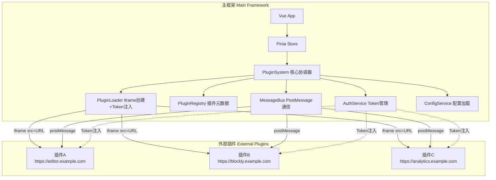
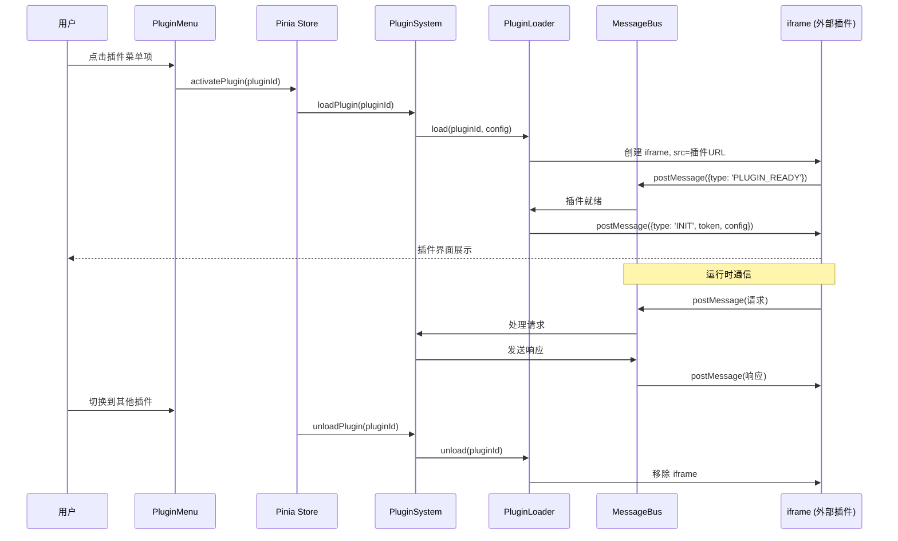

# 插件系统设计文档

## 概述

### 目的

本设计文档描述一个轻量级的插件宿主框架。插件是独立部署在不同 URL 的外部应用（如同独立网站），主框架通过 iframe 嵌入它们，并通过 Token 完成身份认证。主框架不包含任何插件源码，只负责：

1. 管理插件配置和元数据
2. 通过 iframe 加载外部插件 URL
3. 将主应用 Token 传递给插件
4. 通过 PostMessage 与插件通信
5. 提供插件菜单和容器 UI

### 设计原则

1. **KISS**: 插件是外部应用，主框架只做宿主容器
2. **浏览器原生隔离**: 跨域 iframe 天然提供安全隔离，无需自建沙箱
3. **Token 透传**: 复用主应用已有的认证体系（`src/store/modules/token.ts`）
4. **最小侵入**: 不修改现有代码结构，新增独立模块

### 技术栈

- **Frontend**: Vue 3 + TypeScript + Vite + Pinia + Element Plus
- **通信**: PostMessage API（iframe 跨域通信）
- **认证**: 复用现有 Token 体系（SecureLS + JWT）
- **配置**: 静态默认配置（`public/config/plugins.json`）+ API 动态配置（合并覆盖）

## 架构

### 高层架构



### 插件加载流程



### 目录结构

```
src/plugin-system/
├── core/
│   ├── PluginSystem.ts          # 核心协调器，管理生命周期
│   ├── MessageBus.ts            # PostMessage 双向通信
│   ├── PluginRegistry.ts        # 插件元数据注册表
│   └── PluginLoader.ts          # iframe 创建 + Token 注入
├── types/
│   ├── index.ts                 # 统一类型导出
│   └── manifest.ts              # 插件清单类型
├── services/
│   ├── AuthService.ts           # Token 管理（封装现有 Token store）
│   └── ConfigService.ts         # 配置加载（plugins.json）
├── components/
│   └── PluginMenu.vue           # 侧边栏插件菜单
├── views/
│   ├── PluginContainer.vue      # iframe 容器视图
│   └── PluginLayout.vue         # 布局（菜单 + 容器）
└── index.ts                     # 入口，导出 Vue 插件安装方法

src/store/modules/plugin-system.ts  # Pinia store
src/api/plugins/index.ts            # API 调用（单文件）
public/config/plugins.json          # 插件配置
```

## 组件与接口

### 1. PluginSystem（核心协调器）

统一管理插件生命周期，协调各子组件。

```typescript
interface IPluginSystem {
  /** 初始化：加载配置，注册插件 */
  initialize(): Promise<void>
  /** 加载并激活插件（创建 iframe） */
  loadPlugin(pluginId: string): Promise<void>
  /** 卸载插件（销毁 iframe） */
  unloadPlugin(pluginId: string): Promise<void>
  /** 获取插件运行状态 */
  getPluginState(pluginId: string): PluginState
  /** 获取所有已注册插件 */
  getAllPlugins(): PluginInfo[]
  /** 销毁插件系统 */
  destroy(): Promise<void>
}
```

### 2. MessageBus（PostMessage 通信）

处理主框架与 iframe 插件之间的所有 PostMessage 通信。

```typescript
interface IMessageBus {
  /** 向指定插件发送消息 */
  sendToPlugin(pluginId: string, message: PluginMessage): void
  /** 广播消息到所有活跃插件 */
  broadcast(message: PluginMessage): void
  /** 订阅来自插件的消息 */
  onMessage(handler: MessageHandler): Unsubscribe
  /** 订阅特定类型的消息 */
  onMessageType(type: string, handler: MessageHandler): Unsubscribe
  /** 注册插件 iframe 连接 */
  registerPlugin(pluginId: string, iframe: HTMLIFrameElement, origin: string): void
  /** 注销插件连接 */
  unregisterPlugin(pluginId: string): void
  /** 销毁，移除所有监听器 */
  destroy(): void
}


type MessageHandler = (pluginId: string, message: PluginMessage) => void
type Unsubscribe = () => void
```

### 3. PluginRegistry（插件元数据注册表）

存储和查询已注册插件的元数据。数据来源于 `plugins.json` 配置。

```typescript
interface IPluginRegistry {
  /** 注册插件 */
  register(config: PluginManifest): void
  /** 注销插件 */
  unregister(pluginId: string): void
  /** 获取插件配置 */
  get(pluginId: string): PluginManifest | undefined
  /** 获取所有插件 */
  getAll(): PluginManifest[]
  /** 按分组查询 */
  getByGroup(group: string): PluginManifest[]
  /** 验证清单格式 */
  validateManifest(manifest: PluginManifest): ValidationResult
}
```

### 4. PluginLoader（iframe 创建 + Token 注入）

负责创建 iframe、设置 src 为插件 URL、注入 Token。

```typescript
interface IPluginLoader {
  /** 加载插件：创建 iframe，注入 Token */
  load(pluginId: string, manifest: PluginManifest, container: HTMLElement): Promise<LoadedPlugin>
  /** 卸载插件：销毁 iframe */
  unload(pluginId: string): void
  /** 获取已加载的插件 */
  getLoaded(pluginId: string): LoadedPlugin | undefined
  /** 检查是否已加载 */
  isLoaded(pluginId: string): boolean
}

interface LoadedPlugin {
  pluginId: string
  iframe: HTMLIFrameElement
  origin: string
  state: PluginState
  loadedAt: number
}
```

### 5. AuthService（Token 管理）

封装现有 `src/store/modules/token.ts`，为插件系统提供 Token 访问。

```typescript
interface IAuthService {
  /** 获取当前 accessToken */
  getAccessToken(): string | null
  /** 监听 Token 变化（刷新后通知插件） */
  onTokenChange(callback: (token: string) => void): Unsubscribe
  /** Token 是否有效 */
  isAuthenticated(): boolean
}
```

### 6. ConfigService（配置加载）

从 `public/config/plugins.json` 加载静态默认配置，同时检查 domain 信息（`useDomainStore().defaultInfo`）中是否包含插件配置。如果 domain 返回了插件配置则作为动态配置合并覆盖静态默认值，否则只使用静态配置。

```typescript
interface IConfigService {
  /** 加载配置：先加载静态 plugins.json，再检查 domain 信息合并 */
  loadConfig(): Promise<PluginsConfig>
  /** 获取已加载的配置（合并后的结果） */
  getConfig(): PluginsConfig | null
  /** 仅加载静态默认配置 */
  loadStaticConfig(): Promise<PluginsConfig>
  /** 从 domain 信息中提取插件配置（如果有） */
  getDomainPluginConfig(): Partial<PluginsConfig> | null
  /** 强制刷新配置 */
  refreshConfig(): Promise<PluginsConfig>
}
```

配置加载策略：
1. 先加载 `public/config/plugins.json` 作为静态默认值
2. 检查 `useDomainStore().defaultInfo` 中是否存在 `plugins` 字段（后端 domain API 可扩展返回）
3. 如果 domain 信息中有插件配置：按 `id` 合并，domain 数据覆盖静态配置中的同 id 插件，新增的追加
4. 如果 domain 信息中没有插件配置：直接使用静态配置
5. domain 信息尚未加载时不阻塞，降级使用静态配置

与现有系统的集成：
- 复用 `src/api/domain-query.ts` 的 `getDomainDefault()` 接口
- 后端需扩展 `DomainDefaultInfo` 接口，增加可选的 `plugins` 字段
- ConfigService 在 `useDomainStore().defaultInfo` 加载完成后读取，不额外发起请求

## 数据模型

### PluginManifest（插件清单）

每个插件在 `plugins.json` 中的配置项。

```typescript
/** 插件清单 - plugins.json 中每个插件的配置 */
interface PluginManifest {
  /** 插件唯一标识 */
  id: string
  /** 显示名称 */
  name: string
  /** 插件描述 */
  description: string
  /** 插件入口 URL（外部应用地址） */
  url: string
  /** 插件图标（Element Plus icon 名称或 URL） */
  icon: string
  /** 所属菜单分组 */
  group: string
  /** 是否启用 */
  enabled: boolean
  /** 排序权重（越小越靠前） */
  order: number
  /** 允许的 PostMessage origin（用于安全校验） */
  allowedOrigin: string
  /** 插件版本 */
  version: string
  /** iframe sandbox 属性（可选，默认 'allow-scripts allow-same-origin'） */
  sandbox?: string
  /** 额外配置，透传给插件 */
  extraConfig?: Record<string, string | number | boolean>
}
```

### PluginsConfig（全局配置）

`public/config/plugins.json` 的顶层结构。

```typescript
/** plugins.json 顶层结构 */
interface PluginsConfig {
  /** 配置版本 */
  version: string
  /** 菜单分组定义 */
  menuGroups: MenuGroup[]
  /** 插件列表 */
  plugins: PluginManifest[]
}

interface MenuGroup {
  /** 分组标识 */
  id: string
  /** 分组显示名称 */
  name: string
  /** 分组图标 */
  icon: string
  /** 排序权重 */
  order: number
}
```

### PluginState（插件运行状态）

```typescript
type PluginState = 'unloaded' | 'loading' | 'active' | 'error'
```

### PluginInfo（运行时插件信息）

```typescript
/** 运行时插件信息，供 UI 和 Store 使用 */
interface PluginInfo {
  pluginId: string
  name: string
  description: string
  icon: string
  group: string
  state: PluginState
  enabled: boolean
  order: number
  /** 最后一次错误信息 */
  lastError?: string
}
```

### PluginMessage（PostMessage 消息格式）

```typescript
/** 主框架与插件之间的 PostMessage 消息格式 */
interface PluginMessage {
  /** 消息类型 */
  type: PluginMessageType
  /** 消息唯一 ID（用于请求-响应配对） */
  id: string
  /** 消息负载 */
  payload?: Record<string, unknown>
  /** 关联的请求 ID（响应消息使用） */
  requestId?: string
}

type PluginMessageType =
  | 'INIT'              // 主框架 → 插件：初始化，携带 token 和 config
  | 'PLUGIN_READY'      // 插件 → 主框架：插件加载完成
  | 'TOKEN_UPDATE'      // 主框架 → 插件：Token 刷新通知
  | 'REQUEST'           // 插件 → 主框架：请求
  | 'RESPONSE'          // 主框架 → 插件：响应
  | 'EVENT'             // 双向：事件通知
  | 'DESTROY'           // 主框架 → 插件：即将销毁

interface ValidationResult {
  valid: boolean
  errors: string[]
}
```

### plugins.json 配置示例

```json
{
  "version": "1.0.0",
  "menuGroups": [
    { "id": "editors", "name": "编辑工具", "icon": "Edit", "order": 1 },
    { "id": "tools", "name": "实用工具", "icon": "Tools", "order": 2 }
  ],
  "plugins": [
    {
      "id": "code-editor",
      "name": "代码编辑器",
      "description": "在线代码编辑器",
      "url": "https://editor.example.com",
      "icon": "EditPen",
      "group": "editors",
      "enabled": true,
      "order": 1,
      "allowedOrigin": "https://editor.example.com",
      "version": "1.0.0"
    },
    {
      "id": "blockly-editor",
      "name": "Blockly 编辑器",
      "description": "可视化编程工具",
      "url": "https://blockly.example.com",
      "icon": "Grid",
      "group": "editors",
      "enabled": true,
      "order": 2,
      "allowedOrigin": "https://blockly.example.com",
      "version": "1.0.0"
    }
  ]
}
```

### Pinia Store

```typescript
/** plugin-system store state */
interface PluginSystemState {
  /** 是否已初始化 */
  initialized: boolean
  /** 全局配置 */
  config: PluginsConfig | null
  /** 所有插件运行时信息 */
  plugins: Map<string, PluginInfo>
  /** 当前激活的插件 ID */
  activePluginId: string | null
  /** 加载中状态 */
  loading: boolean
  /** 全局错误信息 */
  error: string | null
}
```


## 正确性属性 (Correctness Properties)

*属性是系统在所有有效执行中都应保持为真的特征或行为——本质上是关于系统应该做什么的形式化陈述。属性是人类可读规范与机器可验证正确性保证之间的桥梁。*

### Property 1: 插件注册往返 (Plugin Registration Round-Trip)

*For any* 有效的插件清单，注册到 PluginRegistry 后，通过 `get(pluginId)` 查询应返回等价的清单数据；注销后，查询应返回 `undefined`。

**Validates: Requirements 1.1, 1.5**

### Property 2: 无效清单拒绝 (Invalid Manifest Rejection)

*For any* 插件清单，如果缺少任何必需字段（id, name, url, allowedOrigin, version, group, icon, enabled, order, description），`validateManifest` 应返回 `{ valid: false }` 且 `errors` 数组非空，包含缺失字段的描述。

**Validates: Requirements 1.2, 1.3, 9.3, 15.1**

### Property 3: 有效清单接受 (Valid Manifest Acceptance)

*For any* 包含所有必需字段且字段值类型正确的插件清单，`validateManifest` 应返回 `{ valid: true, errors: [] }`，无论是否包含可选字段（sandbox, extraConfig）。

**Validates: Requirements 9.4, 15.2**

### Property 4: 插件查询过滤 (Plugin Query Filtering)

*For any* 已注册插件集合和任意分组名称，`getByGroup(group)` 返回的所有插件的 `group` 字段都应等于查询的分组名称，且不遗漏任何匹配的插件。

**Validates: Requirements 1.4**

### Property 5: Token 注入 (Token Injection on Init)

*For any* 被加载的插件，PluginLoader 发送的 INIT 消息的 payload 中必须包含当前有效的 accessToken，且该 token 与 AuthService.getAccessToken() 返回值一致。

**Validates: Requirements 2.4, 5.1**

### Property 6: Token 刷新传播 (Token Refresh Propagation)

*For any* 一组活跃插件，当 Token 发生变化时，MessageBus 应向所有活跃插件发送 TOKEN_UPDATE 消息，且消息中包含新的 token 值。

**Validates: Requirements 5.3**

### Property 7: 消息来源验证 (Message Origin Enforcement)

*For any* 通过 postMessage 接收的消息，MessageBus 应验证 `event.origin` 是否匹配已注册插件的 `allowedOrigin`。来自未注册 origin 的消息应被丢弃且记录警告日志。

**Validates: Requirements 2.5, 8.3, 8.5**

### Property 8: 消息往返 (Message Bus Round-Trip)

*For any* 有效的 PluginMessage，通过 MessageBus 从主框架发送到插件，插件应能接收到结构完整的消息；反之亦然。序列化再反序列化后消息内容应保持一致。

**Validates: Requirements 2.2**

### Property 9: iframe 沙箱属性 (iframe Sandbox Attributes)

*For any* 被加载的插件，创建的 iframe 元素必须设置 `sandbox` 属性（默认为 `allow-scripts allow-same-origin`），且 `src` 属性等于清单中的 `url` 字段。

**Validates: Requirements 2.1, 8.1, 8.4**

### Property 10: 插件卸载清理 (Plugin Unload Cleanup)

*For any* 已加载的插件，调用 `unload(pluginId)` 后：iframe 应从 DOM 中移除，`isLoaded(pluginId)` 应返回 `false`，MessageBus 中该插件的连接应被注销。

**Validates: Requirements 2.6, 7.4**

### Property 11: 插件状态有效性 (Plugin State Validity)

*For any* 插件在任意时刻，其状态必须是 `'unloaded' | 'loading' | 'active' | 'error'` 之一。状态转换只允许：unloaded→loading, loading→active, loading→error, active→unloaded, error→loading, error→unloaded。

**Validates: Requirements 7.1**

### Property 12: 错误隔离 (Error Isolation Between Plugins)

*For any* 两个已加载的插件 A 和 B，当插件 A 进入 error 状态时，插件 B 的状态不应受到影响，仍保持其原有状态。

**Validates: Requirements 10.1, 10.6**

### Property 13: 生命周期事件日志 (Lifecycle Event Logging)

*For any* 插件状态转换（load, active, error, unload），系统应产生包含 pluginId 和 timestamp 的日志条目。

**Validates: Requirements 10.2, 14.1**

### Property 14: Token 不泄露 (Token Security in Logs)

*For any* 系统产生的日志输出，不应包含 JWT 格式的 token 字符串（匹配 `eyJ` 开头的 base64 编码模式）。

**Validates: Requirements 5.5**

### Property 15: 懒加载行为 (Lazy Loading Behavior)

*For any* 已注册但未被用户激活的插件，系统不应创建 iframe 元素。只有在显式调用 `loadPlugin` 时才创建 iframe。

**Validates: Requirements 13.4**

### Property 16: 配置合并与降级 (Config Merge and Fallback)

*For any* 静态配置和 domain 动态配置，`loadConfig()` 返回的合并结果中：domain 提供的插件应覆盖静态配置中同 id 的插件，domain 新增的插件应追加。当 domain 信息中无 plugins 字段时，应返回完整的静态配置。

**Validates: Requirements 9.1, 9.2, 13.5**

## 错误处理

### 插件加载失败

| 场景 | 处理方式 |
|------|---------|
| iframe 加载超时（30秒） | 标记插件状态为 `error`，显示超时提示，允许重试 |
| 插件 URL 不可达 | iframe onerror 触发，标记为 `error`，显示错误信息 |
| 插件未发送 PLUGIN_READY | 超时后标记为 `error` |
| 5分钟内连续失败3次 | 自动禁用该插件，需手动重新启用 |

### PostMessage 通信错误

| 场景 | 处理方式 |
|------|---------|
| 消息来自未知 origin | 丢弃消息，记录警告日志 |
| 消息格式无效 | 丢弃消息，记录警告日志 |
| 请求超时（5秒无响应） | 返回超时错误给调用方 |

### 配置加载失败

| 场景 | 处理方式 |
|------|---------|
| plugins.json 不存在或网络错误 | 使用空配置，插件菜单不显示，记录错误日志 |
| plugins.json 格式无效 | 同上 |
| domain 信息尚未加载 | 降级使用静态配置，不阻塞 |
| domain 信息中无 plugins 字段 | 正常，使用静态配置 |
| domain 信息中 plugins 格式无效 | 忽略 domain 数据，使用静态配置，记录警告 |
| 单个插件清单无效 | 跳过该插件，其余正常加载，记录警告 |

### Token 相关

| 场景 | 处理方式 |
|------|---------|
| Token 过期 | 由现有 request.ts 拦截器自动刷新，AuthService 监听变化并通知插件 |
| 用户登出 | 销毁所有活跃插件，清理 iframe |

## 测试策略

### 测试框架

- **单元测试**: Vitest + jsdom（项目已有配置）
- **属性测试**: fast-check（需安装 `pnpm add -D fast-check`）
- **测试文件位置**: `test/unit/plugin-system/`

### 属性测试配置

- 每个属性测试至少运行 100 次迭代
- 每个测试用注释标注对应的设计属性
- 标注格式: `Feature: plugin-system, Property {number}: {title}`

### 单元测试覆盖

| 模块 | 测试重点 |
|------|---------|
| PluginRegistry | 注册/注销/查询、清单验证 |
| MessageBus | 消息发送/接收、origin 验证、订阅/取消订阅 |
| PluginLoader | iframe 创建/销毁、Token 注入、超时处理 |
| AuthService | Token 获取、变化监听 |
| ConfigService | 静态配置加载、domain 插件配置提取、合并策略、domain 无 plugins 降级、缓存、错误处理 |
| PluginSystem | 生命周期管理、状态转换、错误隔离 |

### 属性测试覆盖

| 属性 | 测试模块 | 模式 |
|------|---------|------|
| Property 1: 注册往返 | PluginRegistry | Round-Trip |
| Property 2: 无效清单拒绝 | PluginRegistry | Error Condition |
| Property 3: 有效清单接受 | PluginRegistry | Invariant |
| Property 4: 查询过滤 | PluginRegistry | Metamorphic |
| Property 5: Token 注入 | PluginLoader | Invariant |
| Property 6: Token 刷新传播 | MessageBus + AuthService | Invariant |
| Property 7: 消息来源验证 | MessageBus | Error Condition |
| Property 8: 消息往返 | MessageBus | Round-Trip |
| Property 9: iframe 沙箱 | PluginLoader | Invariant |
| Property 10: 卸载清理 | PluginLoader | Invariant |
| Property 11: 状态有效性 | PluginSystem | Invariant |
| Property 12: 错误隔离 | PluginSystem | Invariant |
| Property 13: 生命周期日志 | PluginSystem | Invariant |
| Property 14: Token 不泄露 | Logger | Invariant |
| Property 15: 懒加载 | PluginSystem | Invariant |
| Property 16: 配置合并与降级 | ConfigService | Invariant |

### 测试与实现的平衡

- 属性测试验证通用正确性（跨所有输入）
- 单元测试验证具体示例和边界情况（超时、重试、空配置等）
- 两者互补，属性测试覆盖广度，单元测试覆盖深度
