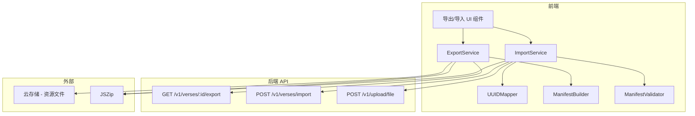
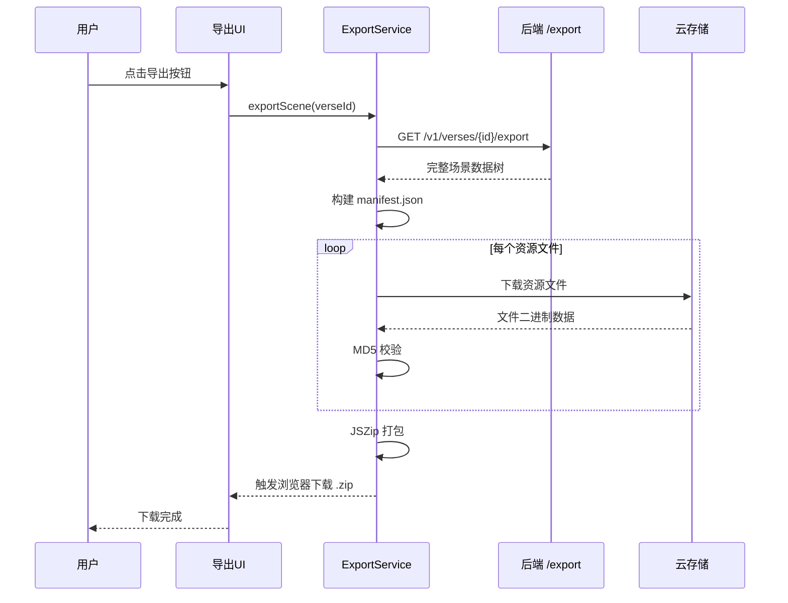
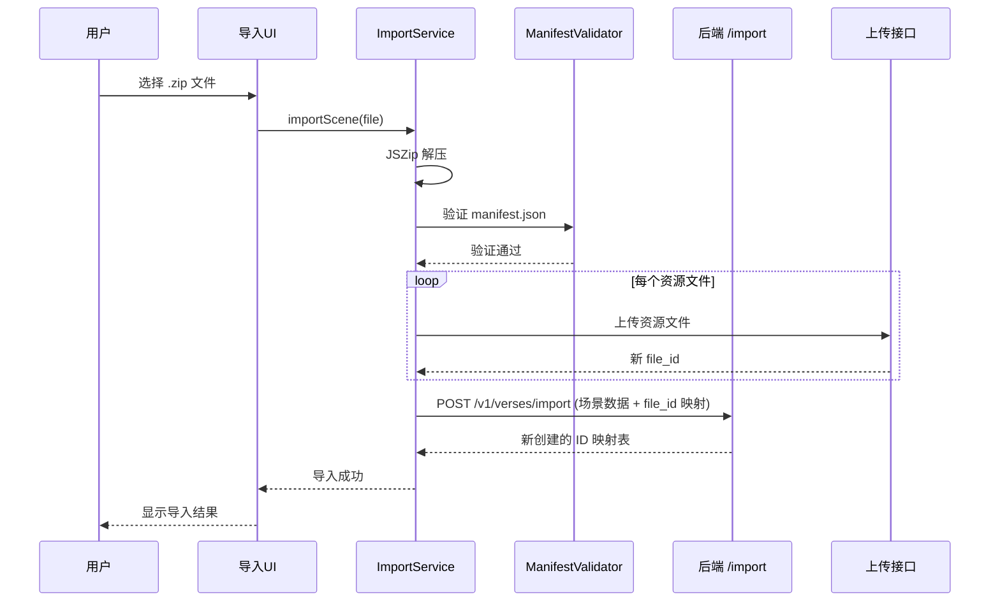

# 设计文档：场景导出/导入

## 概述

本设计描述场景（Verse）导出/导入功能的前端实现方案。核心思路是：

- **导出**：通过后端导出接口获取场景完整数据树，前端下载所有资源文件，生成 manifest.json，使用 JSZip 打包为 ZIP 文件供用户下载。
- **导入**：用户选择 ZIP 文件，前端解压并解析 manifest.json，通过后端导入接口批量创建场景数据，前端负责资源文件上传，最终完成 ID 映射和引用更新。

前端使用 JSZip 库处理 ZIP 压缩/解压，使用 file-saver 触发浏览器下载。后端需要新增两个 API 端点支持批量导出和导入。

## 架构



### 导出流程



### 导入流程



## 组件与接口

### 1. ExportService（导出服务）

```typescript
// src/services/scene-package/export-service.ts

interface ExportProgress {
  phase: 'fetching' | 'downloading' | 'packaging'
  current: number
  total: number
}

interface ExportResult {
  success: boolean
  failedResources: Array<{ uuid: string; name: string; error: string }>
}

type ProgressCallback = (progress: ExportProgress) => void

function exportScene(
  verseId: number,
  onProgress: ProgressCallback
): Promise<ExportResult>
```

职责：
- 调用后端导出接口获取完整场景数据
- 下载所有资源文件并进行 MD5 校验
- 调用 ManifestBuilder 生成 manifest.json
- 使用 JSZip 打包并触发浏览器下载

### 2. ImportService（导入服务）

```typescript
// src/services/scene-package/import-service.ts

interface ImportProgress {
  phase: 'validating' | 'uploading' | 'creating' | 'mapping'
  current: number
  total: number
}

interface ImportResult {
  success: boolean
  verseId: number
  error?: string
}

type ProgressCallback = (progress: ImportProgress) => void

function importScene(
  file: File,
  onProgress: ProgressCallback
): Promise<ImportResult>
```

职责：
- 使用 JSZip 解压用户选择的文件
- 调用 ManifestValidator 验证 manifest.json
- 上传所有资源文件，收集新 file_id
- 调用后端导入接口，传入场景数据和 file_id 映射
- 返回导入结果

### 3. ManifestBuilder（清单构建器）

```typescript
// src/services/scene-package/manifest.ts

interface SceneManifest {
  formatVersion: string
  exportedAt: string
  appVersion: number
  verse: ManifestVerse
  metas: ManifestMeta[]
  resources: ManifestResource[]
  metaResourceLinks: Array<{ metaUuid: string; resourceUuid: string }>
}

interface ManifestVerse {
  uuid: string
  name: string
  description: string | null
  data: unknown
  version: number
  verseCode: VerseCode | null
  metaUuidMapping: Record<string, string>
}

interface ManifestMeta {
  uuid: string
  title: string
  data: unknown | null
  events: unknown | null
  metaCode: MetaCode | null
  resourceUuids: string[]
}

interface ManifestResource {
  uuid: string
  name: string
  type: string
  filePath: string
  fileMd5: string
  info: string
}

function buildManifest(exportData: VerseExportData): SceneManifest

function parseManifest(json: string): SceneManifest
```

### 4. ManifestValidator（清单验证器）

```typescript
// src/services/scene-package/manifest.ts

interface ValidationResult {
  valid: boolean
  errors: string[]
}

function validateManifest(manifest: unknown): ValidationResult
```

职责：
- 验证 formatVersion 兼容性
- 验证必填字段完整性
- 验证资源文件路径在 ZIP 包中存在

### 5. UUIDMapper（UUID 映射器）

```typescript
// src/services/scene-package/uuid-mapper.ts

class UUIDMapper {
  addMapping(oldUuid: string, newId: number): void
  getNewId(oldUuid: string): number | undefined
  hasMapping(oldUuid: string): boolean
  getAllMappings(): Record<string, number>
}

function remapVerseData(
  data: unknown,
  metaMapper: UUIDMapper,
  resourceMapper: UUIDMapper
): unknown

function remapMetaData(
  data: unknown,
  resourceMapper: UUIDMapper
): unknown
```

职责：
- 维护旧 UUID → 新 ID 的映射关系
- 递归遍历 Verse/Meta 的 data JSON，替换所有 ID 引用

### 6. API 层

```typescript
// src/api/v1/scene-package.ts

interface VerseExportData {
  verse: VerseData
  metas: Array<metaInfo & { metaCode: MetaCode | null }>
  resources: ResourceInfo[]
  metaResourceLinks: Array<{ meta_id: number; resource_id: number }>
}

interface VerseImportRequest {
  verse: {
    name: string
    description: string | null
    data: string
    version: number
    uuid: string
    verseCode: VerseCode | null
  }
  metas: Array<{
    title: string
    data: string | null
    events: string | null
    uuid: string
    metaCode: MetaCode | null
    resourceFileIds: number[]
  }>
  resourceFileMappings: Array<{
    originalUuid: string
    fileId: number
    name: string
    type: string
    info: string
  }>
}

interface VerseImportResponse {
  verseId: number
  metaIdMap: Record<string, number>
  resourceIdMap: Record<string, number>
}

function getVerseExport(verseId: number): Promise<VerseExportData>

function postVerseImport(data: VerseImportRequest): Promise<VerseImportResponse>
```

### 7. UI 组件

```
src/components/ScenePackage/ExportButton.vue
  - 导出按钮组件，显示在场景编辑页面
  - 点击触发导出流程并显示进度对话框

src/components/ScenePackage/ImportDialog.vue
  - 导入对话框组件
  - 支持文件选择、进度显示和结果反馈
```

## 数据模型

### ZIP 包结构

```
scene-package.zip
├── manifest.json
└── resources/
    ├── {resource-uuid-1}.{ext}
    ├── {resource-uuid-2}.{ext}
    └── ...
```

### manifest.json 示例

```json
{
  "formatVersion": "1.0",
  "exportedAt": "2025-01-20T10:30:00Z",
  "appVersion": 3,
  "verse": {
    "uuid": "verse-uuid-xxx",
    "name": "我的场景",
    "description": "场景描述",
    "data": { "type": "Verse", "parameters": { "uuid": "..." }, "children": { "modules": [] } },
    "version": 3,
    "verseCode": { "blockly": "<xml>...</xml>", "lua": "...", "js": "..." },
    "metaUuidMapping": { "42": "meta-uuid-aaa", "58": "meta-uuid-bbb" }
  },
  "metas": [
    {
      "uuid": "meta-uuid-aaa",
      "title": "实体A",
      "data": { "type": "MetaRoot", "parameters": { "uuid": "..." }, "children": {} },
      "events": { "inputs": [], "outputs": [] },
      "metaCode": { "blockly": "<xml>...</xml>" },
      "resourceUuids": ["res-uuid-111"]
    }
  ],
  "resources": [
    {
      "uuid": "res-uuid-111",
      "name": "模型A",
      "type": "polygen",
      "filePath": "resources/res-uuid-111.glb",
      "fileMd5": "abc123def456",
      "info": "{\"size\":{\"x\":1,\"y\":2,\"z\":1},\"center\":{\"x\":0,\"y\":1,\"z\":0}}"
    }
  ],
  "metaResourceLinks": [
    { "metaUuid": "meta-uuid-aaa", "resourceUuid": "res-uuid-111" }
  ]
}
```

### ID 映射流程

导入时，由于跨账号导入会产生全新的 ID，需要进行以下映射：

1. 上传资源文件 → 获得新 `file_id`
2. 后端创建 Resource → 获得新 `resource_id`（通过 `resourceIdMap` 返回）
3. 后端创建 Meta → 获得新 `meta_id`（通过 `metaIdMap` 返回）
4. 使用 `metaIdMap` 更新 Verse data 中的 `meta_id` 引用
5. 使用 `resourceIdMap` 更新 Meta data 中的 `resource` 引用
6. 后端更新 Verse data 和 Meta data


## 正确性属性

*属性（Property）是一种在系统所有有效执行中都应成立的特征或行为——本质上是关于系统应该做什么的形式化陈述。属性是人类可读规范与机器可验证正确性保证之间的桥梁。*

### Property 1: Manifest 序列化往返一致性

*For any* 有效的 SceneManifest 对象，调用 `JSON.stringify` 序列化后再通过 `parseManifest` 解析，应产生与原始对象等价的 SceneManifest。

**Validates: Requirements 3.1, 3.2, 3.3, 3.4, 3.5**

### Property 2: Manifest 完整性

*For any* 导出数据（包含 verse、metas、resources、metaResourceLinks），通过 `buildManifest` 生成的 manifest 应满足：
- manifest.verse 包含原始 verse 的 name、description、data、version、uuid 和 verseCode
- manifest.metas 的数量等于原始 metas 的数量，且每个 meta 包含 title、data、events、uuid 和 metaCode
- manifest.resources 的数量等于原始 resources 的数量，且每个 resource 包含 uuid、name、type、filePath 和 fileMd5
- manifest.metaResourceLinks 的数量等于原始关联关系的数量

**Validates: Requirements 1.1, 1.2, 1.3, 1.4, 1.5, 3.3, 3.4, 3.5, 3.6**

### Property 3: Manifest 排除服务端 ID

*For any* 导出数据，通过 `buildManifest` 生成的 manifest JSON 字符串中，verse 层级和 meta 层级不应包含 `"id"` 或 `"author_id"` 作为顶层键。

**Validates: Requirements 3.2**

### Property 4: MD5 校验正确性

*For any* 文件内容的 ArrayBuffer 和已知的 MD5 哈希值，当文件内容未被修改时 MD5 校验应通过；当文件内容被修改（哪怕一个字节）时 MD5 校验应失败。

**Validates: Requirements 2.2**

### Property 5: 资源下载部分失败的容错性

*For any* 资源列表，其中部分资源下载成功、部分失败，导出结果的 `failedResources` 应恰好包含所有失败的资源，且 ZIP 包中应包含所有成功下载的资源文件。

**Validates: Requirements 2.3**

### Property 6: Manifest 版本验证

*For any* manifest 对象，当 `formatVersion` 不在支持的版本列表中时，`validateManifest` 应返回 `valid: false`；当 `formatVersion` 在支持列表中且所有必填字段存在时，应返回 `valid: true`。

**Validates: Requirements 4.2**

### Property 7: UUID 映射器存取一致性

*For any* 一组不重复的 (uuid, id) 对，全部通过 `addMapping` 添加后，对每个 uuid 调用 `getNewId` 应返回对应的 id，且 `getAllMappings` 返回的记录数等于添加的对数。

**Validates: Requirements 5.1**

### Property 8: ID 重映射完整性

*For any* 包含 `meta_id` 和 `resource` 引用的 JSON 数据结构，以及一个覆盖所有旧 ID 的完整映射表，调用 `remapVerseData` 或 `remapMetaData` 后：
- 结果中所有 `meta_id` 值都属于新 ID 集合
- 结果中所有 `resource` 引用值都属于新 ID 集合
- 结果中不存在任何旧 ID 值

**Validates: Requirements 5.2, 5.3, 5.4**

## 错误处理

| 错误场景 | 处理方式 | 用户反馈 |
|---------|---------|---------|
| 后端导出接口返回错误 | 终止导出，抛出异常 | 显示"获取场景数据失败"错误提示 |
| 资源文件下载失败（单个） | 记录失败资源，继续处理其余 | 导出完成后显示失败资源列表 |
| 资源文件 MD5 校验失败 | 视为下载失败，记录并继续 | 同上 |
| ZIP 打包失败 | 终止导出，抛出异常 | 显示"打包失败"错误提示 |
| 导入文件非 ZIP 格式 | 终止导入 | 显示"请选择有效的场景包文件" |
| manifest.json 缺失 | 终止导入 | 显示"场景包格式无效，缺少清单文件" |
| manifest.json 版本不兼容 | 终止导入 | 显示"场景包版本不兼容" |
| 资源文件上传失败 | 终止导入，提示重试 | 显示"资源上传失败，请重试" |
| 后端导入接口返回错误 | 终止导入（后端自动回滚） | 显示"场景创建失败" |
| 网络中断 | 终止当前操作 | 显示"网络连接中断，请检查网络后重试" |

## 测试策略

### 属性测试（Property-Based Testing）

使用 **fast-check** 库进行属性测试，每个属性测试至少运行 100 次迭代。

每个测试需要通过注释标注对应的设计属性：
```
// Feature: scene-export-import, Property N: {property_text}
```

属性测试覆盖的核心模块：
- `buildManifest` / `parseManifest`：往返一致性（Property 1）、完整性（Property 2）、排除服务端 ID（Property 3）
- MD5 校验函数：校验正确性（Property 4）
- `validateManifest`：版本验证（Property 6）
- `UUIDMapper`：存取一致性（Property 7）
- `remapVerseData` / `remapMetaData`：重映射完整性（Property 8）

### 单元测试

单元测试聚焦于具体示例和边界情况：
- manifest.json 解析：格式正确/缺失字段/空文件
- ZIP 文件验证：有效 ZIP/非 ZIP 文件/空 ZIP
- 导入无效场景包的错误消息
- 资源文件路径生成逻辑

### 集成测试

- 完整导出流程（mock 后端 API 和资源下载）
- 完整导入流程（mock 后端 API 和文件上传）
- 导出后导入的端到端往返测试
