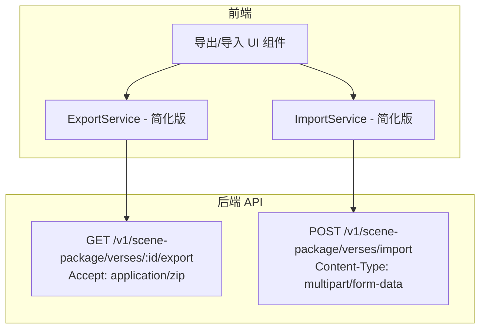
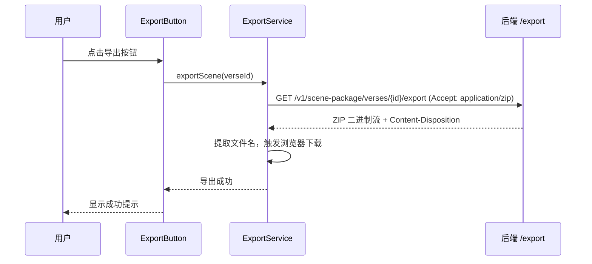
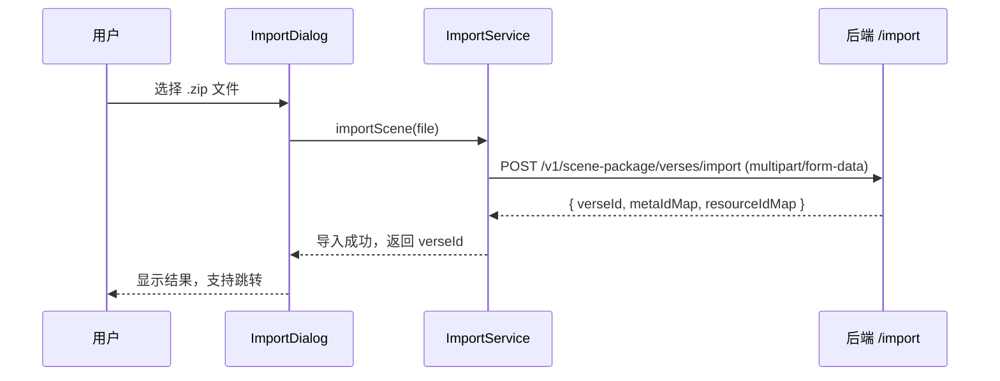

# 设计文档：场景导出/导入 API 重构

## 概述

本次重构将前端场景导出/导入功能与后端实际 API（`/v1/scene-package/`）对齐。核心变化是：

- **导出**：前端直接调用后端 ZIP 导出接口，后端返回完整 ZIP 文件，前端触发浏览器下载。不再需要前端下载资源、MD5 校验、JSZip 打包。
- **导入**：前端将用户选择的 ZIP 文件直接上传给后端导入接口，后端处理解压、创建实体、ID 重映射。不再需要前端解压 ZIP、上传资源、构建导入请求。

这将大幅简化前端代码，移除 manifest.ts、uuid-mapper.ts 等不再需要的模块。

## 参考文档

- 后端 API 文档：#[[file:docs/scene-package-api-usage.md]]

## 架构

重构后的架构大幅简化：



### 简化后的导出流程



### 简化后的导入流程



## 组件与接口

### 1. API 层（重构）

```typescript
// src/api/v1/scene-package.ts

import request from "@/utils/request";
import axios from "axios";
import env from "@/environment";
import Token from "@/store/modules/token";

// ---- 导入响应类型 ----

export interface VerseImportResponse {
  verseId: number;
  metaIdMap: Record<string, number>;
  resourceIdMap: Record<string, number>;
}

// ---- API 函数 ----

/** ZIP 格式导出（返回 Blob），使用原生 axios 以支持 blob 响应 */
export const getVerseExportZip = (verseId: number) => {
  const token = Token.getToken();
  return axios.get(`${env.api}/v1/scene-package/verses/${verseId}/export`, {
    headers: {
      Accept: "application/zip",
      Authorization: token ? `Bearer ${token.accessToken}` : "",
    },
    responseType: "blob",
    timeout: 120000,
  });
};

/** ZIP 文件导入（multipart/form-data） */
export const postVerseImportZip = (file: File) => {
  const formData = new FormData();
  formData.append("file", file);
  return request<VerseImportResponse>({
    url: `/v1/scene-package/verses/import`,
    method: "post",
    data: formData,
    headers: { "Content-Type": "multipart/form-data" },
    timeout: 120000,
  });
};
```

### 2. ExportService（简化版）

```typescript
// src/services/scene-package/export-service.ts

import { getVerseExportZip } from "@/api/v1/scene-package";

export interface ExportResult {
  success: boolean;
  error?: string;
}

/**
 * 从 Content-Disposition 响应头提取文件名。
 */
export function extractFilename(
  contentDisposition: string | undefined,
  fallbackId: number
): string {
  if (contentDisposition) {
    const match = contentDisposition.match(/filename="?([^";\s]+)"?/);
    if (match?.[1]) return match[1];
  }
  return `scene_${fallbackId}.zip`;
}

/**
 * 导出场景为 ZIP 文件并触发浏览器下载。
 */
export async function exportScene(verseId: number): Promise<ExportResult> {
  const response = await getVerseExportZip(verseId);
  const disposition = response.headers["content-disposition"];
  const filename = extractFilename(disposition, verseId);

  const url = window.URL.createObjectURL(new Blob([response.data]));
  const link = document.createElement("a");
  link.href = url;
  link.download = filename;
  link.click();
  window.URL.revokeObjectURL(url);

  return { success: true };
}
```

### 3. ImportService（简化版）

```typescript
// src/services/scene-package/import-service.ts

import { postVerseImportZip } from "@/api/v1/scene-package";

export interface ImportResult {
  success: boolean;
  verseId: number;
  error?: string;
}

/**
 * 导入场景包 ZIP 文件。
 */
export async function importScene(file: File): Promise<ImportResult> {
  try {
    const response = await postVerseImportZip(file);
    return {
      success: true,
      verseId: response.data.verseId,
    };
  } catch (err: unknown) {
    const errorMessage =
      err instanceof Error ? err.message : "导入失败，请重试";
    return {
      success: false,
      verseId: 0,
      error: errorMessage,
    };
  }
}
```

### 4. UI 组件变化

ExportButton.vue 简化：
- 移除进度对话框（不再有多阶段进度）
- 移除结果对话框中的失败资源列表
- 仅保留 loading 状态 + ElMessage 成功/失败提示

ImportDialog.vue 简化：
- 移除多阶段进度显示（validating/uploading/creating/mapping）
- 仅保留：文件选择 → 上传中 loading → 成功/失败
- 移除 onProgress 回调

## 移除的模块

| 模块 | 原因 |
|------|------|
| `src/services/scene-package/manifest.ts` | 后端 ZIP 使用 scene.json，前端不再需要构建/解析/验证 manifest |
| `src/services/scene-package/uuid-mapper.ts` | 后端自动处理 ID 重映射 |
| `test/unit/services/scene-package/manifest.spec.ts` | 对应模块已移除 |
| `test/unit/services/scene-package/uuid-mapper.spec.ts` | 对应模块已移除 |

## 依赖变化

| 依赖 | 操作 | 原因 |
|------|------|------|
| `jszip` | 移除 | 仅在 scene-package 服务中使用，不再需要 |
| `file-saver` | 移除 | 改用原生 DOM API 触发下载 |
| `spark-md5` | 保留 | 在 `src/assets/js/file/base.ts` 中仍有使用 |

## 正确性属性

### Property 1: Content-Disposition 文件名提取

*For any* 包含 `filename="xxx.zip"` 格式的 Content-Disposition 字符串，`extractFilename` 应返回 `xxx.zip`。当 Content-Disposition 为空或不包含 filename 时，应返回 `scene_{id}.zip` 格式的默认文件名。

**Validates: Requirements 2.2, 2.3**

## 错误处理

| 错误场景 | 处理方式 | 用户反馈 |
|---------|---------|---------|
| 导出接口 401 | 由 request 拦截器统一处理 | 跳转登录页 |
| 导出接口 403 | 抛出异常 | 显示"无权访问该场景" |
| 导出接口 404 | 抛出异常 | 显示"场景不存在" |
| 导出网络错误 | 抛出异常 | 显示"导出失败" |
| 导入接口 400 | 返回错误结果 | 显示"请求数据格式错误" |
| 导入接口 422 | 返回错误结果 | 显示"文件引用无效" |
| 导入接口 500 | 返回错误结果 | 显示"服务端导入失败" |
| 非 .zip 文件 | 前端拦截 | 显示"请选择 .zip 格式的场景包文件" |

## 测试策略

### 属性测试（Property-Based Testing）

使用 **fast-check** 库：
- `extractFilename`：Content-Disposition 文件名提取（Property 1）

### 单元测试

- `extractFilename`：各种 Content-Disposition 格式、空值、无 filename 等
- `exportScene`：mock axios 调用，验证下载触发
- `importScene`：mock request 调用，验证成功/失败返回值
