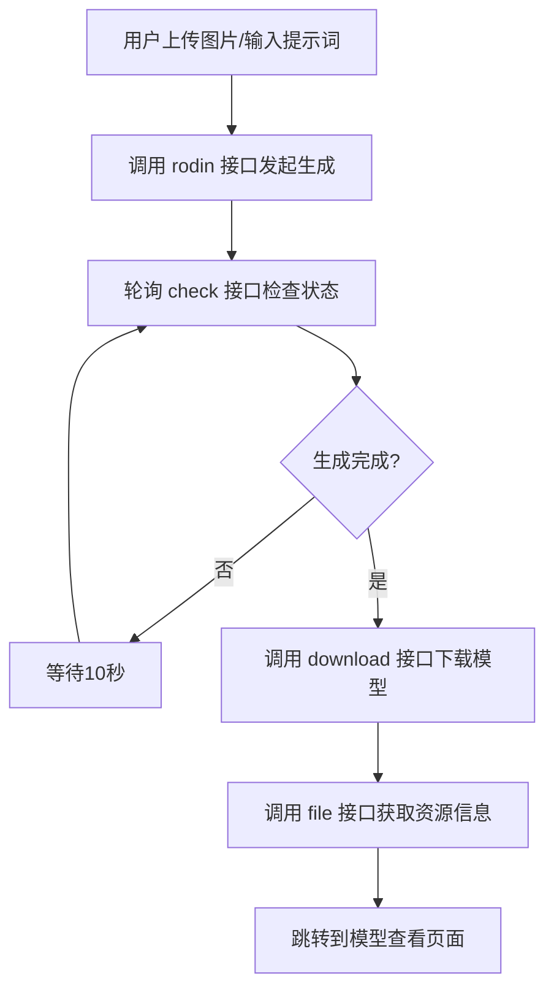
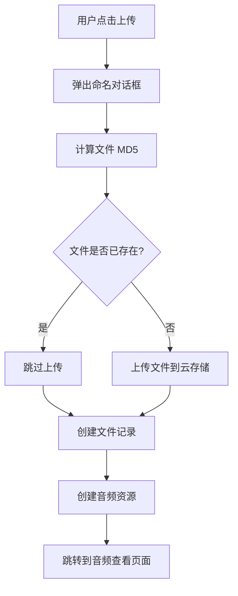

# AI 功能模块文档

本文档详细介绍了项目中与 AI 相关的功能模块，包括 3D 模型生成和语音合成两大核心功能。

---

## 目录

1. [AI Rodin 3D 模型生成](#ai-rodin-3d-模型生成)
2. [腾讯云 TTS 语音合成](#腾讯云-tts-语音合成)

---

## AI Rodin 3D 模型生成

### 概述

AI Rodin 是一个基于 AI 的 3D 模型生成功能，用户可以通过上传图片或输入文字提示词（Prompt）来生成 3D 多边形模型。

### 文件结构

```
src/
├── api/v1/
│   └── ai-rodin.ts          # AI Rodin API 接口封装
├── components/MrPP/
│   ├── AIUpload.vue          # AI 上传组件（用于新建生成任务）
│   └── AIProcess.vue         # AI 处理组件（用于查看生成进度）
└── views/ai/
    ├── index.vue             # AI 模型列表页面
    └── generation.vue        # AI 生成页面入口
```

### API 接口 (`src/api/v1/ai-rodin.ts`)

| 方法 | 描述 | 参数 |
|------|------|------|
| `rodin(query)` | 发起 AI 3D 模型生成请求 | `query`: 包含 `prompt`、`quality`、`resource_id` 等参数 |
| `check(id)` | 检查生成任务状态 | `id`: 任务 ID |
| `download(id)` | 下载生成的模型文件 | `id`: 任务 ID |
| `file(id)` | 获取生成的文件信息 | `id`: 任务 ID |
| `list(sort, search, page, expand)` | 获取 AI 生成任务列表 | 排序、搜索、分页参数 |
| `get(id, expand)` | 获取单个任务详情 | `id`: 任务 ID |
| `del(id)` | 删除 AI 生成任务 | `id`: 任务 ID |
| `schedule(jobs)` | 计算任务进度百分比 | `jobs`: 任务状态数组 |

### 生成质量选项

- `high` - 高质量
- `medium` - 中等质量（默认）
- `low` - 低质量
- `extra-low` - 超低质量

### 工作流程



### 任务状态

任务包含多个子任务（jobs），每个子任务有以下状态：
- `generating` - 生成中
- `done` - 已完成

进度计算公式：`progress = (done_count * 2 + generating_count * 1) / (total_jobs * 2)`

### 环境变量

- `VITE_APP_AI_API` - AI 服务 API 基础地址

---

## 腾讯云 TTS 语音合成

### 概述

TTS（Text-to-Speech）语音合成功能使用腾讯云语音合成服务，支持多语言、多音色、情感控制等高级功能。

### 文件结构

```
src/views/audio/
├── tts.vue                                    # TTS 主页面
├── components/
│   ├── VoiceSelector.vue                      # 音色选择器组件
│   ├── TTSParams.vue                          # 参数控制组件
│   └── LanguageAnalysis.vue                   # 语言分析组件
└── composables/
    ├── useTTS.ts                              # TTS 核心逻辑
    ├── useVoiceSelection.ts                   # 音色选择逻辑
    └── useLanguageAnalysis.ts                 # 语言分析逻辑
```

### 核心 Composable 函数

#### `useTTS` (`src/views/audio/composables/useTTS.ts`)

主要方法：

| 方法 | 描述 |
|------|------|
| `synthesizeSpeech()` | 调用腾讯云 API 合成语音 |
| `uploadAudio()` | 将合成的音频上传到服务器 |
| `updateHighlight()` | 实时更新文本高亮显示进度 |

返回的响应式数据：

| 数据 | 类型 | 描述 |
|------|------|------|
| `isLoading` | `Ref<boolean>` | 正在合成中 |
| `isUploading` | `Ref<boolean>` | 正在上传中 |
| `isPlaying` | `Ref<boolean>` | 音频正在播放 |
| `audioUrl` | `Ref<string>` | 合成音频的 URL |
| `highlightedText` | `Ref<string>` | 已播放的高亮文本 |
| `normalText` | `Ref<string>` | 未播放的普通文本 |

#### `useLanguageAnalysis` (`src/views/audio/composables/useLanguageAnalysis.ts`)

语言检测分析功能：

- **中文检测**：使用正则 `[\u4e00-\u9fa5]`
- **日文检测**：使用正则 `[\u3040-\u309F\u30A0-\u30FF]`（平假名、片假名）
- **英文检测**：使用正则 `[a-zA-Z]`

返回数据：

| 属性 | 描述 |
|------|------|
| `chinesePercentage` | 中文字符百分比 |
| `japanesePercentage` | 日文字符百分比 |
| `englishPercentage` | 英文字符百分比 |
| `otherPercentage` | 其他字符百分比 |
| `suggestion` | 语言建议提示 |
| `detectedLanguage` | 检测到的主要语言 |
| `isMultiLanguage` | 是否为多语言混合 |

### TTS 合成参数

| 参数 | 类型 | 描述 | 取值范围 |
|------|------|------|----------|
| `Text` | `string` | 待合成的文本 | 中文/日文限150字，英文限500字 |
| `Volume` | `number` | 音量 | 可调节 |
| `Speed` | `number` | 语速 | 可调节 |
| `VoiceType` | `number` | 音色类型 ID | 由音色列表提供 |
| `Codec` | `string` | 音频编码格式 | `mp3`, `wav` 等 |
| `SampleRate` | `number` | 采样率 | 16000, 24000 等 |
| `PrimaryLanguage` | `number` | 主要语言 | 1=中文, 2=英文, 3=日文 |
| `ModelType` | `number` | 模型类型 | 0=标准, 1=精品 |
| `EmotionCategory` | `string` | 情感类别 | neutral, happy, sad 等 |
| `EmotionIntensity` | `number` | 情感强度 | 可调节 |

### API 端点

```
POST https://sound.bujiaban.com/tencentTTS
```

### 音色类型

- **精品音色** (`ModelType: 1`) - 高质量音色   
- **标准音色** (`ModelType: 0`) - 标准音色

### 语言限制

| 语言 | 字符限制 | 
|------|----------|
| 中文 | 150 字符 |
| 日文 | 150 字符 |
| 英文 | 500 字符 |

### 自动语言切换

开启自动切换功能后，系统会根据输入文本自动检测语言并切换到对应的语音设置：

1. 分析输入文本的语言构成
2. 显示各语言占比的实时统计
3. 当检测到混合语言时显示警告
4. 自动切换到占比最高的语言

### 情感控制

支持的情感类别（通过 `emotionMap` 映射）：
- 中性 (neutral)
- 高兴 (happy)
- 悲伤 (sad)
- 愤怒 (angry)
- 等其他情感...

情感强度可通过滑块调节。

### 音频上传流程



---

## 相关依赖

### AI Rodin
- `axios` - HTTP 请求
- `querystringify` - URL 参数序列化

### TTS 语音合成
- `vue-i18n` - 国际化支持
- `element-plus` - UI 组件
- `axios` - HTTP 请求
- `@vueuse/core` - Vue 工具函数

---

## 配置说明

### 环境变量

在 `.env.development` 或 `.env.production` 中配置：

```bash
# AI Rodin 服务地址
VITE_APP_AI_API=https://your-ai-api-url.com

# TTS 服务（硬编码在代码中）
# https://sound.bujiaban.com/tencentTTS
```

---

## 扩展建议

1. **AI Rodin**
   - 考虑添加生成任务取消功能
   - 可以增加预览模型的 3D 查看器
   - 支持批量生成任务

2. **TTS 语音合成**
   - 可以添加 SSML 标记支持
   - 考虑添加语音队列功能
   - 支持长文本自动分段合成
